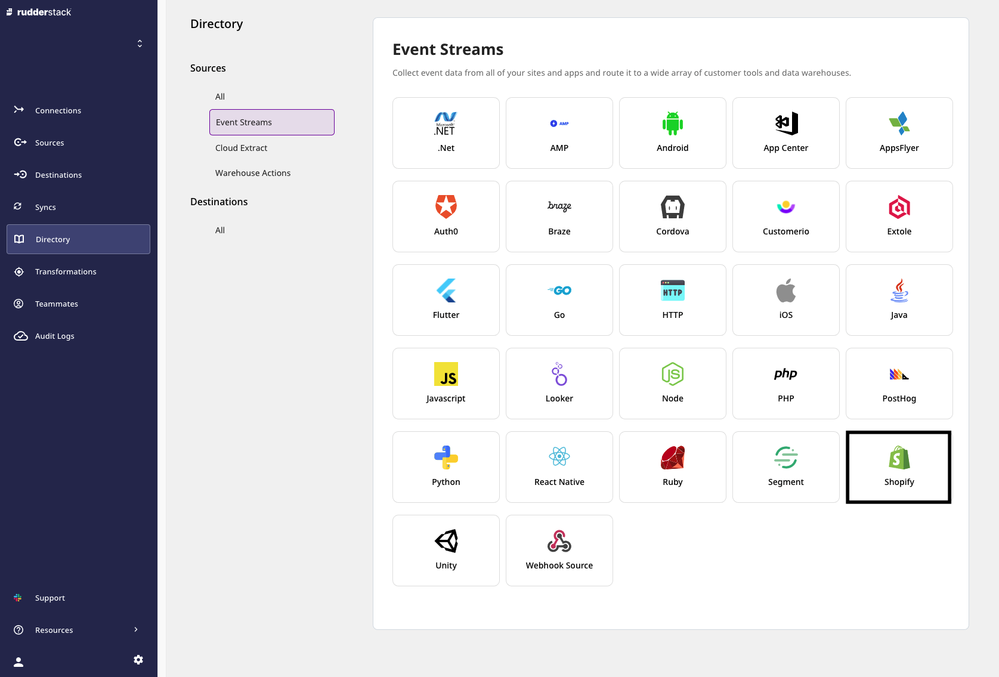
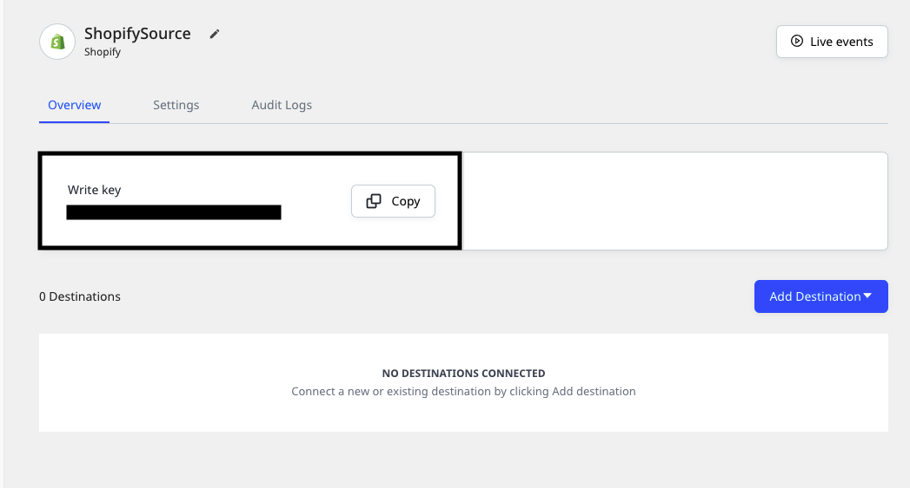
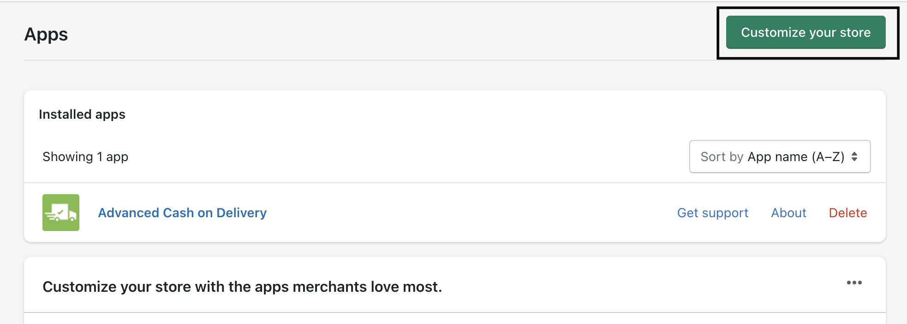
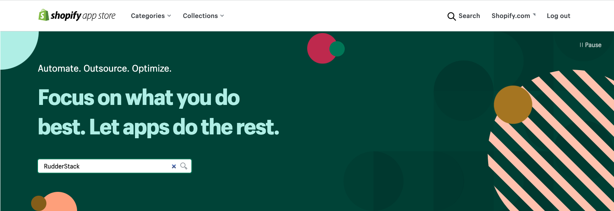
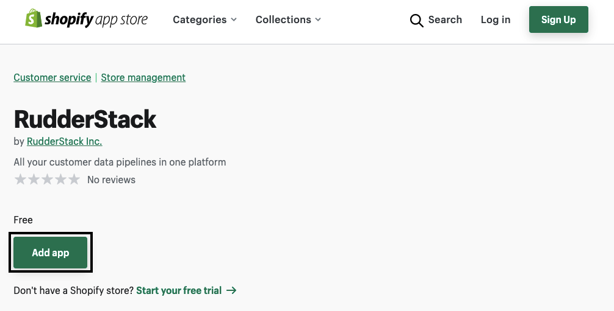
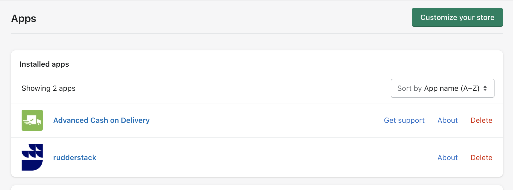
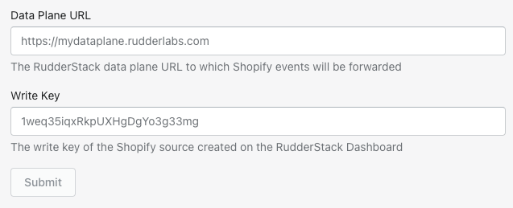
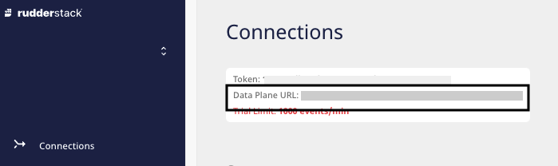

# Shopify

[Shopify](https://www.shopify.in/) is a popular all-in-one E-commerce platform that gives you all the tools to start, run, and grow your business effectively. It offers online retailers a variety of services around digital payments, marketing, product shipping, customer engagement and retention, and more.

This guide will help you set up Shopify as a source in RudderStack.

<div class="infoBlock">
  
  Setting up the Shopify source involves two steps:

<ul>
  <li><a href="#configuring-the-shopify-source-in-rudderstack">Configuring the Shopify source in RudderStack</a></li>
  <li><a href="#configuring-the-rudderstack-app-in-your-shopify-store">Configuring the RudderStack app in your Shopify store</a></li>
</ul>
</div>

## Configuring the Shopify source in RudderStack

Follow these steps to set up your Shopify source in the RudderStack dashboard:

1. Go to your [RudderStack dashboard](https://app.rudderstack.com/) and click on **Add Source**. From the list of **Event Stream** sources, select **Shopify**, as shown:



2. Assign a name to your source and click on **Next**.

3. Your Shopify source is now configured. Note the source **Write key**. This will be required later while configuring the RudderStack app on your Shopify store.



4. Finally, connect the source to your desired destinations.

## Configuring the RudderStack app in your Shopify store

To complete the configuration, you will need to add and configure the RudderStack app in your Shopify store. Follow these steps:

1. Go to your Shopify store's [admin dashboard](https://accounts.shopify.com/store-login).
2. In the left sidebar, click on **Apps**. Then, click on **Customize your store**, as shown:



3. Search for RudderStack, as shown:



4. In the search results, click on the RudderStack app. Then, click on **Add app**. 



<div class="infoBlock">

Alternatively, you can install the RudderStack app directly using this <a href="https://apps.shopify.com/rudderstack">link</a>.
</div>

5. After installation, you should be able to see the app in the **Installed apps** section, as shown:



6. Select the installed RudderStack app.
7. Enter your **RudderStack Data Plane URL** and the **Source Write Key** that you copied [**above**](#setting-up-the-shopify-source-in-rudderstack), as shown:



<div class="infoBlock">

Follow <a href="https://rudderstack.com/docs/rudderstack-open-source/installing-and-setting-up-rudderstack/#what-is-a-data-plane-url-where-do-i-get-it">this section</a> for more information on the data plane URL and where to get it.
</div>

8. Finally, click on **Submit**.

<div class="infoBlock">

  You can also update these fields later with a different write key and data plane URL.
</div>

## Event transformation

The Shopify source supports both the server and client-side tracking. RudderStack enables simultaneous tracking of user events using these.

### Tracking server-side events

<div class="infoBlock">

RudderStack uses the Shopify-provided webhooks for tracking events on the server-side. 
</div>

The following table details the supported Shopify events and their corresponding [topic](https://shopify.dev/api/admin-rest/2022-01/resources/webhook#:~:text=a%20custom%20storefront.-,Mandatory%20webhooks,-You%20don%27t%20create) mapping for `identify` calls:

| Identify event name            | Description                 | Subscribed Shopify topic      | 
| :-----------------------------| :---------------------------| :------------------------------|
| `customers_create`            | Customer was created.        | `customers/create`            | 
| `customers_update`            | Customer was updated.        | `customers/update`            | 
| `customers_disabled`          | Customer was disabled.       | `customers/disable`           | 
| `customers_enable`            | Customer was enabled.        | `customers/enable`            | 

The following table details the supported Shopify events and their corresponding [topic](https://shopify.dev/api/admin-rest/2022-01/resources/webhook#:~:text=a%20custom%20storefront.-,Mandatory%20webhooks,-You%20don%27t%20create) mapping for `track` calls:

| Track event name            | Description                 | Subscribed Shopify topic        |  
| :-----------------------------| :---------------------------| :-----------------------------| 
| `checkout_delete`             | Checkout was deleted.       | `checkouts/delete`            | 
| `checkout_update`             | Checkout was updated.       | `checkouts/update`            |
| `carts_create`                | Cart was created.           | `cart/create`                 |
| `carts_update`                | Cart was updated.           | `cart/update`                 | 
| `fulfillments_create`         | Fulfillment was created.    | `fulfillments/create`         | 
| `fulfillments_update`         | Fulfillment was updated.    | `fulfillments/update`         |
| `orders_create`               | Order was created.          | `orders/create`               | 
| `orders_delete`               | Order was deleted.           | `orders/delete`               |
| `orders_cancelled`            | Order was cancelled.        | `orders/cancelled`            |
| `orders_fulfilled`            | Order was fulfilled.        | `orders/fulfilled`            | 
| `orders_paid`                 | Order was paid.             | `orders/paid`                 | 
| `orders_partially_fullfilled` | Order was partly fulfilled. | `orders/partially_fulfilled`  |

RudderStack also supports the following [E-commerce events](https://rudderstack.com/docs/rudderstack-api/api-specification/rudderstack-ecommerce-events-specification/):

| E-commerce event name          | Description                 | Subscribed Shopify topic      |
| :----------------------------- | :---------------------------| :-----------------------------|
| `Checkout Started`             | A new checkout was created. | `checkouts/create`            |
| `Order Updated`                | Order was updated.          | `orders/updated`              |

<div class="warningBlock">

Any other events flowing through RudderStack except the <code class="inline-code">track</code>, <code class="inline-code">identify</code>, and the E-commerce events mentioned above will be <strong>discarded</strong>.
</div>

#### Required scopes

The RudderStack app requires the following [scopes](https://shopify.dev/api/usage/access-scopes) for tracking user events in the Shopify store:

```text
read_checkouts, read_orders, read_customers, read_fulfillments, write_script_tags
```
The below is an example of server-side event transformed by RudderStack:
```json
{
  "anonymousId": "bb35ad42-d59b-405c-b311-2daf98671c9c",
  "type": "identify",
  "context": {
    "integration": {
      "name": "SHOPIFY"
    },
    "ip": "[::1]",
    "library": {
      "name": "unknown",
      "version": "unknown"
    }
  },
  "integrations": {
    "SHOPIFY": true
  },
  "messageId": "7cbc1a8c-597d-42f7-8a1e-a659700da011",
  "originalTimestamp": "2022-01-03T12:34:08.876+05:30",
  "receivedAt": "2022-01-03T12:34:04.763+05:30",
  "request_ip": "[::1]",
  "rudderId": "f31e31dd-00c2-4f77-96b5-0dd46839bc9c",
  "sentAt": "2022-01-03T12:34:08.876+05:30",
  "timestamp": "2021-12-29T09:45:20.000Z",
  "traits": {
    "acceptsMarketing": false,
    "acceptsMarketingUpdatedAt": "2021-12-29T15:15:20+05:30",
    "address": {
      "address1": "6649 N",
      "address2": "Blue Gum Street",
      "city": "New Orleans",
      "company": "Example Organization",
      "country": "USA",
      "country_code": "US",
      "country_name": "USA",
      "customer_id": 5747017285820,
      "default": true,
      "first_name": "Alex",
      "id": 6947581821116,
      "last_name": "Keener",
      "name": "Alex Keener",
      "phone": "8005550100",
      "province": "Louisiana",
      "province_code": "LA",
      "zip": "00000"
    },
    "addressList": [{
      "address1": "6649 N",
      "address2": "Blue Gum Street",
      "city": "New Orleans",
      "company": "Example Organization",
      "country": "USA",
      "country_code": "US",
      "country_name": "USA",
      "customer_id": 5747017285820,
      "default": true,
      "first_name": "Alex",
      "id": 6947581821116,
      "last_name": "Keener",
      "name": "Alex Keener",
      "phone": "8005550100",
      "province": "Louisiana",
      "province_code": "LA",
      "zip": "00000"
    }],
    "adminGraphqlApiId": "gid://shopify/Customer/5747017285820",
    "currency": "USD",
    "email": "alex@example.com",
    "firstName": "Alex",
    "lastName": "Keener",
    "note": "",
    "orderCount": 0,
    "phone": "8005550100",
    "smsMarketingConsent": {
      "consent_collected_from": "SHOPIFY",
      "consent_updated_at": null,
      "opt_in_level": "single_opt_in",
      "state": "not_subscribed"
    },
    "state": "disabled",
    "tags": "",
    "taxExempt": false,
    "taxExemptions": [],
    "totalSpent": "0.00",
    "verifiedEmail": true
  },
  "userId": "5747017285820"
}
```

### Tracking client-side events

<div class="infoBlock">

For tracking the client-side events, RudderStack inserts a JavaScript tracking code into every page of the respective Shopify store.
</div>

- RudderStack supports the [`page`](https://www.rudderstack.com/docs/rudderstack-api/api-specification/rudderstack-spec/page/) event for every page visited on the Shopify store.
- It also supports the `Registration Viewed` as a generic [`track`](https://www.rudderstack.com/docs/rudderstack-api/api-specification/rudderstack-spec/track/) event whenever the user views their account or registration page.
- The following [E-commerce events](https://www.rudderstack.com/docs/rudderstack-api/api-specification/rudderstack-ecommerce-events-specification/) are also supported on client-side:

| Event name             | Description                                |
| :----------------------| :------------------------------------------|
| `Cart Viewed`          | User viewed the cart page.                 |
| `Checkout Started`     | User clicked on the buy button.            |
| `Product Added`        | User added the product to the cart.        |
| `Product Clicked`      | User clicked on a product.                 |
| `Product List Viewed`  | User viewed the product collections page.  |
| `Product Viewed`       | User viewed a product page.                |

The below is an example of client-side event transformed by RudderStack:
```json
{
  "channel": "web",
  "context": {
    "app": {
      "build": "1.0.0",
      "name": "RudderLabs JavaScript SDK",
      "namespace": "com.rudderlabs.javascript",
      "version": "2.2.4"
    },
    "traits": {},
    "library": {
      "name": "RudderLabs JavaScript SDK",
      "version": "2.2.4"
    },
    "userAgent": "Mozilla/5.0 (Macintosh; Intel Mac OS X 10_15_7) AppleWebKit/537.36 (KHTML, like Gecko) Chrome/98.0.4758.80 Safari/537.36",
    "os": {
      "name": "",
      "version": ""
    },
    "locale": "en-GB",
    "screen": {
      "density": 2,
      "width": 1440,
      "height": 900,
      "innerWidth": 1440,
      "innerHeight": 185
    },
    "campaign": {},
    "page": {
      "path": "/",
      "referrer": "$direct",
      "referring_domain": "",
      "search": "",
      "title": "rudderstack-store-final",
      "url": "https://rudderstack-store-final.myshopify.com/",
      "tab_url": "https://rudderstack-store-final.myshopify.com/",
      "initial_referrer": "$direct",
      "initial_referring_domain": ""
    }
  },
  "type": "page",
  "messageId": "0cd68548-8e0a-42d0-9745-c2a0b38092f2",
  "originalTimestamp": "2022-02-22T05:08:51.357Z",
  "anonymousId": "f4a8e9c1-b757-4565-a12c-0dd80619316d",
  "userId": "",
  "properties": {
    "path": "/",
    "referrer": "",
    "search": "",
    "title": "rudderstack-store-final",
    "url": "https://rudderstack-store-final.myshopify.com/",
    "category": "t",
    "referring_domain": "",
    "tab_url": "https://rudderstack-store-final.myshopify.com/",
    "initial_referrer": "$direct",
    "initial_referring_domain": ""
  },
  "integrations": {
    "All": true
  },
  "category": "t",
  "sentAt": "2022-02-22T05:08:51.357Z"
}
```

## FAQ

### I'm getting a Registration Failed/Updated Failed error when I enter the data plane URL and the write key. What should I do?

When [configuring the RudderStack app in your Shopify store](#configuring-the-rudderstack-app-in-your-shopify-store), you need to enter your RudderStack data plane URL and the source write key obtained while [setting up the Shopify source in RudderStack](#configuring-the-shopify-source-in-rudderstack).


If you get a **Registrated Failed** or **Update Failed** error after entering the credentials, uninstall and reinstall the RudderStack app in your Shopify store and try again.

### Where can I find the RudderStack data plane URL?

You can find the data plane URL in the home page of your [RudderStack dashboard](https://app.rudderstack.com), as shown:



### My app is behaving unexpectedly and no event is flowing. What should I do?

You can try deleting and reinstalling the app. If that does not work, please [contact us](mailto:%20docs@rudderstack.com).

### How to track events from multiple stores?

You need to have the app installed and configured properly in each of the stores.

## Contact us

For queries on any of the sections covered in this guide, you can [**contact us**](mailto:%20docs@rudderstack.com) or start a conversation on our [**Slack**](https://rudderstack.com/join-rudderstack-slack-community) channel.
