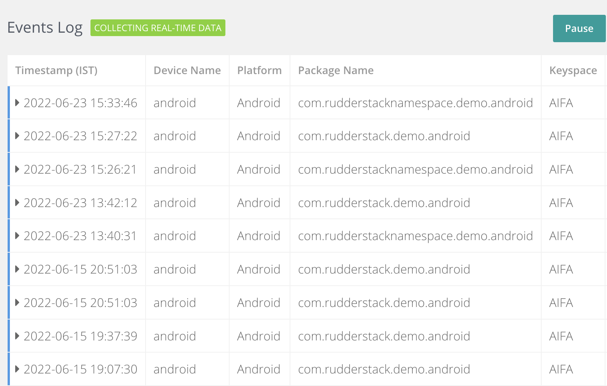

RudderStack supports server-to-server (S2S) API integration with Singular.

Refer to the <a href="https://support.singular.net/hc/en-us/articles/360048588672-Server-to-Server-S2S-API-Endpoint-Reference">Singular documentation</a> for the Singular API endpoint reference.

RudderStack supports two types of <Link to="/event-spec/standard-events/track">`track`</Link> events that you can send to Singular via the <Link to="/tmp-destinations/rudderstack-connection-modes/#cloud-mode">cloud mode</Link>:

- Session events
- Custom events

## Session events

RudderStack lets you specify the event names to be used as session events in the dashboard settings, as shown:

RudderStack sends the session events to Singular via its [`launch`](https://s2s.singular.net/api/v1/launch) API.

RudderStack considers an event as a session event only if it is specified in the dashboard settings or if it one of the following three <Link to="/event-spec/application-lifecycle-events-spec/">lifecycle events</Link>:
<ul>
  <li>Application Installed</li>
  <li>Application Opened</li>
  <li>Application Updated</li>
</ul>

RudderStack automatically tracks the above three lifecycle events if lifecycle event tracking is enabled.

### Supported mappings

This section lists the mappings of the RudderStack event properties to the relevant Singular fields.

The following table lists the mapping of the attributes **automatically captured** by RudderStack for the **mobile platforms** (<Link to="/sources/sdks/rudderstack-android-sdk/">Android</Link> and <Link to="/sources/sdks/rudderstack-ios-sdk/">iOS</Link>):

| RudderStack property | Singular attribute | Presence | Description |
| :----| :----| :----| :----| 
| `context.os.name` | `p` | Required | The source platform (Android or iOS). |
| `context.app.namespace` | `i` | Required | The package name (Android) or bundle ID (iOS) of your app. |
| `context.app.version` | `app_v` | Required | The app version. |
| `context.ip` / `request_ip` (in that order) | `ip` | Required | The user's IP address. Refer to the note below for information on anonymizing your IP. |
| `context.os.version` | `ve` | Required | The device OS version at session time. |
| `context.device.model` | `mo` | Required | The device model. This parameter must be used with the `ma` parameter. |
| `context.device.manufacturer` | `ma` | Required | The make of the device hardware. This parameter must be used with the `mo` parameter. |
| `context.locale` | `lc` | Required | The device's IETF local tag using two-lettered language and country code, separated by an underscore. |
| `context.device.id` | `idfv` | Required | The raw [`IdentifierForVendor`](https://developer.apple.com/library/ios/documentation/UIKit/Reference/UIDevice_Class/Reference/UIDevice.html#//apple_ref/occ/instp/UIDevice/identifierForVendor) in upper case with dashes. **This is applicable for iOS apps only**. |
| `context.device.id` | `andi` | Required | The raw [`Android ID`](http://developer.android.com/reference/android/provider/Settings.Secure.html#ANDROID_ID) in lower case. **This is applicable for Android apps only** and is required only when the Android advertising ID is unavailable on the device. |
| `context.app.build` | `bd` | Required | The device build (URL encoded). |
| `context.device.adTrackingEnabled` | `dnt` | Required | Pass `true` if do not track(`dnt`) is disabled (`dnt=0`), else pass `false`(`dnt=1`). This is automatically captured if you pass the advertising ID to the SDK. |
| `context.app.name` | `n` | Optional | The human-readable app name as displayed in the UI. |
| <Link to="/event-spec/standard-events/common-fields/#clock-skew-considerations"><code class="inline-code">timestamp</code></Link> | `utime` | Optional | The session time (in UNIX time). |
| `context.network.wifi` | `c` | Optional | The connection type (WiFi or carrier). |
| `context.network.carrier` | `cn` | Optional | The carrier name of the internet provider. |

To anonymize your IP, you can send a dummy IP in the <code class="inline-code">context.ip</code> field. RudderStack uses it as the IP address instead of capturing it automatically from the backend. In case of mobile SDKs, you can leverage the <Link to="/transformations">Transformations</Link> feature to do this - when sending events via the <Link to="/tmp-destinations/rudderstack-connection-modes/#cloud-mode">cloud mode</Link>.

The following table lists the mapping of the attributes that **must be passed via the event properties**:

These properties are not persisted in the SDK and must be passed with every event.

| RudderStack property | Singular attribute | Presence | Description |
| :----| :----| :----| :----|
| `properties.install_ref` | `install_ref` | Required | The Google Install Referrer Information. |
| `properties.referring_application` | `install_source` | Required | The install source package name in Android. Use [`getInitiatingPackageName()`](https://developer.android.com/reference/android/content/pm/InstallSourceInfo#getInitiatingPackageName()) to retrieve this. |
| `properties.install_receipt` | `install_receipt` | Required | The receipt received from the install. To retreive this, follow the [iOS Install Receipt](https://support.singular.net/hc/en-us/articles/360037640812#Reference_Retrieving_the_iOS_Install_Receipt) guide. |
| `properties.asid` | `asid` | Required | The App Set ID for Android v12+ devices. |
| `properties.url` | `openui` | Required | If the app is opened via a deep link/universal link, the value of the encoded deep link URL. |
| `context.device.attTrackingStatus` | `att_authorization_status` | Required | The [App Tracking Transparency authorization status](https://developer.apple.com/documentation/apptrackingtransparency/attrackingmanager/authorizationstatus). |
| `userId` | `custom_user_id` | Optional | The user ID passed through the `identify` call. |
| `properties.attribution_token` | `attribution_token` | Optional | Used to attribute Apple Search Ads for iOS 14.3 and above. More information [here](https://support.singular.net/hc/en-us/articles/360037640812#asa_adservices). |
| `properties.skan_conversion_value` | `skan_conversion_value` | Optional | The latest `SkAdNetwork` value at the time of the session notification. |
| `properties.skan_first_call_timestamp` | `skan_first_call_timestamp` | Optional | UNIX timestamp of the first call made to the `SkAdNetwork` API. |
| `properties.skan_last_call_timestamp` | `skan_last_call_timestamp` | Optional | UNIX timestamp of the last call made to the `SkAdNetwork` API at the time of the session notification. |
| `properties.install` | `install` | Optional | The install flag. Set to `true` on the first session after app install, or `false` otherwise. Required for reinstall tracking capability. |
 

The following table lists the mapping of the attributes that **must be passed via the event properties just once**:

These properties are persisted in the SDK and must be passed just once.

| RudderStack property | Singular attribute | Presence | Description |
| :----| :----| :----| :----|
| `context.device.token` | `fcm` | Optional | The Firebase Cloud Messaging Device Token. It is required for uninstall tracking in Android. |
| `context.device.token` | `apns_token` | Optional | The Apple Push Notification Service Device Token. It is required for uninstall tracking in iOS. |
| `context.device.advertisingId` | `idfa` | Required | The raw [advertising ID](https://developer.apple.com/library/ios/documentation/AdSupport/Reference/ASIdentifierManager_Ref/index.html) in upper case with dashes. **This is applicable for iOS apps only**. |
| `context.device.advertisingId`| `aifa` | Required | This is the lower case raw [advertising ID](http://support.google.com/googleplay/android-developer/answer/6048248?hl=en) with dashes. **This is applicable for Android apps only**. |

For more information on setting the device token, refer to the relevant SDK documentation:
<ul>
  <li><Link to="/sources/sdks/rudderstack-android-sdk/#setting-the-android-device-token">Android</Link></li>
  <li><Link to="sources/sdks/rudderstack-ios-sdk/#setting-the-device-token">iOS</Link></li>
</ul>

RudderStack supports only <code class="inline-code">fcm</code> for mapping the device token.

## Custom events

RudderStack sends all the events other than the session events as custom events via Singular's [`evt`](https://s2s.singular.net/api/v1/evt) endpoint.

### Supported mappings

The following table lists the mapping of the attributes **automatically captured** by RudderStack for the **mobile platforms** (<Link to="/sources/sdks/rudderstack-android-sdk/">Android</Link> and <Link to="/sources/sdks/rudderstack-ios-sdk/">iOS</Link>):

| RudderStack property | Singular attribute | Presence | Description |
| :----| :----| :----| :----| 
| `context.os.name` | `p` | Required | The source platform (Android or iOS). |
| `context.app.namespace` | `i` | Required | The package name (Android) or bundle ID (iOS) of your app. |
| `context.ip` / `request_ip` (in same order) | `ip` | Required | The user's IP address. |
| `context.device.advertisingId` | `idfa` | Required | The raw [`IdentifierForVendor`](https://developer.apple.com/library/ios/documentation/UIKit/Reference/UIDevice_Class/Reference/UIDevice.html#//apple_ref/occ/instp/UIDevice/identifierForVendor) in upper case with dashes. **This is applicable for iOS apps only**. |
| `context.device.advertisingId`| `aifa` | Required | This is the lower case raw [advertising ID](http://support.google.com/googleplay/android-developer/answer/6048248?hl=en) with dashes. **This is applicable for Android apps only**.  |
| `context.device.id` | `idfv` | Required | The raw [`IdentifierForVendor`](https://developer.apple.com/library/ios/documentation/UIKit/Reference/UIDevice_Class/Reference/UIDevice.html#//apple_ref/occ/instp/UIDevice/identifierForVendor) in upper case with dashes. **This is applicable for iOS apps only**. |
| `context.device.id` | `andi` | Required | The raw [`Android ID`](http://developer.android.com/reference/android/provider/Settings.Secure.html#ANDROID_ID) in lower case. **This is applicable for Android apps only** and is required only when the Android Advertising ID is unavailable on the device. |
| `context.os.version` | `ve` | Required | The device OS version at session time. |
| <Link to="/event-spec/standard-events/common-fields/#clock-skew-considerations"><code class="inline-code">timestamp</code></Link> | `utime` | Optional | The session time (in UNIX time). |

Singular prefers <code class="inline-code">aifa</code> over <code class="inline-code">andi</code> (in Android) and <code class="inline-code">idfa</code> over <code class="inline-code">idfv</code> (in iOS).

The following table lists the mapping of the attributes that **must be passed via the event properties**:

| RudderStack property | Singular attribute | Presence | Description |
| :----| :----| :----| :----|
| `event` | `n` | Required | The name of the event. **This is user-defined**. |
| `context.device.attTrackingStatus` | `att_authorization_status` | Required | The [App Tracking Transparency authorization status](https://developer.apple.com/documentation/apptrackingtransparency/attrackingmanager/authorizationstatus). |
| `userId` | `custom_user_id` | Optional | The user ID passed through the `identify` call. |
| `properties.skan_conversion_value` | `skan_conversion_value` | Optional | The latest `SkAdNetwork` value at the time of the session notification. |
| `properties.skan_first_call_timestamp` | `skan_first_call_timestamp` | Optional | UNIX timestamp of the first call made to the `SkAdNetwork` API. |
| `properties.skan_last_call_timestamp` | `skan_last_call_timestamp` | Optional | UNIX timestamp of the last call made to the `SkAdNetwork` API at the time of the session notification. |
| `properties.eventAttributes` | `e` | Optional | The custom event attributes in JSON format. You need to pass these with every event as they are not persisted in the SDK. |
| `properties.is_revenue_event` | `is_revenue_event` | Optional | Determines if an event is a revenue event. You need to pass this through the properties with every event as it is not persisted in the SDK. |

The following table lists the mapping of the **user-defined attributes specific to revenue events**:

| RudderStack property | Singular attribute | Presence | Description |
| :----| :----| :----| :----|
| `properties.total`/ `properties.value` / `properties.revenue` | `amt` | Optional | The currency amount. |
| `properties.currency` | `cur` | Optional | The ISO 4217 three-lettered currency code. This should be in conjunction with the `amt` parameter. |
| `properties.purchase_receipt` | `purchase_receipt` | Optional | The receipt received from a purchase. |
| `properties.product_id`/`properties.sku` | `purchase_product_id` | Optional | The product SKU identifier. |
| `properties.orderId` / `properties.purchase_transaction_id` (in that order) | `purchase_transaction_id` | Optional | The transaction identifier. |

If you set any one out of the <code class="inline-code">value</code>, <code class="inline-code">revenue</code>, or <code class="inline-code">total</code> properties, RudderStack automatically considers the event as a revenue event, unless it is explicitly mentioned by the <code class="inline-code">is_revenue_event</code> property.

A few important considerations in case of custom events are listed below:

- RudderStack takes the user agent from `context.userAgent` for Android and from the event properties in case of iOS.
- RudderStack stores the extra attributes passed in the custom event in Singular's `e` field.

## FAQ

### How can I verify if the events are successfully delivered to Singular?

To verify if the events are successfully delivered to Singular, you can use RudderStack's <Link to="/rudderstack-cloud/live-events/#destination-live-events">Destination live events</Link> feature.

You can also verify the event delivery by going to your [Singular dashboard](https://app.singular.net/login?redir=%2F#/) and following these steps:

1. Go to **Settings** > **Console**. You should see a list of tracked devices, as shown:

2. To add a new device, click on the **Add Device** option and choose the relevant settings:

3. Finally, click on the eye icon associated with the tracked device to start seeing the events in real-time.

You should be able to see a real-time log of all the events sent to Singular, as shown:

For more customizable and granular reports, you can go to <strong>Attribution</strong> > <strong>Export Logs</strong> in the Singular dashboard. Note that this report is not real-time and takes some time to generate.

## Contact us

For queries on any of the sections covered in this guide, you can [contact us](mailto:%20docs@rudderstack.com) or start a conversation in our [Slack](https://rudderstack.com/join-rudderstack-slack-community) community.