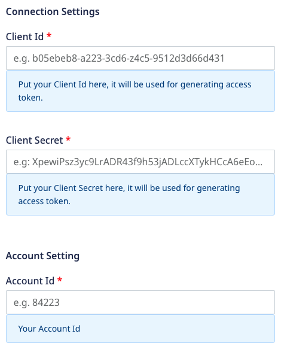

[Yahoo demand-side platform (DSP)](https://www.adtech.yahooinc.com/advertising/solutions/dsp) (formerly Verizon Media) provides a unified solution to advertisers to programmatically monitor, create, and manage advertising campaigns.

RudderStack supports Yahoo DSP as a destination where you can send your event data seamlessly.

<div class="infoBlock">
Find the open source transformer code for this destination in the <a href="https://github.com/rudderlabs/rudder-transformer/tree/master/v0/destinations/yahoo_dsp">GitHub repository</a>.
</div>

## Getting started

Before configuring Yahoo DSP as a destination in RudderStack, verify if the source platform is supported by referring to the table below:

| **Connection Mode** | **Web**       | **Mobile**    | **Server**    |
| :------------------ | :------------ | :------------ | :------------ |
| **Device mode**     |  -            | -             | -             |
| **Cloud mode**      |  -            | -             |  **Supported** |

<div class="infoBlock">
To know more about the difference between cloud mode and device mode in RudderStack, refer to the <Link to="/tmp-destinations/rudderstack-connection-modes/">RudderStack Connection Modes</Link> guide.
</div>

Once you have confirmed that the source platform supports sending events to Yahoo DSP, follow these steps:

1. From your [RudderStack dashboard](https://app.rudderstack.com/), add the source. Then, from the list of destinations, select **Yahoo DSP**.
2. Assign a name to your destination and click on **Continue**.

## Connection settings

To successfully configure Yahoo DSP as a destination, configure the following settings:




- **Client ID**: Enter the client ID from your Yahoo DSP account.
- **Client Secret**: Enter the client secret from your Yahoo DSP account.

<div class="infoBlock">
Refer to the <a href="https://developer.yahooinc.com/dsp/api/docs/authentication/vmdn-auth-overview.html#get-your-id">Yahoo DSP documentation</a> for more information on how to obtain the Client ID and Client Secret.
</div>

- **Account ID**: Enter the Advertiser ID linked with your audience type.
- **Audience Type**: Specify the type of the audience you want to update by choosing `email`, `device ID`, or `IP Address` from the dropdown. The default audience type is `email`.

  If you select the audience type as `device ID`, also choose the **Seed List Type** as shown:
  

- **Audience ID**: Enter the ID of the created audience.

<div class="infoBlock">
Refer to the <Link to="#faq">FAQ</Link> section for more information on how to obtain Account ID and Audience ID.
</div>

- **Hash Required**: This setting hash-encodes the user data and is enabled by default. However, you can disable it to prevent hashing.

## `audiencelist` event structure

The following code snippet shows a sample `audienceList` call for `email` audience type:

```json
{
    "type": "audiencelist",
    "properties": {
        "listData": {
            "add": [{
                    "email": 'alex@example.com'
                },
                {
                    "email": 'john@example.com'
                }
            ]
        }
    }
}
```

The following code snippet shows a sample `audienceList` call for `deviceId` audience type:

```json
{
    "type": "audiencelist",
    "properties": {
        "listData": {
            "add": [{
                    "deviceId": '34A668B2-03CF-11E5-8418-1697F925EC7B'
                },
                {
                    "deviceId": '34a66c5e-03cf-11e5-8418-1697f925ec7b'
                }
            ]
        }
    }
}
```

The following code snippet shows a sample `audienceList` call for `ipAddress` audience type:

```json
{
    "type": "audiencelist",
    "properties": {
        "listData": {
            "add": [{
                    "ipAddress": '10.1.7.237'
                },
                {
                    "ipAddress": '10.1.7.238'
                }
            ]
        }
    }
}
```

<div class="infoBlock">
You can send up to 50,000 <code class="inline-code">email</code>, <code class="inline-code">deviceId</code>, or <code class="inline-code">ipAddress</code> fields within one API call.
</div>

<div class="warningBlock">
<code class="inline-code">remove</code> method is not supported in the <code class="inline-code">listData</code>.
</div>

## FAQ

### How do I obtain the Account ID?

The Account ID in the connection settings is the Advertiser ID associted with your Yahoo DSP account. To obtain it:

1. Log into your [Yahoo DSP](https://id.b2b.yahooinc.com/identity/XUI/#login/&realm=%2Fdsp&goto=https%3A%2F%2Fid.b2b.yahooinc.com%2Fidentity%2Foauth2%2Fauthorize%3Frealm%3D%252Fdsp%26nonce%3Dm2uitpzW4R1xm6GezTdVpNRD%26state%3DZ5D6wc5CvqnlYm0pZsv4f8t5%26response_type%3Dcode%26scope%3Dopenid%2520profile%2520email%26client_id%3Db743c250-2149-4c47-aed1-31a477359099%26redirect_uri%3Dhttps%253A%252F%252Fdeveloper.yahooinc.com%252Foidc%252Fredirect) account.
2. Select **Advertisers** and click on the relevant advertiser to get the Advertiser ID as shown:


### How do I create an audience?

To create an audience, follow these steps:

1. Log into your [Yahoo DSP](https://id.b2b.yahooinc.com/identity/XUI/#login/&realm=%2Fdsp&goto=https%3A%2F%2Fid.b2b.yahooinc.com%2Fidentity%2Foauth2%2Fauthorize%3Frealm%3D%252Fdsp%26nonce%3Dm2uitpzW4R1xm6GezTdVpNRD%26state%3DZ5D6wc5CvqnlYm0pZsv4f8t5%26response_type%3Dcode%26scope%3Dopenid%2520profile%2520email%26client_id%3Db743c250-2149-4c47-aed1-31a477359099%26redirect_uri%3Dhttps%253A%252F%252Fdeveloper.yahooinc.com%252Foidc%252Fredirect) account
2. Select **Advertisers** and choose the relevant advertiser.
3. Select **Targeting Library** > **New Custom Audience** to create the required audience as shown:


### How do I obtain the Audience ID?

To obtain the Audience ID, follow these steps:

1. Log into your [Yahoo DSP](https://id.b2b.yahooinc.com/identity/XUI/#login/&realm=%2Fdsp&goto=https%3A%2F%2Fid.b2b.yahooinc.com%2Fidentity%2Foauth2%2Fauthorize%3Frealm%3D%252Fdsp%26nonce%3Dm2uitpzW4R1xm6GezTdVpNRD%26state%3DZ5D6wc5CvqnlYm0pZsv4f8t5%26response_type%3Dcode%26scope%3Dopenid%2520profile%2520email%26client_id%3Db743c250-2149-4c47-aed1-31a477359099%26redirect_uri%3Dhttps%253A%252F%252Fdeveloper.yahooinc.com%252Foidc%252Fredirect) account.
2. Select **Audiences** and use the ID for relevant audience.


## Contact us

For queries on any of the sections covered in this guide, you can [contact us](mailto:%20docs@rudderstack.com) or start a conversation in our [Slack](https://rudderstack.com/join-rudderstack-slack-community) community.
