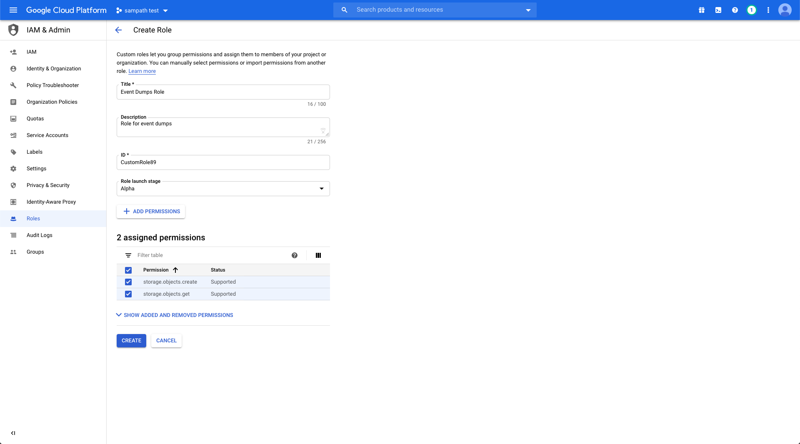
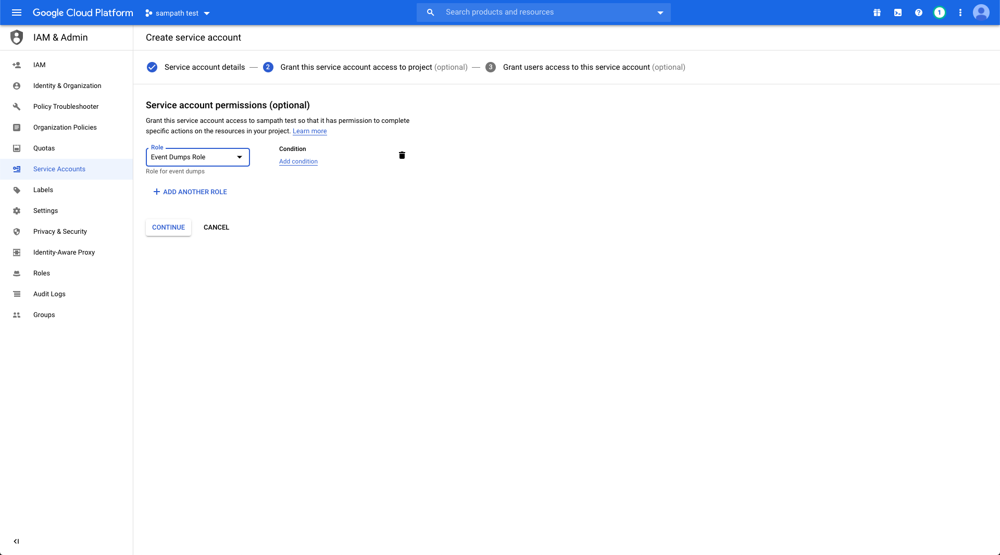
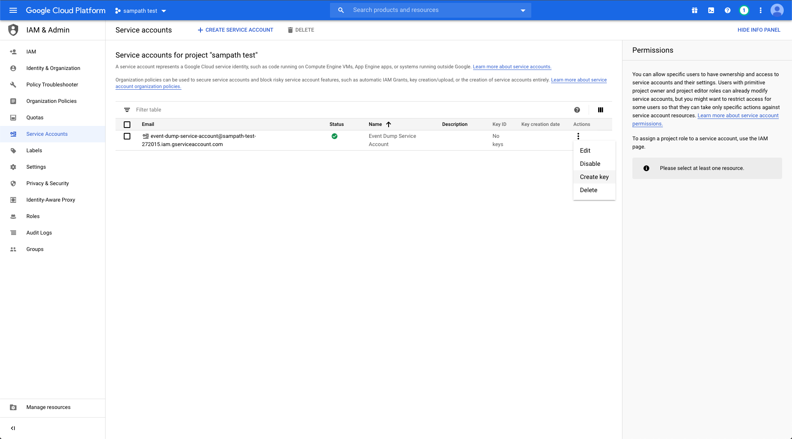
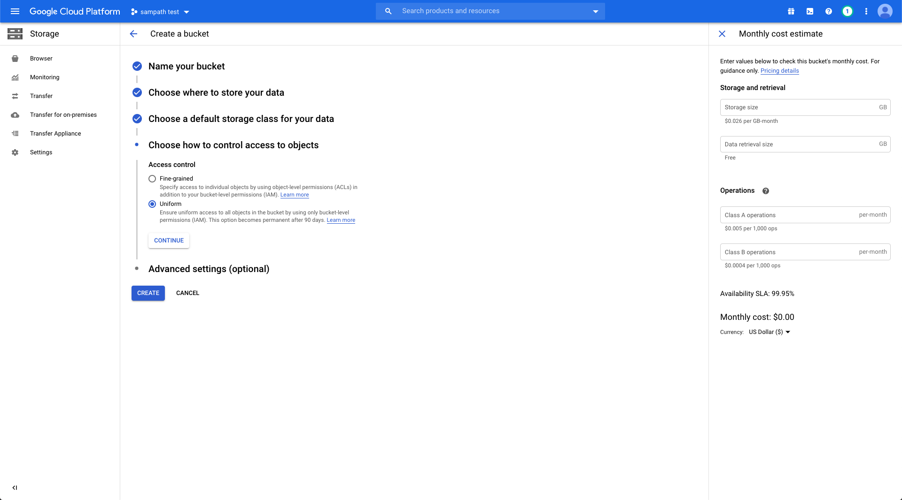
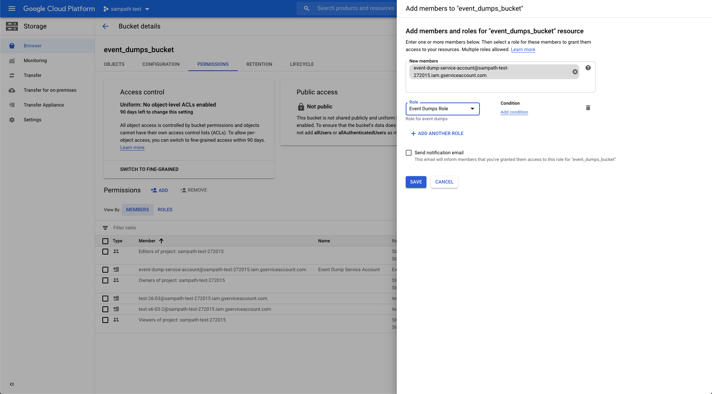

# Bucket Configuration Settings for Event Backups

RudderStack stores the following two types of events into its cloud-specific bucket:

* All the raw events ingested by RudderStack are stored.
* In case of delivery failures, the final event payload along with the error is stored.

<div class="successBlock">

The events are deleted from the bucket upon successful delivery of the events. **RudderStack does not persist any of the customer data**.
</div>

Follow the steps in this guide if you want RudderStack to back up the events in your **own** cloud-specific bucket.

## Bucket Configuration Settings

If you are using **open-source RudderStack** and want to use your own bucket to dump the events, you will need to enable and set certain variables in your RudderStack backend.

### Docker Setup

#### Dumping events into your S3 bucket

To capture the event dumps in your S3 bucket, uncomment the following lines in your [**docker.env**](https://github.com/rudderlabs/rudder-server/blob/master/build/docker.env#L45-L50) file: 

```
# JOBS_BACKUP_STORAGE_PROVIDER=S3
# JOBS_BACKUP_BUCKET=<your_s3_bucket>
# JOBS_BACKUP_PREFIX=<prefix>
# AWS_ACCESS_KEY_ID=
# AWS_SECRET_ACCESS_KEY=
```

Then follow these steps:

* Specify your S3 bucket name for the variable `JOBS_BACKUP_BUCKET`.
* Add the specific AWS IAM keys by following the [**Permissions for Amazon S3**](https://rudderstack.com/docs/user-guides/administrators-guide/bucket-configuration-settings#permissions-for-amazon-s3) section below.

<div class="infoBlock">

The <code class="inline-code">&lt;prefix&gt;</code> value for the **<code class="inline-code">JOBS_BACKUP_PREFIX</code>** variable refers to the path under the bucket in which RudderStack dumps the data. 
For example, if **<code class="inline-code">JOBS_BACKUP_PREFIX</code>** s set to **<code class="inline-code">prefix</code>**  then RudderStack dumps the data in the location **<code class="inline-code">&lt;your_s3_bucket&gt;/prefix</code>** 
</div>

<div class="successBlock">

**If you're a RudderStack Pro/Enterprise user, you can share the Access Key ID and Secret Access Key with the RudderStack team by <a href="https://rudderstack.com/join-rudderstack-slack-community">contacting us</a>.**

The RudderStack team will then use the above credentials to authenticate RudderStack and enable it to back up events into your S3 bucket.
</div>

#### Dumping events into your GCS bucket

To capture the event dumps in your GCS bucket, uncomment the following lines in your [**docker.env**](https://github.com/rudderlabs/rudder-server/blob/master/build/docker.env#L45-L50) file: 

```
# JOBS_BACKUP_STORAGE_PROVIDER=GCS
# JOBS_BACKUP_BUCKET=<your_gcs_bucket>
# JOBS_BACKUP_PREFIX=<prefix>
# GOOGLE_APPLICATION_CREDENTIALS=/path/to/credentials
```

Then, follow these steps:

* Specify your GCS bucket name for the variable `JOBS_BACKUP_BUCKET`.
* Specify the location of the downloaded JSON file containing the required permissions for the variable `GOOGLE_APPLICATION_CREDENTIALS`. You can obtain this JSON file by referring to the [**Permissions for GCS**](https://rudderstack.com/docs/user-guides/administrators-guide/bucket-configuration-settings#permissions-for-gcs) section below.

<div class="successBlock">

**If you're a RudderStack Pro/Enterprise user, you can share the downloaded JSON containing the required permissions with the RudderStack team by <a href="https://rudderstack.com/join-rudderstack-slack-community">contacting us</a>**.

The RudderStack team will then use this service account JSON file to authenticate RudderStack and dump the events into your GCS bucket.
</div>

### Kubernetes Setup

Similar to the Docker setup, you can configure your bucket settings by changing the values in the [**values.yaml**](https://github.com/rudderlabs/rudderstack-helm/blob/master/values.yaml#L87) file.

## Permissions for Amazon S3

To use your own S3 bucket for RudderStack to dump the events, you need to perform the following steps: 

* Create a bucket using the Amazon [**S3**](https://aws.amazon.com/s3/) service.  
* Create a new customer-managed [**policy**](https://docs.aws.amazon.com/IAM/latest/UserGuide/tutorial_managed-policies.html) with the following JSON:

```
{
    "Version": "2012-10-17",
    "Statement": [
        {
            "Effect": "Allow",
            "Action": [
                "s3:PutObject",
                "s3:AbortMultipartUpload"
            ],
            "Resource": "arn:aws:s3:::{BUCKET_NAME}/*"
        }
    ]
}
```

* Create a new group and add the policy created above to this group. 
* Create a new [**user**](https://docs.aws.amazon.com/IAM/latest/UserGuide/id_users_create.html) in [**Identity and Access Management \(IAM\)**](https://console.aws.amazon.com/iam) with the programmatic access and add the user to the above created group. 
* Download and note the **Access key ID** and **Secret Access Key**.

## Permissions for GCS

To use your own GCS bucket for RudderStack to dump the events, you need to perform the following steps: 

* Under **Roles** in your GCP dashboard, create a role with the following permissions: 
  * **storage.objects.create**
  * **storage.objects.get**

<div class="infoBlock">

We recommend adding each permission one after the other.
</div>

<!---->



Then, create a service account by following the steps below:

* Assign a name to the service account, as shown:

<!-- -->


* Add the role you created in the step above.

<!---->



* Create a key with the type JSON and save this file locally, as shown:

<!---->




* Then, create a bucket with the bucket access control set to **Uniform**, as shown:

<!---->




Once the bucket is created, add the required permissions to it by following the steps below:

* Go to the **Permissions** tab.
* Then, add the member with the service account created above.
* Add the role created above.

<!---->



* Finally the download the JSON file containing the required permissions.

## Contact Us

For more information on any of the sections covered in this guide, you can you can [**contact us**](mailto:%20docs@rudderstack.com) or start a conversation in our [**Slack**](https://rudderstack.com/join-rudderstack-slack-community) community.
