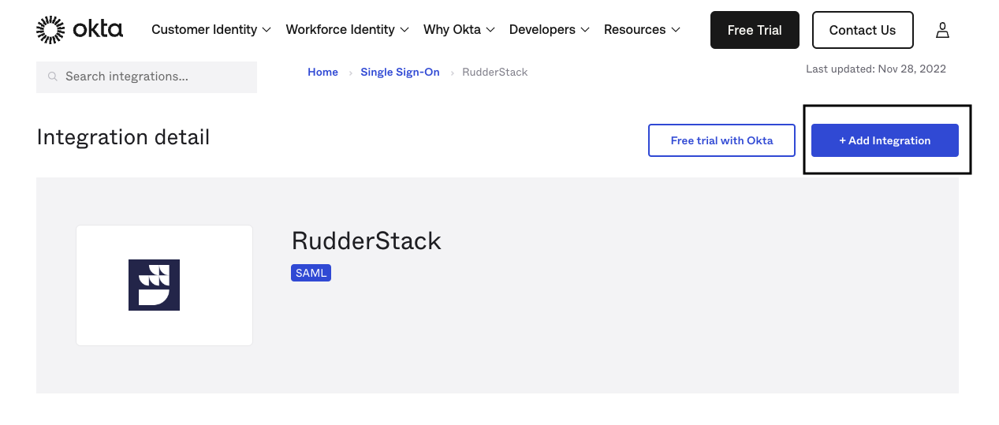
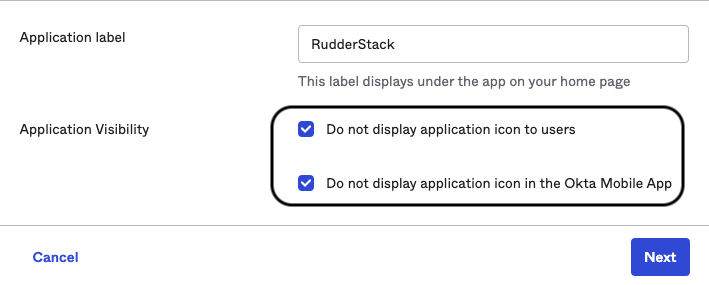
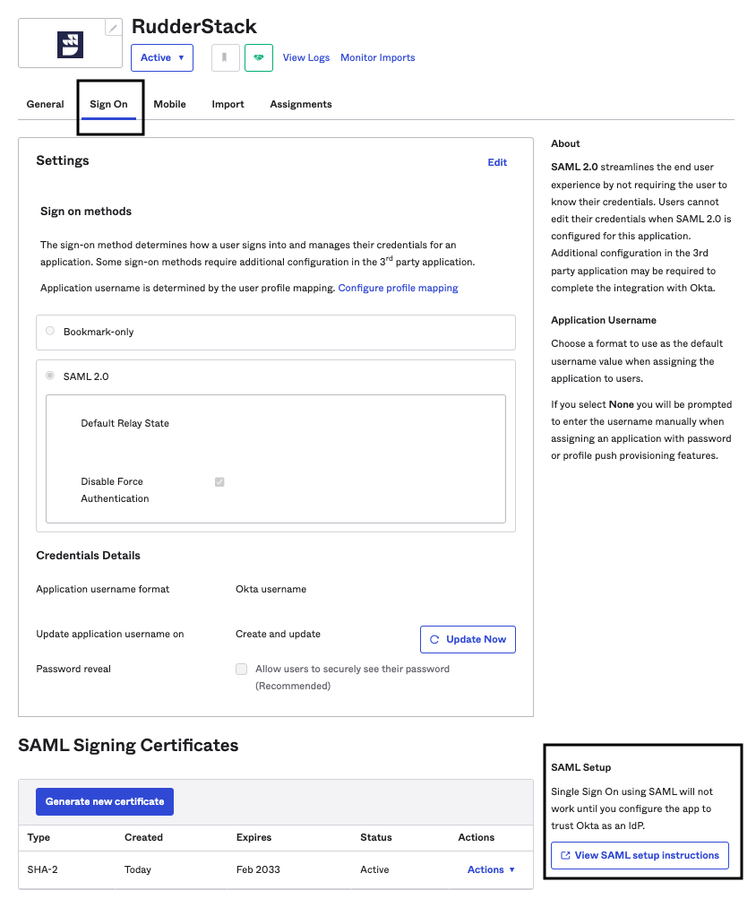
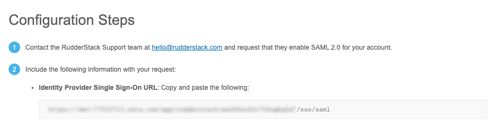
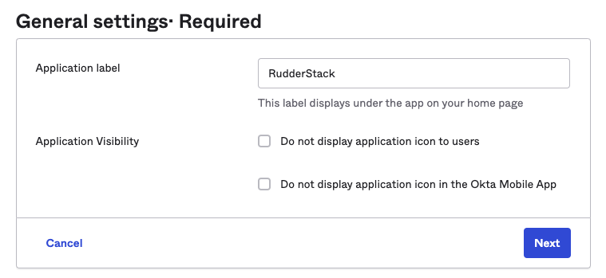
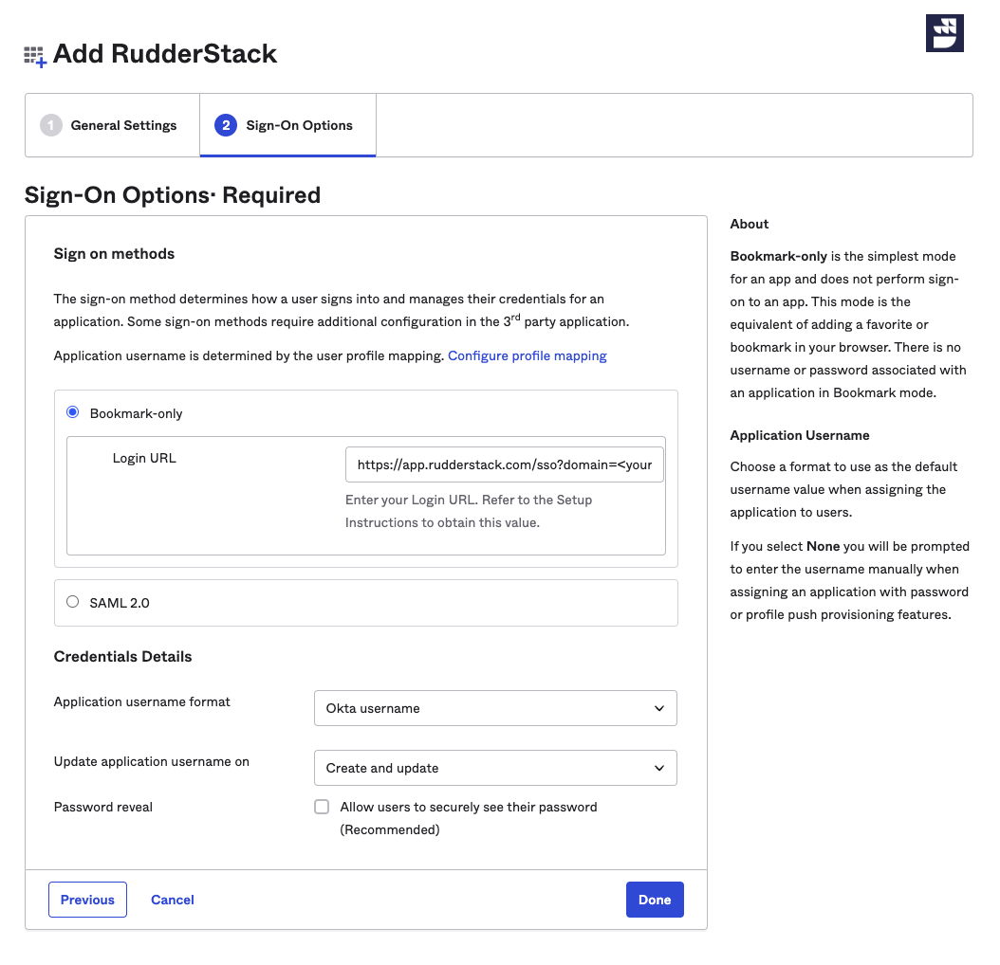

The <a href="https://www.okta.com/integrations/rudderstack/">Okta RudderStack app</a> is available on the **Okta Integration Network (OIN)**. This guide lists the steps to set up the integration.

<GhBadge
  url={'https://rudderstack.com/enterprise-quote'}
  label={'Plan'}
  message={'Enterprise'}
  color={'blueviolet'}
/>

To manually configure and enable Okta SSO for your organization, refer to the <Link to="/user-guides/administrators-guide/okta-sso/manual-setup/">Manual Setup</Link> guide. 

## Step 1: Add the RudderStack SSO SAML 2.0 app

1. Log in to Okta as an administrator.
2. Go to the [RudderStack SSO integration page](https://www.okta.com/integrations/rudderstack/). Then, click **Add Integration**, as shown:

3. Select the account under **Choose an account**.
4. Set the **Application Label** (your preferred application name) and the **Application Visibility**, as shown. Then, click **Next**.

Check the <strong>Do not display application icon to users</strong> and <strong>Do not display application icon in the Okta Mobile App</strong> settings as this app need not be visible to your users.

5. Under **Sign on methods**, choose **SAML 2.0**. Retain the rest of the settings and click **Done**. 

## Step 2: Configure SAML 2.0 for RudderStack

1. In your Okta dashboard, go to **Applications** and select the application you configured above.
2. Go to the **Sign On** tab and click the **View SAML setup instructions** button, as shown:

3. In the **Configuration Steps** section of the guide, copy the **Identity Provider Single Sign-On URL** present in **Step 2**, as shown:

4. Share this URL with the [RudderStack team](mailto:hello@rudderstack.com) to enable SAML 2.0 for your account.

## Step 3: Add the RudderStack SSO Bookmark app

Your users will use this app to quickly access the RudderStack web app using the SSO functionality.

1. Go to the [RudderStack SSO integration page](https://www.okta.com/integrations/rudderstack/). Then, click **Add Integration**, as shown:

2. Set the **Application Label** that you set previously. Then, click **Next**.

Do not check the <strong>Do not display application icon to users</strong> and <strong>Do not display application icon in the Okta Mobile App</strong> settings as this app will be visible to your users.

3. Under **Sign on methods**, choose **Bookmark-only**. Set the **Login URL** to `https://app.rudderstack.com/sso?domain=<your_website>.com`, where `<your_website>` is your organizaiton's web domain. Retain the rest of the settings and click **Done**. 

