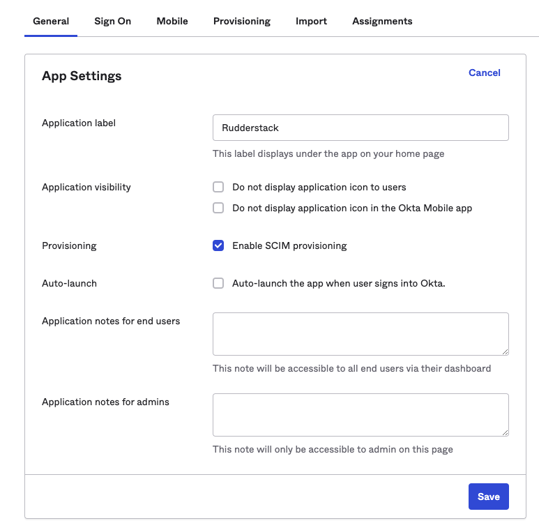
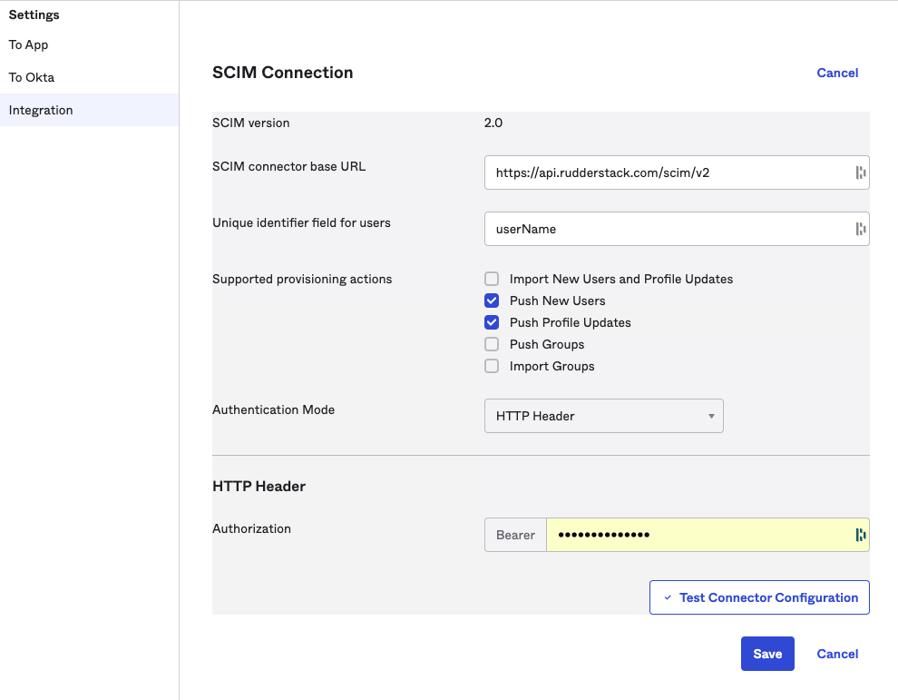
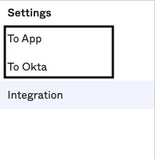
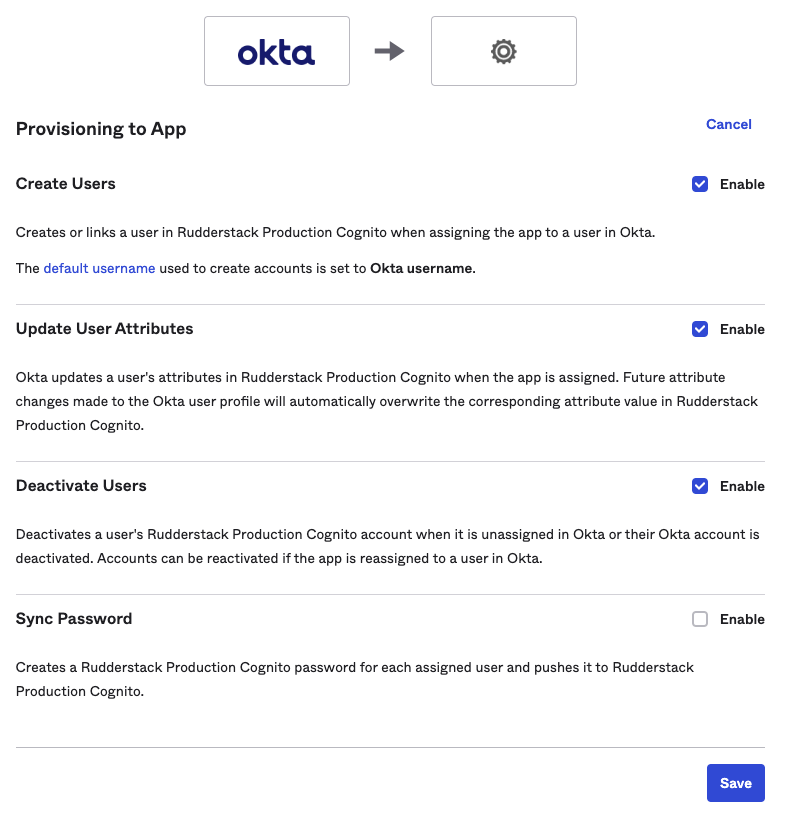
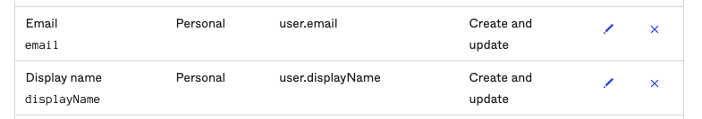
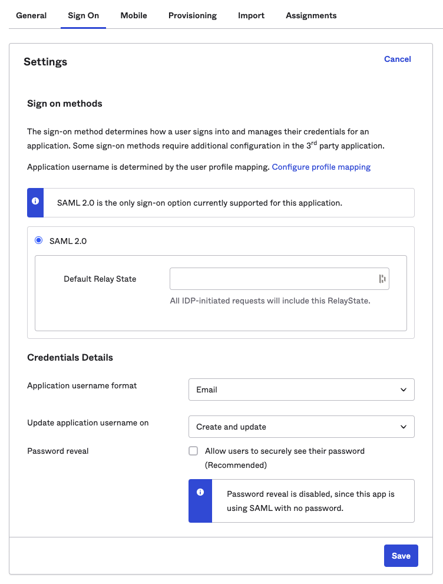

This guide lists the steps to **manually** configure and enable Okta SSO for your organization.

RudderStack does not support IdP-initiated authentication. To use Okta SSO for your organization, you need to log in through <a href="https://app.rudderstack.com/sso">this link</a>.

<GhBadge
  url={'https://rudderstack.com/enterprise-quote'}
  label={'Plan'}
  message={'Enterprise'}
  color={'blueviolet'}
/>

## Configuring the RudderStack SSO App

1. Log into your Okta application as an **administrator**. Then, go to the **Applications** page in the dashboard.
2. Click the **Create App Integration** button to integrate Okta with RudderStack, as shown:

3. Select **SAML 2.0** sign-in method, as shown:

4. Under **General Settings**, set the **App name** to **RudderStack**, as shown. Then, click **Next**.

### SAML settings

Enter the following settings in the **Configure SAML** section:

- **Single sign on URL**: Set this to `https://auth2.rudderstack.com/saml2/idpresponse`. 

Make sure you also enable the <strong>Use this for Recipient URL and Destination URL</strong> option under this setting.

- **Audience URI (SP Entity ID)**: Set this to `urn:amazon:cognito:sp:us-east-1_ABZiTjXia`.
- **Default RelayState**: Leave this field blank.
- **Name ID format**: Select **Unspecified** from the dropdown.
- **Application username**: Select **Okta username** from the dropdown.
- **Update application username on**: Select **Create and update** from the dropdown.

### Attribute Statements settings

In the **Attribute Statements** section, you need to enter the following settings:

| Name              | Name format (optional) | Default value            | Comments |
| :---------------- | :----------------------- | :--------------- | :-----|
| Email         | Unspecified              | `user.email` | Set the value corresponding to **your organization's** user email. |
| LastName          | Unspecified              | `user.lastName`  |  Although `user.lastName` is recommended, you can provide any other value here. | 

As long as the attributes you set match the <strong>Email</strong> and <strong>LastName</strong> fields, your SSO should work without any issues.

In the next page, select the **I'm an Okta customer adding an internal app** option and click **Finish**.

The RudderStack Single Sign-On app is now created and you will be directed to the app's page.

## Enabling SSO

The RudderStack SSO app supports dynamic configuration. 

In the **Sign On** section of the RudderStack SSO app, right click and copy the URL associated with **Identity Provider metadata** under the **View Setup Instructions** button, as shown in the below image. 

Share this URL with the RudderStack team to enable SSO for your organization.

The <strong>Identity Provider metadata</strong> URL ends with <code class="inline-code">/metadata</code>.

## SCIM configuration steps

You can automatically grant RudderStack access to your users by configuring [SCIM provisioning](https://www.okta.com/blog/2017/01/what-is-scim/) in Okta.

Before setting up the SCIM provisioning, make sure you first generate a <Link to="/dashboard-guides/personal-access-token/">personal access token</Link> with <Link to="/dashboard-guides/user-management/#admin">Admin</Link> role. Otherwise, your SCIM provisioning tasks will fail.

1. Log in to Okta as an administrator.
2. In the sidebar, go to **Applications** > **Applications** and select your SSO app.
3. Go to the **General** tab, click **Edit** and check the **Enable SCIM provisioning** option, as shown: 

4. A new tab called **Provisioning** will now be visible in the app settings. Go to **Integration**, click **Edit** and enter the following details:

| Setting | Value |
| :------| :-------|
| SCIM connector base URL | `https://api.rudderstack.com/scim/v2` |
| Unique identifier field for users | `userName` |
| Supported provisioning actions | Check the following settings:   <ul><li>Push New Users</li><li>Push Profile Updates</li></ul> |
| Authentication Mode | `HTTP Header` |

5. Under **HTTP Header**, paste your personal access token that you generated in the <Link to="#requirements">Requirements</Link> section above.
6. Click **Save**. Okta will send a test request to verify the configuration.
7. Once the verification is complete, you will be able to see two new options, **To App** and **To Okta**, in the **Settings** sidebar, as shown:

8. Go to the **To App** settings and click **Edit**. Then, enable the following **Provisioning to App** settings:

9. Scroll down to the attribute mappings section and click **Show Unmapped Attributes**. 
10. Unmap all the attributes one by one by clicking the **X** icon, **except** the following mandatory attributes:
    - **Display name**
    - **Email**

When Okta sends a request to create a user, it assumes that the update has failed if the response does not contain the details of the mapped attributes. Hence, you must unmap all the attributes except <strong>Display name</strong> and <strong>Email</strong>.

11. For **Display name** and **Email**, click the edit icon and set the  **Apply on** field to **Create and update**.  

The <strong>Value</strong> fields for <strong>Display name</strong> and <strong>Email</strong> may vary depending on how you have set up your Okta app.

12. Click **Save** to finish the configuration.
13. Go back to your app settings, click the **Sign On** tab and click **Edit**.
14. Under **Credentials Details**, set **Application username format** to **Email**, as shown:

15. Finally, click **Save**.

RudderStack currently does not support some SCIM features like importing users or groups, removing users, or snycing passwords. Refer to the <Link to="/user-guides/administrators-guide/okta-sso/scim-configuration#known-issues">Known issues</Link> section for more information.

