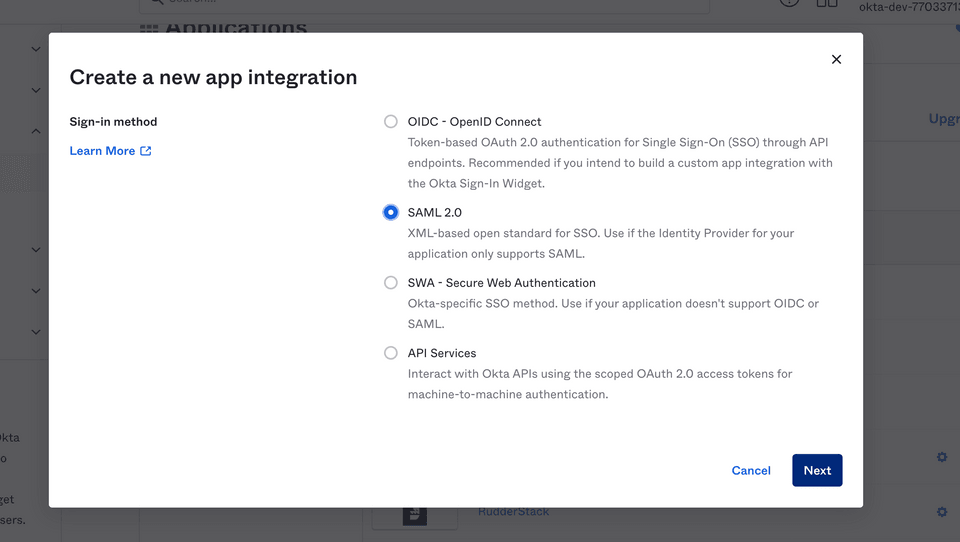
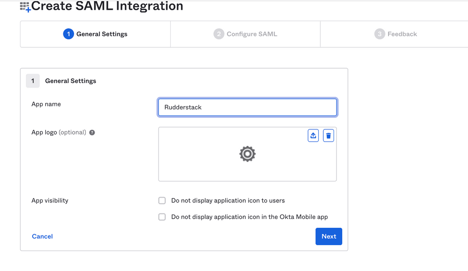
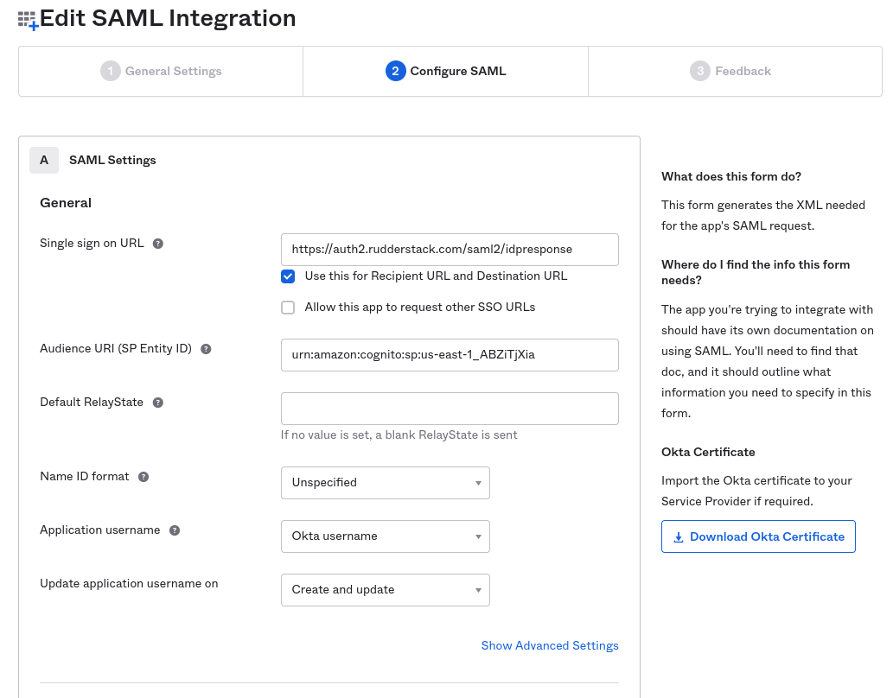
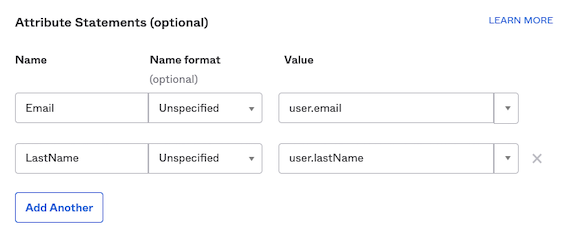
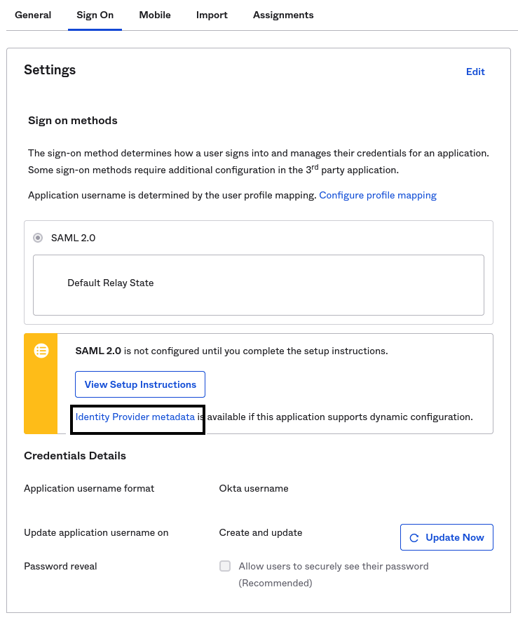

This guide lists the steps to **manually** configure and enable Okta SSO for your organization.

RudderStack does not support IdP-initiated authentication. To use Okta SSO for your organization, you need to log in through [this link](https://app.rudderstack.com/sso).

<GhBadge
  url={'https://rudderstack.com/enterprise-quote'}
  label={'Plan'}
  message={'Enterprise'}
  color={'blueviolet'}
/>

## Configuring the RudderStack SSO App

1. Log into your Okta application as an **administrator**. Then, go to the **Applications** page in the dashboard.
2. Click the **Create App Integration** button to integrate Okta with RudderStack, as shown:

3. Select **SAML 2.0** sign-in method, as shown:

4. Under **General Settings**, set the **App name** to **RudderStack**, as shown. Then, click **Next**.

### SAML settings

Enter the following settings in the **Configure SAML** section:

- **Single sign on URL**: Set this to `https://auth2.rudderstack.com/saml2/idpresponse`. 

Make sure you also enable the <strong>Use this for Recipient URL and Destination URL</strong> option under this setting.

- **Audience URI (SP Entity ID)**: Set this to `urn:amazon:cognito:sp:us-east-1_ABZiTjXia`.
- **Default RelayState**: Leave this field blank.
- **Name ID format**: Select **Unspecified** from the dropdown.
- **Application username**: Select **Okta username** from the dropdown.
- **Update application username on**: Select **Create and update** from the dropdown.

### Attribute Statements settings

In the **Attribute Statements** section, you need to enter the following settings:

| Name              | Name format (optional) | Default value            | Comments |
| :---------------- | :----------------------- | :--------------- | :-----|
| Email         | Unspecified              | `user.email` | Set the value corresponding to **your organization's** user email. |
| LastName          | Unspecified              | `user.lastName`  |  Although `user.lastName` is recommended, you can provide any other value here. | 

As long as the attributes you set match the <strong>Email</strong> and <strong>LastName</strong> fields, your SSO should work without any issues.

In the next page, select the **I'm an Okta customer adding an internal app** option and click **Finish**.

The RudderStack Single Sign-On app is now created and you will be directed to the app's page.

## Enabling SSO

The RudderStack SSO app supports dynamic configuration. 

In the **Sign On** section of the RudderStack SSO app, right click and copy the URL associated with **Identity Provider metadata** under the **View Setup Instructions** button, as shown in the below image. 

Share this URL with the RudderStack team to enable SSO for your organization.

The <strong>Identity Provider metadata</strong> URL ends with <code class="inline-code">/metadata</code>.

