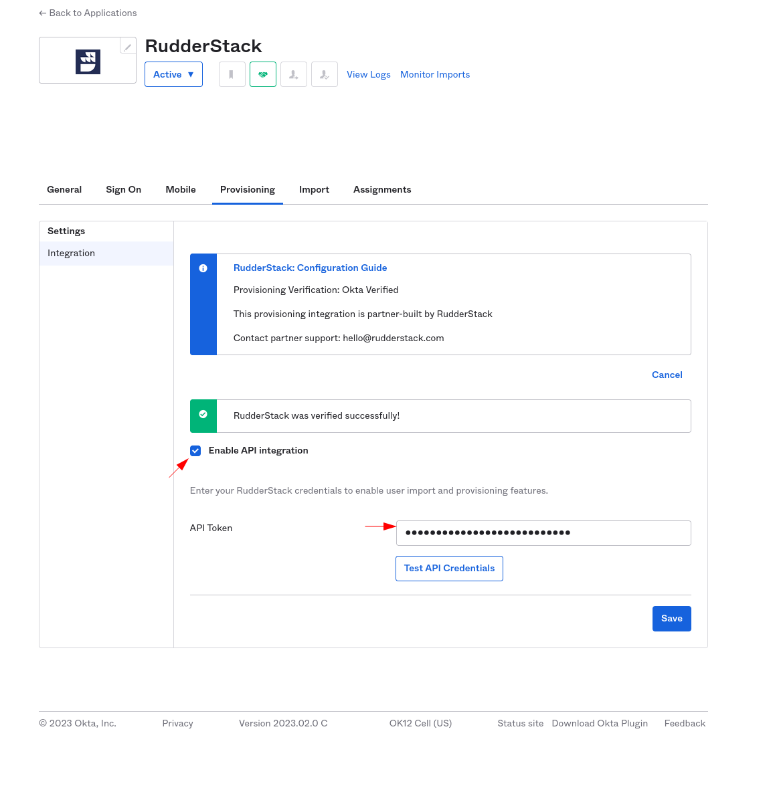

This guide lets you configure Okta's [SCIM provisioning](https://www.okta.com/blog/2017/01/what-is-scim/) feature to automatically grant RudderStack access to your users.  It is divided into the following sections:

- [Supported features](#supported-features)
- [Requirements](#requirements)
- [Configuration steps](#configuration-steps)
- [Known issues](#known-issues)

## Supported features

Currently, RudderStack supports the following provisioning features:

- **Push users**: You can create or link a user in RudderStack when assigning the app to a user in Okta.
- **Update user attributes**: Okta updates a user's attributes in RudderStack when the app is assigned to them. Note that any future attribute changes made to the Okta user's profile will automatically overwrite the corresponding attribute value in RudderStack.

Currently, you can only update the user's display name. Updating the email is not supported.

- **Deactivate/reactivate users**: This feature deactivates a user's RudderStack account when it is unassigned in Okta or their Okta account is deactivated. To reactivate the account, you can reassign the app to the user in Okta.

When a user is deactivated through SCIM, RudderStack does not delete the user from its database; it only revokes their organization user role leading to the loss of their workspace access.

## Requirements

To configure the SCIM app, you need a <Link to="/dashboard-guides/personal-access-token/">personal access token</Link> with **admin privileges**.

Follow these steps to create a new personal access token:

1. Log in to the RudderStack workspace you want to enable SCIM for. Note that your role in the organization must of the <Link to="/dashboard-guides/user-management/#admin">Admin</Link> type.
2. Go to **Settings** > **Account** tab and scroll down to **Personal access tokens**. Then, click **Generate new token**, as shown:

3. Enter the token name and select **Admin** from the **Role** dropdown.

Set an appropriate name for the token as it will be used for configuring SCIM.

4. Click **Generate** and save the token securely. It will **not** be visible again once you close this window.

Make sure your user role and personal access token have <Link to="/dashboard-guides/user-management/#admin">Admin</Link> privileges, otherwise your SCIM provisioning tasks will fail.

## Configuration steps

1. Log in to Okta as an administrator.
2. In the sidebar, go to **Applications** > **Applications** and select your SSO app.
3. In the app settings, go to the **Provisioning** tab and check the **Enable API Integration** setting.
4. In the **API Token** field, enter the personal access token you generated above.

5. Click **Save** to finish the configuration.

## Known issues

Currently, RudderStack does not support the following SCIM features:

- Import users
- Import groups
- Push groups (will be supported in the future)
- Remove users
- Sync password
- Enhanced group push

RudderStack does not support removing users. This is because it uses SCIM with SAML, where removing a user from Okta implies that they also lose the ability to authenticate to RudderStack completely (logins via passwords, Google, etc. are completely blocked). Instead, RudderStack supports deactivating the user which means they only lose access to the workspace.

