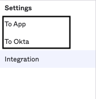
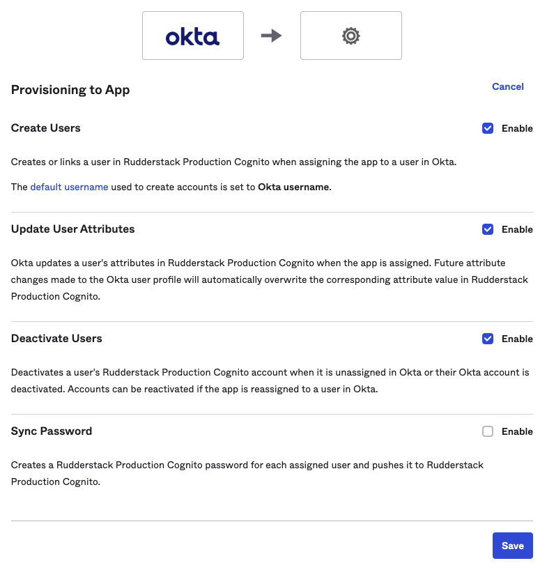
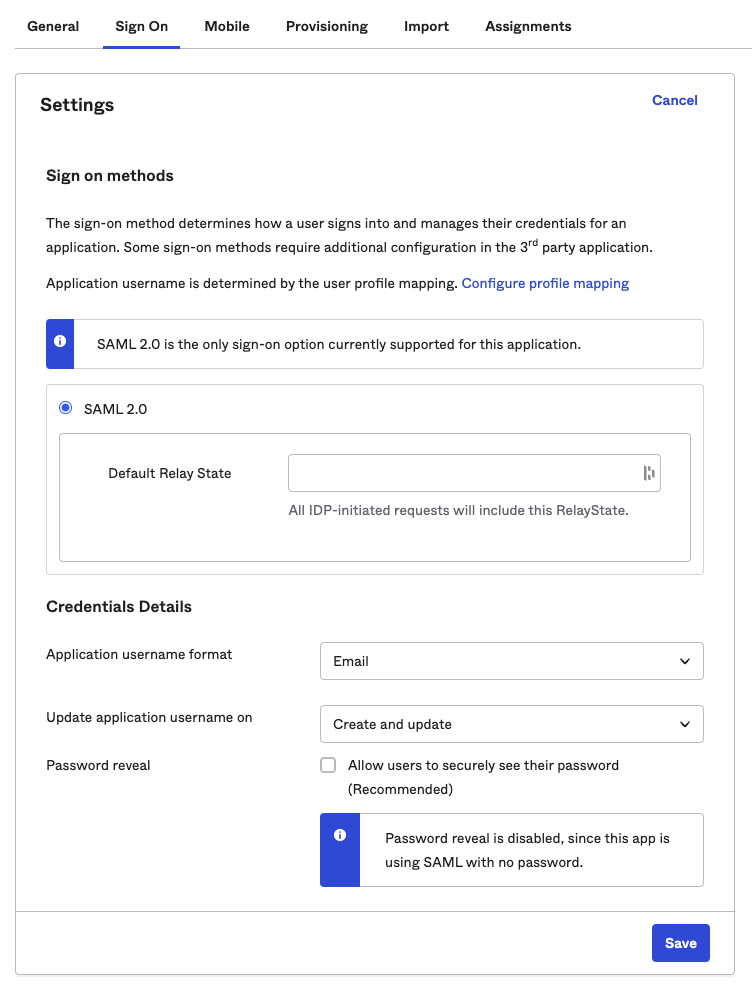

This guide lets you configure Okta's [SCIM provisioning](https://www.okta.com/blog/2017/01/what-is-scim/) feature to automatically grant RudderStack access to your users.  It is divided into the following sections:

- [Supported features](#supported-features)
- [Requirements](#requirements)
- [Configuration steps](#configuration-steps)
- [Known issues](#known-issues)

## Supported features

Currently, RudderStack supports the following provisioning features:

- **Push users**: You can create or link a user in RudderStack when assigning the app to a user in Okta.
- **Update user attributes**: Okta updates a user's attributes in RudderStack when the app is assigned to them. Note that any future attribute changes made to the Okta user's profile will automatically overwrite the corresponding attribute value in RudderStack.

Currently, you can only update the user's display name. Updating the email is not supported.

- **Deactivate/reactivate users**: This feature deactivates a user's RudderStack account when it is unassigned in Okta or their Okta account is deactivated. To reactivate the account, you can reassign the app to the user in Okta.

When a user is deactivated through SCIM, RudderStack does not delete the user from its database; it only revokes their organization user role leading to the loss of their workspace access.

## Requirements

To configure the SCIM app, you need a <Link to="/dashboard-guides/personal-access-token/">personal access token</Link> with **admin privileges**.

Follow these steps to create a new personal access token:

1. Log in to the RudderStack workspace you want to enable SCIM for. Note that your role in the organization must of the <Link to="/dashboard-guides/user-management/#admin">Admin</Link> type.
2. Go to **Settings** > **Account** tab and scroll down to **Personal access tokens**. Then, click **Generate new token**, as shown:

3. Enter the token name and select **Admin** from the **Role** dropdown.

Set an appropriate name for the token as it will be used for configuring SCIM.

4. Click **Generate** and save the token details securely. It will **not** be visible again once you close this window.

Make sure your user role and personal access token have <Link to="/dashboard-guides/user-management/#admin">Admin</Link> privileges, otherwise your SCIM provisioning tasks will fail.

## Configuration steps

1. Log in to Okta as an administrator.
2. In the sidebar, go to **Applications** > **Applications** and select your SSO app.
3. Go to the **General** tab, click **Edit** and check the **Enable SCIM provisioning** option, as shown: 

4. A new tab called **Provisioning** will now be visible in the app settings. Go to **Integration**, click **Edit** and enter the following details:

| Setting | Value |
| :------| :-------|
| SCIM connector base URL | `https://api.rudderstack.com/scim/v2` |
| Unique identifier field for users | `userName` |
| Supported provisioning actions | Check the following settings:   <ul><li>Push New Users</li><li>Push Profile Updates</li></ul> |
| Authentication Mode | `HTTP Header` |

5. Under **HTTP Header**, paste your personal access token that you generated in the <Link to="#requirements">Requirements</Link> section above.
6. Click **Save**. Okta will send a test request to verify the configuration.
7. Once the verification is complete, you will be able to see two new options, **To App** and **To Okta**, in the **Settings** sidebar, as shown:

8. Go to the **To App** settings and click **Edit**. Then, enable the following **Provisioning to App** settings:

9. Scroll down to the attribute mappings section and click **Show Unmapped Attributes**. 
10. Unmap all the attributes one by one by clicking the **X** icon, **except** the following mandatory attributes:
    - **Display name**
    - **Email**

When Okta sends a request to create a user, it assumes that the update has failed if the response does not contain the details of the mapped attributes. Hence, you must unmap all the attributes except <strong>Display name</strong> and <strong>Email</strong>.

11. For **Display name** and **Email**, click the edit icon and set the  **Apply on** field to **Create and update**.  

The <strong>Value</strong> fields for <strong>Display name</strong> and <strong>Email</strong> may vary depending on how you have set up your Okta app.

12. Click **Save** to finish the configuration.
13. Go back to your app settings, click the **Sign On** tab and click **Edit**.
14. Under **Credentials Details**, set **Application username format** to **Email**, as shown:

15. Finally, click **Save**.

## Known issues

Currently, RudderStack does not support the following SCIM features:

- Import users
- Import groups
- Push groups (will be supported in the future)
- Remove users
- Sync password
- Enhanced group push

RudderStack does not support removing users. This is because it uses SCIM with SAML, where removing a user from Okta implies that they also lose the ability to authenticate to RudderStack completely (logins via passwords, Google, etc. are completely blocked). Instead, RudderStack supports deactivating the user which means they only lose access to the workspace.

