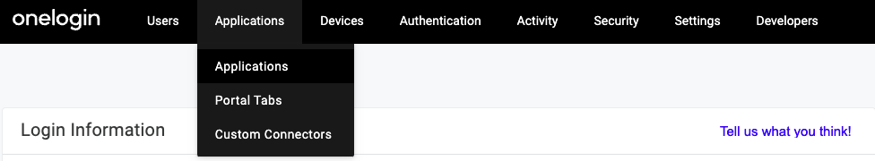

This guide lists the steps to configure and enable OneLogin SSO for your organization.

<GhBadge
  url={'https://rudderstack.com/enterprise-quote'}
  label={'Plan'}
  message={'Enterprise'}
  color={'blueviolet'}
/>

## Configuring the RudderStack SSO app

1. Log into your [OneLogin portal](https://app.onelogin.com/login) and click **Administration** in the top menu, as shown:

2. From the top menu, go to **Applications** > **Applications**, as shown:

3. Then, click **Add App**, as shown:

4. In the resulting **Find Applications** page, search for **SAML Custom Connector (Advanced)**. From the search results, select the application, as shown:

5. Name your SAML app and click on **Save**, as shown:

6. In the **Configuration** tab, enter the settings as shown in the following image:

The settings to be configured are listed in the following table:

| Setting | Value |
| :-------| :------|
| Audience (EntityID) | `urn:amazon:cognito:sp:us-east-1_ABZiTjXia` |
| Recipient | `https://auth2.rudderstack.com/saml2/idpresponse` |
| ACS (Consumer) URL Validator | `^https:\/\/auth2\.rudderstack\.com\/saml2\/idpresponse\/\$` |
| ACS (Consumer) URL | `https://auth2.rudderstack.com/saml2/idpresponse` |
| Login URL | `https://app.rudderstack.com/sso?domain=[your-domain.com]` |

Make sure you enter the correct domain name in the <strong>Login URL</strong> setting. For example, if your employee email is <code class="inline-code">john@example.com</code>, then your <strong>Login URL</strong> will be `https://app.rudderstack.com/sso?domain=example.com`.

7. From the dropdown, select the **SAML initiator** and **SAML nameID format** fields as shown:

Configure the other SAML settings related to the assertion validity, encryption method, etc. as per your organizational requirements.

8. Next, go to the **Parameters** tab and add the custom parameters as shown below:

The custom parameters and their values are listed in the following table:

| Parameter | Value |
| :-------| :------|
| Email | `Email` |
| LastName | `Name` |
| NameID value | `Email` |

For the <strong>LastName</strong> custom attribute, you can specify a single field <code class="inline-code">Name</code> - which specifies how you would like to see your employees on the RudderStack web app.

9. To add any other custom parameter, click the **+** button, enter the **Field name**, and select the value from the dropdown, as shown:

Make sure you enable (tick) the <strong>Include in SAML assertion</strong> flag for each custom parameter.

10. Click on **Save** to save the configuration.

## Enabling SSO

Go to the **SSO** tab of your app and copy the **Issuer URL**, as shown:

The <strong>Issuer URL</strong> is the SAML metadata endpoint that contains the certificate and any other information required to enable SSO for your organization.

Share this **Issuer URL** with the RudderStack team.

## Contact us

For more information on any of the steps in the guide, you can [contact us](mailto:docs@rudderstack.com) or start a conversation in our [Slack](https://rudderstack.com/join-rudderstack-slack-community) community.
