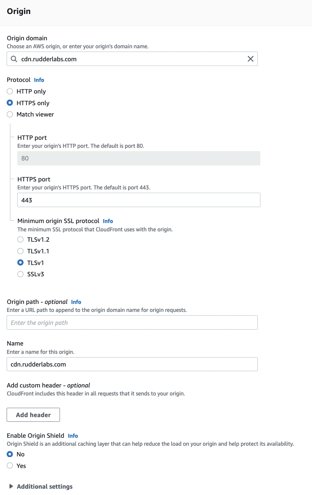
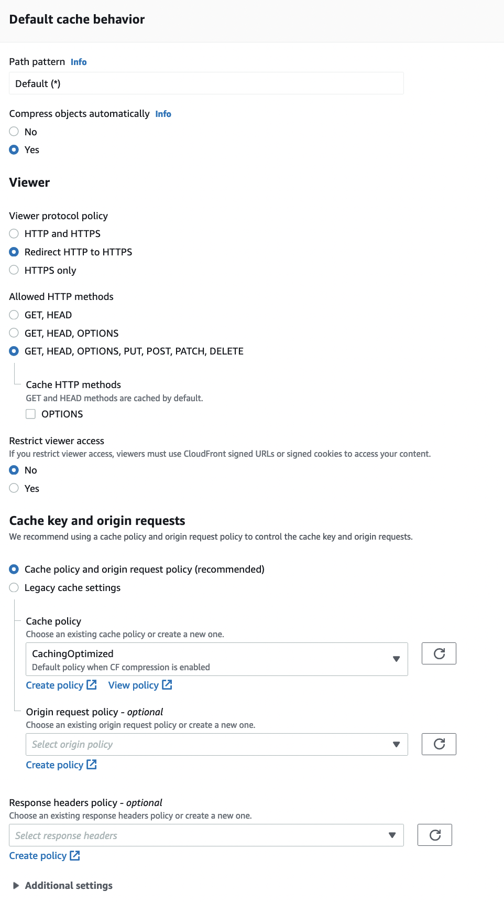
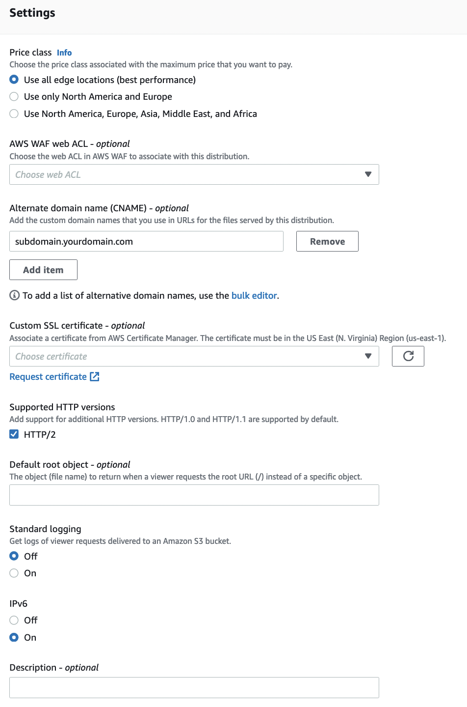
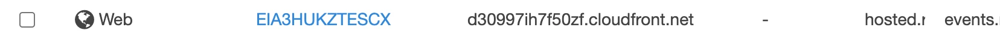
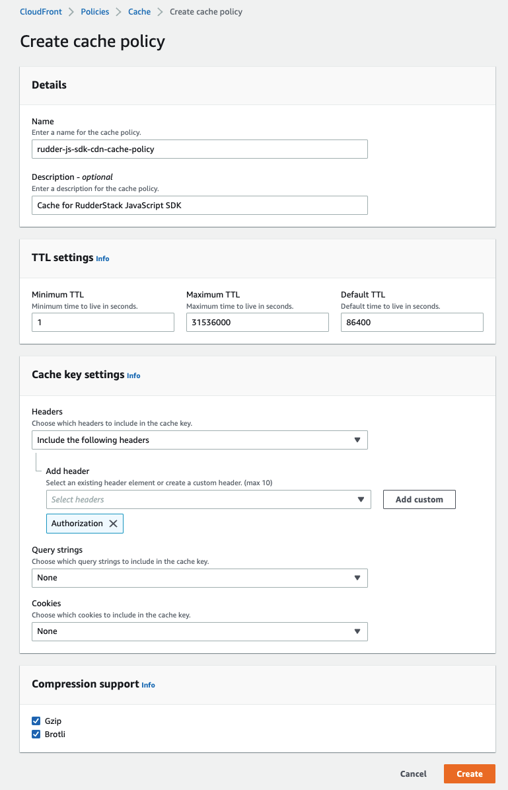
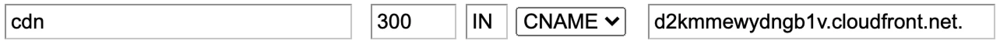
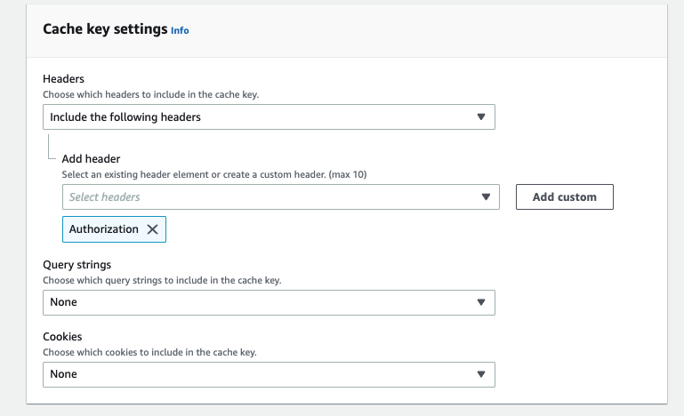
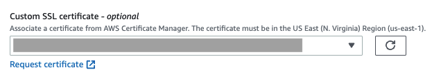

# How to Use Custom Domains

This guide contains the steps to use your own domain to route the events or proxy the [RudderStack JavaScript SDK](https://www.rudderstack.com/docs/stream-sources/rudderstack-sdk-integration-guides/rudderstack-javascript-sdk/) via your own CDN. 

<div class="warningBlock">

You will need access to your domain’s DNS settings as well as your CDN settings.
</div>

<div class="infoBlock">

The examples in this guide use CloudFront. However, the settings should be similar regardless of your CDN.
</div>

## Endpoint details

The following table lists the three endpoints to be proxied via your own CDN to route the events:

| Endpoint | Description |
| :---------| :-----------|
| `cdn.rudderlabs.com` | Loads the JavaScript SDK. |
| `api.rudderlabs.com` | Fetches the source configuration based on your source write key. |
| `<DATA_PLANE_URL>` | Required for sending the events to RudderStack. | 

To use your own domain for these endpoints, you will need to route the traffic through your CDN. 

<div class="warningBlock">

You will incur CDN charges for this traffic if you choose to use your own domain.
</div>

For each endpoint, you will need to create a CDN distribution and add a CNAME record in your domain for the distribution domain. This guide shows you how to do that.

## Setup for serving the SDK

To serve the JavaScript SDK, start by creating a new distribution. The following sections highlight the required distribution settings.

### Origin



| Field                  | Setting              |
| :--------------------- | :------------------- |
| Origin domain     | `cdn.rudderlabs.com` |
| Protocol | HTTPS Only           |
| HTTPS port | 443 |
| Minimum origin SSL protocol | TLSv1 |
| Name | `cdn.rudderlabs.com` |
| Enable Origin Shield | No |

### Default cache behavior settings



| Field     | Setting                 |
| :---------- | :---------------------- |
| Compress objects automatically | Yes |
| Viewer protocol policy              | Redirect HTTP to HTTPS                                     |
| Allowed HTTP methods                | `GET`, `HEAD`, `OPTIONS`, `PUT`, `POST`, `PATCH`, `DELETE` |
| Restrict viewer access | No |

### Cache key and origin requests

| Field     | Setting                 |
| :---------- | :---------------------- |
| Cache and origin request settings   | Cache policy and origin request policy    |
| Cache policy | CachingOptimized |

<div class="infoBlock">

Click on <strong>Create policy</strong> and refer to the settings in the <a href="#create-cache-policy">Create policy</a> section below.
</div>

### Additional distribution settings



| Field       | Setting                              |
| :------- | :------------------- |
| Price class | Use all edge locations(best performance) |
| Alternate domain name(CNAME) | `<subdomain.yourdomain.com>`         |
| SSL Certificate                   | Add your custom SSL Certificate. Refer to the [Using custom SSL certificates](#using-custom-ssl-certificates) section below for more information. |
| Supported HTTP versions | HTTP/2 |
| Standard logging | Off |
| IPv6 | On |

Finally, click on **Create distribution** and wait for CloudFront to be deployed, as shown:



## Create cache policy settings



| Field     | Setting                 |
| :---------- | :---------------------- |
| Name   | <YOUR_CACHE_POLICY_NAME>          |
| Description | <CACHE_POLICY_DESCRIPTION> |

### TTL settings

| Field       | Setting                              |
| :------- | :------------------- |
| Minimum TTL | 1 |
| Maxmimum TTL | 31536000 |
| Default TTL | 86400 |

### Cache key settings

| Field       | Setting                     |
| :------- | :------------------- |
| Headers | Include the following headers |
| Add header | Select `Authorization` from the dropdown list. |
| Query strings | None |
| Cookies | None |

## Adding CNAME Record to DNS

Once your distribution is deployed, you will need to create a CNAME record in your domain for the subdomain you wish to use, along with the distribution URL.

| Name       | Value                        |
| :--------------- | :--------------------- |
| Subdomain you wish to use \(used in the creation of the distribution\). This will vary based on your DNS provider but will typically be just the subdomain. For example: for `cdn.yourdomain.com` you would use `cdn`. | The CDN URL for the created distribution created. Example: `d3jlkfchu4u.cloudfront.net` |



## Serving the SDK

Once the setup and DNS propagation is completed, you will be able to change the SDK URL, as shown:

Before:

```markup
 <script src="https://cdn.rudderlabs.com/v1.1/rudder-analytics.min.js"></script>
```

After:

```markup
<script src="https://subdomain.yourdomain.com/v1.1/rudder-analytics.min.js"></script>
```

<div class="infoBlock">

If you are using an older version of the JavaScript SDK (v1), refer to the <a href="https://www.rudderstack.com/docs/stream-sources/rudderstack-sdk-integration-guides/rudderstack-javascript-sdk/version-migration-guide/">Version Migration Guide</a> to migrate to v1.1.
</div>

## Setup for sending events

Normally, all the tracked events are sent to RudderStack via your data plane URL. To have events routed through your own domain, you will need to setup a proxy to that and then use your own URL as the data plane URL when initializing the SDK.

### Required settings

The settings for sending the events will be the same as the settings for serving the JavaScript SDK, except for the following:

| Field                             | Setting                      |
| :-------------------------------- | :--------------------------- |
| Origin Domain Name                | `<DATA_PLANE_URL>`      |
| Alternate Domain Names \(CNAMEs\) | `<subdomain.yourdomain.com>` |

### Adding CNAME record to DNS

The settings for the CNAME record will be the same as the settings for serving the JavaScript SDK. You will need to use the newly created distribution domain and the subdomain you set for it.

### Sending events

Once the setup and DNS propagation is completed, you can use the newly created URL as the data plane URL when initializing the SDK, as shown:

Before:

```javascript
rudderanalytics.load( 
  <WRITE_KEY> ,
  "https://hosted.rudderlabs.com"
)
```

After:

```javascript
rudderanalytics.load(
  <WRITE_KEY>,
  "https://subdomain.yourdomain.com"
)
```

You should be able to confirm that the events are routed through your own domain and not the `rudderstack.com` domain in the network tab of your browser console.

<div class="infoBlock">

Refer to this <a href="https://www.rudderstack.com/docs/stream-sources/rudderstack-sdk-integration-guides/rudderstack-javascript-sdk/js-sdk-faqs/#how-to-check-if-the-data-is-being-transmitted-to-the-desired-destinations">JavaScript SDK FAQ</a> for more information on verifying the flow of events.
</div>

## Setup for fetching source configuration

When the JavaScript SDK is loaded, it uses the source write key to fetch the required configuration from RudderStack. This determines which native SDKs may be needed and which destinations are used.

<div class="infoBlock">

The call to fetch the source configuration is sent to <code class="inline-code">api.rudderstack.com</code> with the source <code class="inline-code">WRITE_KEY</code> used as an authorization header. For this reason, this distribution will be slightly different as you will need to explicitly whitelist the Authorization header to make sure it is sent along with each request.
</div>

### Required settings

The settings for sending events will be the same as the settings for serving the JavaScript SDK except for the following:

| Field                             | Setting                      |
| :-------------------------------- | :--------------------------- |
| Origin Domain Name                | `api.rudderlabs.com`         |
| Alternate Domain Names \(CNAMEs\) | `<subdomain.yourdomain.com>` |

You will also need to whitelist the **Authorization** header in **Cache key settings** by following the steps below:

1. Under **Headers**, choose **Include the following headers** from the dropdown.
2. In the **Add header** field, select **Authorization** from the list of options.



### Adding CNAME record to DNS

The settings for the CNAME record will be the same as the settings for serving the JavaScript SDK. You will need to use the newly created distribution domain and the subdomain you set for it.

### Fetching the source configuration

To use a custom URL to fetch the source configuration, add it as an option when loading the JavaScript SDK, as shown:

```javascript
rudderanalytics.load(
  <SOURCE_WRITE_KEY>,
  "https://hosted.rudderlabs.com",
  {
    configUrl: "https://subdomain.yourdomain.com",
  }
)
```

## Using custom SSL certificates

To use your own domain, you can request or import a SSL certificate with your CDN provider. Note that this is an optional setting.

To use the AWS Certificate Manager with CloudFront, choose the relevant ACM/IAM certificate in the **Custom SSL certificate** field, as shown:



<div class="infoBlock">

You can choose your subdomain or use a wildcard domain <code class="inline-code">*.yourdomain.com</code> to set up multiple subdomains.
</div>

<div class="successBlock">

The AWS Certificate Manager will guide you through the verification by email or DNS TXT records. You will be able to choose your own domain for SSL certificates once verified.
</div>

## FAQ

### While accessing the custom domain URL for JavaScript SDK, I am getting the Access Denied error. What does this mean?

The **Access Denied** error might be encountered on accessing the parent folder for JavaScript SDK without appending the required device-mode SDK URL to it, such as:

<script src="https://subdomain.yourdomain.com/v1.1/js-integrations"></script>

To overcome this, append the URL for required device-mode destination. For example, if you want to access Google Analytics, the custom URL should be:

<script src="https://subdomain.yourdomain.com/v1.1/js-integrations/GA.min.js"></script>


## Contact us

For queries on any of the sections covered in this guide, you can [contact us](mailto:%20docs@rudderstack.com) or start a conversation in our [Slack](https://rudderstack.com/join-rudderstack-slack-community) community.
