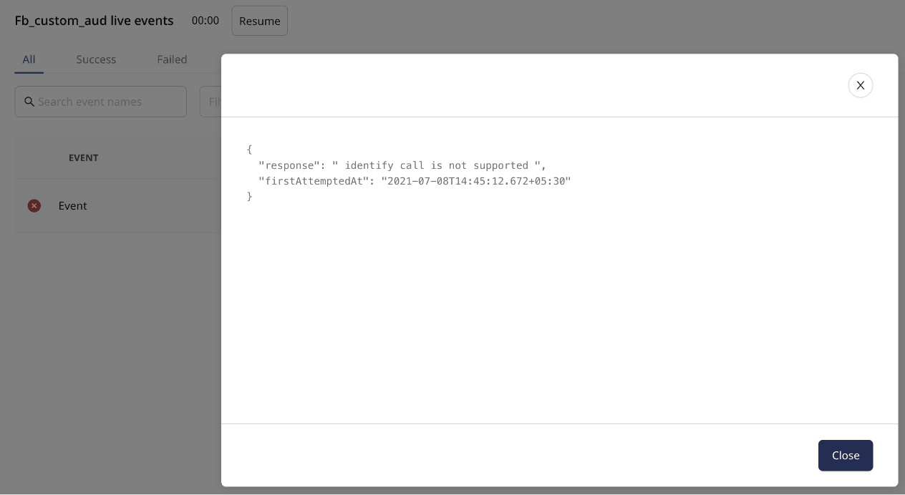

When routing events to a destination via RudderStack, there can be instances when the events do not show up in your destination. In such cases, knowing the reason for failure is helpful.

This guide walks you through the steps to debug your destination live events using RudderStack's <Link to="/dashboard-guides/live-events/">Live Events</Link> feature.

To view and debug your destination live events, your destination must be configured to send events via the <Link to="/destinations/rudderstack-connection-modes/#cloud-mode">cloud mode</Link>.

## Why are events sent to the destination failing?

Routing events to a destination via RudderStack can fail for various reasons. Some of the common ones include:

- Incorrect destination configuration.
- Bad event structure, that is, event is not in a destination-specific format.
- Rate limiting enforced by the destination.
- Destination downtime.

You can use RudderStack's **Live Events** feature to view the events sent to your destination in real-time, and debug any delivery failure.

## Viewing destination live events

To view the events sent to your destination in real-time, follow these steps:

1. <Link to="/dashboard-guides/destinations/#adding-a-destination">Set up your destination</Link> in RudderStack.
2. Click the **LIve Events** button to view the events sent from your source, as shown:

The resulting window highlights the following information: 

- **Name** of the event.
- **Error message** of the event in case of any event failure. Upon clicking **See full error**, you get the specific details like the error response and the time of the first attempt made to send the event.

- Clicking the event also lets you view the **payload** sent to the destination.

Live events are shown for all the RudderStack destinations. However, the <strong>event payload</strong> is not shown for some object storage destinations like <Link to="/destinations/streaming-destinations/amazon-s3/">Amazon S3</Link>, <Link to="/destinations/streaming-destinations/google-cloud-storage/">Google Cloud Storage</Link>, and <Link to="/destinations/streaming-destinations/microsoft-azure-blob-storage/">Microsoft Azure Blob Storage</Link>. These also include the <Link to="/destinations/warehouse-destinations/">supported warehouse destinations</Link> like <Link to="/destinations/warehouse-destinations/redshift/">Amazon Redshift</Link>, <Link to="/destinations/warehouse-destinations/bigquery/">Google BigQuery</Link>, <Link to="/destinations/warehouse-destinations/snowflake/">Snowflake</Link>, etc.

## Use case

Suppose that you send some events to the <Link to="/destinations/streaming-destinations/fb-custom-audience/">Facebook Custom Audience</Link> destination but they are not delivered. 

Upon checking the **Live Events** tab for the **Facebook Custom Audience** destination, you observe the following error:

On clicking the **See full error** option, you can see the following error response:

From the error response, it is clear that an <Link to="/event-spec/standard-events/identify/">`identify`</Link> event was sent to the destination. According to the <Link to="/destinations/streaming-destinations/fb-custom-audience/">Facebook Custom Audience documentation</Link>, only <Link to="/event-spec/standard-events/track/">`track`</Link> events are supported. As a result, when RudderStack tries sending the `identify` event, the destination gives an error. RudderStack retries sending this event several times before marking it as aborted.

This way, you can use the **Live Events** feature to better understand the responses received from the destination in case of any delivery failures and resolve them faster.