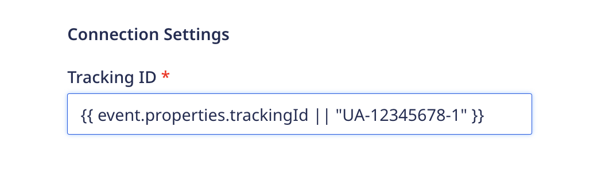

Dynamic settings configuration is supported in <Link to="/destinations/rudderstack-connection-modes/#cloud-mode">cloud mode</Link> RudderStack destinations, allowing you to configure destinations based on data from an event payload.

This feature is useful if you want to configure multiple instances of the same destination programmatically with different configurations for specific fields. In this guide, we'll show you how to configure a dynamic destination setting, and walk through a use-case using a Google Analytics destination.
## Create the configuration setting template

To use this feature, enter the path of your desired configuration value from the event payload using object notation in a [handlebars.js](https://handlebarsjs.com/guide/expressions.html) expression, as well as a default value for the setting in case the value is not present:

For example: `{{ event.path.to.key || "default_config_value" }}`, where

- `event` is the top level object for the event payload
- `path.to.key` is the location of the property you want to make configurable for your destination, e.g., `properties.url`
- `"default_config_value"` is the default value for the property

If `event.path.to.key` exists, its value will be passed as a configuration setting to your destination. If not present, RudderStack will send the default value that you supply in the expression.

<div class="infoBlock">
  <ul>
    <li> To set a number as the default value, set it as a string.</li>
    <li> In case of a multi-word string, we recommend setting the value within double quotes, e.g. <code class="inline-code">"default value"</code>.</li>
  </ul>
</div>

The next section walks through an example of dynamic configuration using multiple Google Analytics tracking IDs.

## Use Case: Dynamically configure your Google Analytics destination using Tracking ID

Suppose you have implemented two web properties with `rudderanalytics.js`, each with a unique Universal Analytics (UA) tracking ID. You don't want to set up different RudderStack destinations for each property; rather, you would like to pass the event data to the appropriate tracking ID in your Google Analytics instance.

To achieve this you will:

1. Create a transformation that:
    - adds a `trackingId` property to your event
    - sets the appropriate `trackingId` value based on the RudderStack `sourceId` for the given web property.<br /><br />

1. Configure your Google Analytics destination in the RudderStack dashboard with a template that dynamically updates the `trackingId` property for each event, routing the data to the appropriate GA property.

### Step 1: Add a transformation

To populate the configuration values from the event payload, add a <Link to="/features/transformations/using-transformations#adding-a-transformation">transformation function</Link>.

The following sample code uses the transformation's `metadata()` function to determine the `sourceId` from the metadata object. If the `sourceId` matches one of your provided IDs, then the associated `trackingId` is sent to Google Analytics.

If there is no match for the `sourceId`, the default value that you define in the next step will be passed to Google Analytics.

```javascript
export function transformEvent(event, metadata) {
  let updatedEvent = event;
  const met = metadata(event);
  if (
    met &&
    met.sourceId === "example_source_id_1" &&
    event &&
    event.properties
  ) {
    updatedEvent.properties.trackingId = "UA-Custom-TrackingID_1";
  } else if (
    met &&
    met.sourceId === "example_source_id_2" &&
    event &&
    event.properties
  ) {
    updatedEvent.properties.trackingId = "UA-Custom-TrackingID_2";
  }
  return updatedEvent;
}
```

### Step 2: Specify the setting path in destination settings

Once you have added a transformation, the next step is to <Link to="/dashboard-guides/destinations/#adding-a-destination">add a Google Analytics destination</Link> in the RudderStack dashboard.

In the **Connection Settings**, configure the **Tracking ID** field, as shown:



With the transformation in place and the dynamic tracking ID configured in the connection settings, RudderStack will route the event data to Google Analytics based on the tracking ID in the payload.

## FAQ
### How should I use this feature? What if I don't want to use it?

In the text field of a particular connection setting that you want to configure, enter the path of the payload along with a default value in the following format:

```javascript
{{ event.path.config.name || "default_config_value" }}
```

If you don't want to use this feature, you can enter the configuration setting in the dashboard as you normally would.

### Can I specify only the payload path without a default value?

We highly recommend setting a payload path along with a default value. This is because if, for some reason, the payload path does not have any value, the default value is passed as the connection setting. If both the values are absent, you will get an error. 

### My default value is a number starting with 0. What happens if I don't set it as a string?

If your default value is a number starting with 0, you need to set it as a string. Otherwise, the value will not be accepted and you may encounter an error.


