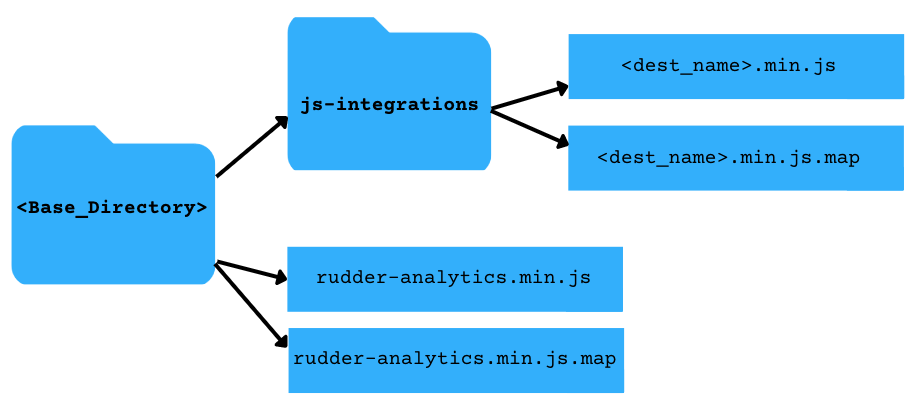

This guide will take you through the steps to self-host RudderStack JavaScript SDK via your own CDN:

1. Download the [JavaScript SDK](https://cdn.rudderlabs.com/v1.1/rudder-analytics.min.js).
2. Download the device mode destination SDKs you wish to use. Available path....
3. Move the files downloaded in the above steps in a structure like below: 

