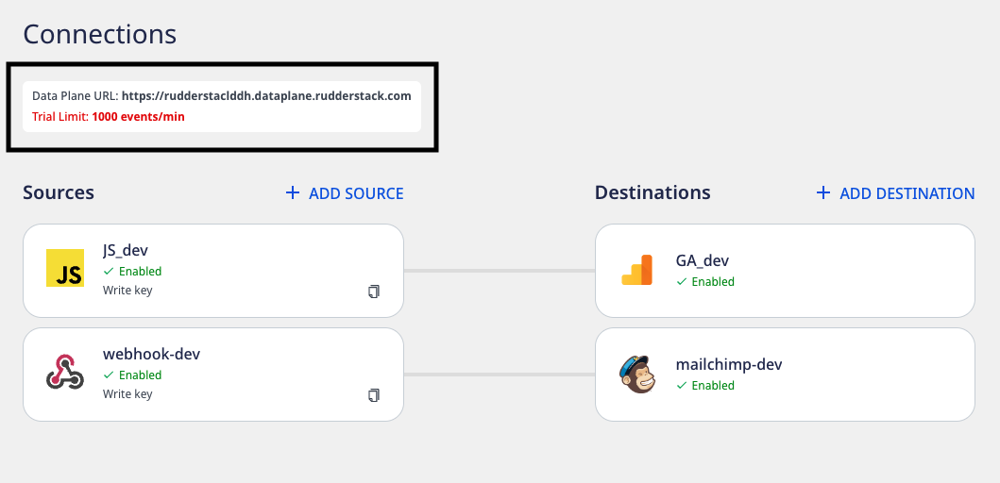

This document explains the step-by-step process of migrating from Snowplow to RudderStack. It covers the necessary steps for replacing your instrumentation code and start using the RudderStack SDKs to track your events with minimal code changes.

RudderStack provides a plugin for the RudderStack Android, iOS, and JavaScript SDKs to help the Snowplow customers migrate to RudderStack easily.

## Migrating the workspace

After creating a [RudderStack](https://app.rudderstack.com/signup?type=freetrial) account, you will see the following dashboard containing your <Link to="/dashboard-guides/overview/#data-plane-url">data plane URL</Link>:



Similar to Snowplow, you will need to set up your source-destination connections in the dashboard and facilitate the event data flow.

<div class="successBlock">
Keep your source write key and the data plane URL handy.
</div>

If you need more support or want us to manage your hosting, you can [contact us](mailto:%20support@rudderstack.com).

## Updating the SDK implementation

Depending on the platform, follow these steps to move your existing SDK implementation to RudderStack:

<Tabs>
  <TabList>
    <Tab>Android</Tab>
    <Tab>iOS</Tab>
    <Tab>JavaScript</Tab>
  </TabList>
    <TabPanels>
      <TabPanel>
      <ol>
      <li>Open your project level <code class="inline-code">app/build.gradle</code>, and add the following lines of code:
<span>

```groovy
buildscript {
  repositories {
    mavenCentral()
  }
}
allprojects {
  repositories {
    mavenCentral()
  }
}
```
</span>
</li>
<li>Then open your <code class="inline-code">app/build.gradle</code> and add the dependency under dependencies as shown below:
<span>

```groovy
implementation 'com.rudderstack.android.snowplow:adapter:1.0.0.beta.1'
```
</span>
</li>
<li>Update your SDK initialization to the following snippet. Replace <code class="inline-code">WRITE_KEY</code> and <code class="inline-code">DATA_PLANE_URL</code> with your source write key and data plane URL obtained above.
<Tabs>
  <TabList>
    <Tab>Java</Tab>
    <Tab>Kotlin</Tab>
  </TabList>
    <TabPanels>
      <TabPanel>
<span>

```java
RSTracker tracker = new RSTracker()
            .createTracker(
                this, WRITE_KEY, networkConfiguration
            );

RSTracker tracker = new RSTracker()
            .createTracker(
                this, WRITE_KEY, DATA_PLANE_URL
            );

RSTracker tracker = new RSTracker()
            .createTracker(
                this, WRITE_KEY, networkConfiguration,
                sessionConfiguration, trackerConfiguration,
                subjectConfiguration
            );
```
</span>
      </TabPanel>
      <TabPanel>
<span>

```kotlin
val tracker = RSTracker()
            .createTracker(
                this, WRITE_KEY, networkConfiguration
            )

val tracker = RSTracker()
            .createTracker(
                this, WRITE_KEY, DATA_PLANE_URL
            )

val tracker = RSTracker()
            .createTracker(
                this, WRITE_KEY, networkConfiguration,
                sessionConfiguration, trackerConfiguration,
                subjectConfiguration
            )
```
</span>
      </TabPanel>
    </TabPanels>
</Tabs>
</li>
</ol>

NetworkConfiguration
<Tabs>
  <TabList>
    <Tab>Java</Tab>
    <Tab>Kotlin</Tab>
  </TabList>
    <TabPanels>
      <TabPanel>
<span>

```java
// 1
NetworkConfiguration networkConfiguration = new NetworkConfiguration(DATA_PLANE_URL);
// 2
NetworkConfiguration networkConfiguration = new NetworkConfiguration(DATA_PLANE_URL, CONTROL_PLANE_URL);
```
</span>
      </TabPanel>
      <TabPanel>
<span>

```kotlin
// 1
val networkConfiguration = NetworkConfiguration(DATA_PLANE_URL)
// 2
val networkConfiguration = NetworkConfiguration(DATA_PLANE_URL, CONTROL_PLANE_URL)
```
</span>
      </TabPanel>
    </TabPanels>
</Tabs>
SessionConfiguration
<Tabs>
  <TabList>
    <Tab>Java</Tab>
    <Tab>Kotlin</Tab>
  </TabList>
    <TabPanels>
      <TabPanel>
<span>

```java
SessionConfiguration sessionConfiguration = new SessionConfiguration(
  new TimeMeasure(1, TimeUnit.MINUTES),
  new TimeMeasure(1, TimeUnit.MINUTES)
);
```
</span>
      </TabPanel>
      <TabPanel>
<span>

```kotlin
val sessionConfiguration = SessionConfiguration(
  TimeMeasure(1, TimeUnit.MINUTES),
  TimeMeasure(1, TimeUnit.MINUTES)
);
```
</span>
      </TabPanel>
    </TabPanels>
</Tabs>
TrackerConfiguration
<Tabs>
  <TabList>
    <Tab>Java</Tab>
    <Tab>Kotlin</Tab>
  </TabList>
    <TabPanels>
      <TabPanel>
<span>

```java
TrackerConfiguration trackerConfiguration = new TrackerConfiguration()
  .base64Encoding(false)
  .logLevel(LogLevel.VERBOSE)
  .deepLinkContext(true)
  .applicationContext(true)
  .platformContext(true)
  .geoLocationContext(true)
  .lifecycleAutotracking(true)
  .diagnosticAutotracking(true)
  .screenViewAutotracking(true)
  .screenContext(true)
  .applicationContext(true)
  .exceptionAutotracking(true)
  .installAutotracking(true)
  .userAnonymisation(false)
  .appId(APP_ID);
```
</span>
      </TabPanel>
      <TabPanel>
<span>

```kotlin
val trackerConfiguration = TrackerConfiguration()
  .base64Encoding(false)
  .logLevel(LogLevel.VERBOSE)
  .deepLinkContext(true)
  .applicationContext(true)
  .platformContext(true)
  .geoLocationContext(true)
  .lifecycleAutotracking(true)
  .diagnosticAutotracking(true)
  .screenViewAutotracking(true)
  .screenContext(true)
  .applicationContext(true)
  .exceptionAutotracking(true)
  .installAutotracking(true)
  .userAnonymisation(false)
  .appId(APP_ID)
```
</span>
      </TabPanel>
    </TabPanels>
</Tabs>

| Method/Variable name | Default      | 
| :---------- | :------------ | 
| logLevel     |        LogLevel.OFF       |           
| lifecycleAutotracking      |   true            |           
| screenViewAutotracking     |   true            |           
| sessionContext      |         true      |        

SubjectConfiguration

RudderStack will call Identify API as soon as initialization is completed. userId will be mapped to RudderStack's userId. Other properties will be mapped to RudderStack's traits.

<div class="infoBlock">
userId is mandatory. If not provided, the call will be ignored.
</div>

<Tabs>
  <TabList>
    <Tab>Java</Tab>
    <Tab>Kotlin</Tab>
  </TabList>
    <TabPanels>
      <TabPanel>
<span>

```java
Traits.Address address = new Traits.Address()
  .putCity("city value")
  .putCountry("country value")
  .putPostalCode("postalCode value")
  .putState("state value")
  .putStreet("street value");

Traits.Company company = new Traits.Company()
  .putName("name value")
  .putId("id value")
  .putIndustry("industry value");

Traits traits = new Traits()
  .putCompany(company)
  .putAddress(address)
  .putAge("age value")
  .putBirthday("birthday value")
  .putCreatedAt("createAt value")
  .putDescription("description value")
  .putEmail("email value")
  .putFirstName("fName value")
  .putGender("gender value")
  .putId("id value")
  .putLastName("lName value")
  .putName("name value")
  .putPhone("phone value")
  .putTitle("title value")
  .putUserName("userName value")
  .put("Key-1", "value-1")
  .put("Key-2", 20)
  .put("Key-3", true);

SubjectConfiguration subjectConfiguration = new SubjectConfiguration()
  .userId("User-1")
  .traits(traits);
```
</span>
      </TabPanel>
      <TabPanel>
<span>

```kotlin
val address: Traits.Address = Traits.Address()
  .putCity("city value")
  .putCountry("country value")
  .putPostalCode("postalCode value")
  .putState("state value")
  .putStreet("street value")

val company: Traits.Company = Traits.Company()
  .putName("name value")
  .putId("id value")
  .putIndustry("industry value")

val traits = Traits()
  .putCompany(company)
  .putAddress(address)
  .putAge("age value")
  .putBirthday("birthday value")
  .putCreatedAt("createAt value")
  .putDescription("description value")
  .putEmail("email value")
  .putFirstName("fName value")
  .putGender("gender value")
  .putId("id value")
  .putLastName("lName value")
  .putName("name value")
  .putPhone("phone value")
  .putTitle("title value")
  .putUserName("userName value")
  .put("Key-1", "value-1")
  .put("Key-2", 20)
  .put("Key-3", true)

val subjectConfiguration = SubjectConfiguration()
  .userId("User-1")
  .traits(traits)
```
</span>
      </TabPanel>
    </TabPanels>
</Tabs>

<div class="successBlock">
You can use the rest of your code without any changes as the RudderStack API is fully compatible with Snowplow.
</div>
      </TabPanel>
      <TabPanel>
<ol>
<li>Add the SDK to your <code class="inline-code">Podfile</code> as shown:

```ruby
pod 'RudderSnowplowMigrator', '1.0.0.beta.1'
```
</li>
<li>Then, run the following command:

```ruby
pod install
```
</li>
<li>Update your SDK initialization to the following. Replace <code class="inline-code">WRITE_KEY</code> and <code class="inline-code">DATA_PLANE_URL</code> with your source write key and data plane URL obtained above.
<Tabs>
  <TabList>
    <Tab>Objective-C</Tab>
    <Tab>Swift</Tab>
  </TabList>
    <TabPanels>
      <TabPanel>
<span>

```objectivec
RSTracker *tracker = [RSTracker createTrackerWithWriteKey:WRITE_KEY network:networkConfig];

RSTracker *tracker = [RSTracker createTrackerWithWriteKey:WRITE_KEY dataPlaneUrl:DATA_PLANE_URL];

RSTracker *tracker = [RSTracker createTrackerWithWriteKey:WRITE_KEY network:networkConfig configurations:@[trackerConfig]];

RSTracker *tracker = [RSTracker getDefaultTracker]
```
</span>
      </TabPanel>
      <TabPanel>
<span>

```swift
let tracker = RSTracker.createTracker(
            writeKey: WRITE_KEY,
            network: networkConfig
        )

let tracker = RSTracker.createTracker(
            writeKey: WRITE_KEY,
            dataPlaneUrl: DATA_PLANE_URL
        )

let tracker = RSTracker.createTracker(
            writeKey: WRITE_KEY,
            network: networkConfig,
            configurations: [trackerConfig, sessionConfig]
        )
```
</span>
      </TabPanel>
    </TabPanels>
</Tabs>
</li>
</ol>
NetworkConfiguration
<Tabs>
  <TabList>
    <Tab>Objective-C</Tab>
    <Tab>Swift</Tab>
  </TabList>
    <TabPanels>
      <TabPanel>
<span>

```objectivec
// 1
RSNetworkConfiguration *networkConfig = [[RSNetworkConfiguration alloc] initWithDataPlaneUrl:DATA_PLANE_URL];
// 2
RSNetworkConfiguration *networkConfig = [[RSNetworkConfiguration alloc] initWithDataPlaneUrl:DATA_PLANE_URL controlPlaneUrl:CONTROL_PLANE_URL];
```
</span>
      </TabPanel>
      <TabPanel>
<span>

```swift
// 1
let networkConfig = NetworkConfiguration(dataPlaneUrl: DATA_PLANE_URL)
// 2
let networkConfig = NetworkConfiguration(dataPlaneUrl: DATA_PLANE_URL, controlPlaneUrl: CONTROL_PLANE_URL)
```
</span>
      </TabPanel>
    </TabPanels>
</Tabs>
SessionConfiguration
<Tabs>
  <TabList>
    <Tab>Objective-C</Tab>
    <Tab>Swift</Tab>
  </TabList>
    <TabPanels>
      <TabPanel>
<span>

```objectivec
RSSessionConfiguration *sessionConfig = [[RSSessionConfiguration alloc] initWithForegroundTimeout:[[NSMeasurement alloc] initWithDoubleValue:30 unit:NSUnitDuration.minutes] backgroundTimeout:[[NSMeasurement alloc] initWithDoubleValue:30 unit:NSUnitDuration.minutes]];

// 2
RSSessionConfiguration *sessionConfig = [[RSSessionConfiguration alloc] initWithForegroundTimeoutInSeconds:60 backgroundTimeoutInSeconds:60];
```
</span>
      </TabPanel>
      <TabPanel>
<span>

```swift
// 1
let sessionConfig = SessionConfiguration(
  foregroundTimeout: Measurement(value: 30, unit: .minutes),
  backgroundTimeout: Measurement(value: 30, unit: .minutes)
)

// 2
let sessionConfig = SessionConfiguration(foregroundTimeoutInSeconds: 60, backgroundTimeoutInSeconds: 60)
```
</span>
      </TabPanel>
    </TabPanels>
</Tabs>
TrackerConfiguration
<Tabs>
  <TabList>
    <Tab>Objective-C</Tab>
    <Tab>Swift</Tab>
  </TabList>
    <TabPanels>
      <TabPanel>
<span>

```objectivec
RSTrackerConfiguration * trackerConfig = [
  [RSTrackerConfiguration alloc] init
];
[trackerConfig base64Encoding: YES];
[trackerConfig logLevel: LogLevelDebug];
[trackerConfig sessionContext: YES];
[trackerConfig deepLinkContext: YES];
[trackerConfig applicationContext: YES];
[trackerConfig platformContext: YES];
[trackerConfig geoLocationContext: NO];
[trackerConfig screenContext: YES];
[trackerConfig screenViewAutotracking: YES];
[trackerConfig lifecycleAutotracking: YES];
[trackerConfig installAutotracking: YES];
[trackerConfig exceptionAutotracking: YES];
[trackerConfig diagnosticAutotracking: NO];
[trackerConfig userAnonymisation: NO];
[trackerConfig appId: APP_ID];
```
</span>
      </TabPanel>
      <TabPanel>
<span>

```swift
let trackerConfig = TrackerConfiguration()
  .base64Encoding(false)
  .logLevel(.debug)
  .deepLinkContext(true)
  .applicationContext(true)
  .platformContext(true)
  .geoLocationContext(true)
  .lifecycleAutotracking(true)
  .diagnosticAutotracking(true)
  .screenViewAutotracking(true)
  .screenContext(true)
  .applicationContext(true)
  .exceptionAutotracking(true)
  .installAutotracking(true)
  .userAnonymisation(false)
  .appId(APP_ID)
```
</span>
      </TabPanel>
    </TabPanels>
</Tabs>

| Method/Variable name | Default      | 
| :---------- | :------------ | 
| logLevel     |        LogLevel.OFF       |           
| lifecycleAutotracking      |   true            |           
| screenViewAutotracking     |   true            |           
| sessionContext      |         true      |

SubjectConfiguration

RudderStack will call Identify API as soon as initialization is completed. userId will be mapped to RudderStack's userId. Other properties will be mapped to RudderStack's traits.

<div class="infoBlock">
userId is mandatory. If not provided, the call will be ignored.
</div>

<Tabs>
  <TabList>
    <Tab>Objective-C</Tab>
    <Tab>Swift</Tab>
  </TabList>
    <TabPanels>
      <TabPanel>
<span>

```objectivec
RSSubjectConfiguration * subjectConfig = [
  [RSSubjectConfiguration alloc] init
];
[subjectConfig userId: @ "user_id"];
[subjectConfig traits: @ {
  @ "key_1": @ "value_1", @ "key_2": @20, @ "key_3": @YES
}];
```
</span>
      </TabPanel>
      <TabPanel>
<span>

```swift
let subjectConfig = SubjectConfiguration()
  .userId("user_id")
  .traits(["key_1": "value_1", "key_2": 20, "key_3": true])
```
</span>
      </TabPanel>
    </TabPanels>
</Tabs>
<div class="successBlock">
You can use the rest of your code without any changes as the RudderStack API is fully compatible with Snowplow.
</div>        
      </TabPanel>
      <TabPanel>
<ul>
<li>Add the SDK to your web application:
<span>

```markup
<script>
	rudderanalytics = window.rudderanalytics = [];

	var methods = [
		"load",
		"page",
		"track",
		"identify",
		"reset"
	];
	for (var i=0; i<methods.length; i++) {
		var method = methods[i];
		rudderanalytics[method] = function(methodName) {
			return function() {
				rudderanalytics.push([methodName, ...arguments]);
			}
		} (method)
	}
	rudderanalytics.load(<WRITE_KEY>, <DATA_PLANE_URL>);
	rudderanalytics.page();
</script>
<script src="https://cdn.rudderlabs.com/v1.1/rudder-analytics.min.js"></script>
```
</span>
<div class="infoBlock">
For the minified version of the above script, refer to the <Link to="/sources/event-streams/sdks/rudderstack-javascript-sdk/">RudderStack JavaScript SDK</Link> guide. 
</div>

<div class="infoBlock">
If you are using an older version of the JavaScript SDK (v1), refer to the <Link to="/sources/event-streams/sdks/rudderstack-javascript-sdk/version-migration-guide/">Version Migration Guide</Link> to migrate to v1.1.
</div>
</li>
<li>Update the object. RudderStack uses <code class="inline-code">rudderanalytics</code> as the global object library as compared to Snowplow's <code class="inline-code">analytics</code> object.

<div class="successBlock">
You can use the rest of your code without any changes as the RudderStack API is fully compatible with Snowplow.
</div>
</li>
</ul>
      </TabPanel>
      <TabPanel>
      <ul>
      <li>Change your .NET project's <strong>Dependencies</strong> to include the <code class="inline-code">RudderAnalytics</code> package via <a href="https://docs.microsoft.com/en-us/nuget/consume-packages/install-use-packages-powershell">NuGet</a></li>
      <li>Then, initialize the RudderStack client by running the following code snippet. Replace <code class="inline-code">WRITE_KEY</code> and <code class="inline-code">DATA_PLANE_URL</code> with your source write key and data plane URL obtained above.
<span>

```csharp
using RudderStack;

RudderAnalytics.Initialize(
     <WRITE_KEY>,
     new RudderConfig(dataPlaneUrl: <DATA_PLANE_URL>)
);
```
</span>
<div class="successBlock">
You can use the rest of your code without any changes as the RudderStack API is fully compatible with Snowplow.
</div>
</li>
</ul>
    </TabPanel>
    <TabPanel>
      <ul>
      <li>Install the RudderStack React Native SDK by running the following command:
<span>

```bash
// npm
npm install @rudderstack/rudder-sdk-react-native --save
// yarn
yarn add @rudderstack/rudder-sdk-react-native
// navigate to iOS folder and run pod install
pod install
```
</span>
      </li>
      <li>Then, import the React Native SDK.
<span>

```typescript
import rudderClient from "@rudderstack/rudder-sdk-react-native"
```
</span>
	</li>
	<li>Next, change the SDK initialization as shown in the following snippet. Replace <code class="inline-code">WRITE_KEY</code> and <code class="inline-code">DATA_PLANE_URL</code> with your source write key and data plane URL obtained above.
<span>

```typescript
await rudderClient.setup(<WRITE_KEY>, {
  dataPlaneUrl: <DATA_PLANE_URL>,
  trackLifecycleEvents: true,
  recordScreenViews: true,
})
```
</span>
</li>
<li>Update the references to the <code class="inline-code">analytics</code> keyword in your application code with <code class="inline-code">rudderClient</code>.</li>
<div class="successBlock">
You can use the rest of your code without any changes as the RudderStack API is fully compatible with Snowplow.
</div>
</ul>
    </TabPanel>
  </TabPanels>
</Tabs>

## Class names

| Snowplow Class   | Java | Kotlin | Objective C | Swift |
| :------------- | :-------------- |:------------- | :-------------- |
| `NetworkConfiguration` | `NetworkConfiguration` | `NetworkConfiguration` | `RSNetworkConfiguration` | `NetworkConfiguration` |
| `TrackerConfiguration` | `TrackerConfiguration` | `TrackerConfiguration` | `RSTrackerConfiguration` | `TrackerConfiguration` |
| `SessionConfiguration` | `SessionConfiguration` | `SessionConfiguration` | `RSSessionConfiguration` | `SessionConfiguration` |
| `SubjectConfiguration` | `SubjectConfiguration` | `SubjectConfiguration` | `RSSubjectConfiguration` | `SubjectConfiguration` |
| `Structured` | `Structured` | `Structured` | `RSStructured` | `Structured` |
| `ScreenView` | `ScreenView` | `ScreenView` | `RSScreenView` | `ScreenView` |
| `Background` | `Background` | `Background` | `RSBackground` | `Background` |
| `Foreground` | `Foreground` | `Foreground` | `RSForeground` | `Foreground` |
| `SelfDescribing` | `SelfDescribing` | `SelfDescribing` | `RSSelfDescribing` | `SelfDescribing` |
| `SelfDescribingJson` | `SelfDescribingJson` | `SelfDescribingJson` | `RSSelfDescribingJson` | `SelfDescribingJson` |
| `TimeMeasure` | `TimeMeasure` | `TimeMeasure` | `N/A` | `N/A` |
| `Snowplow` | `RSTracker` | `RSTracker` | `RSTracker` | `RSTracker` |


## Sending events

<Tabs>
  <TabList>
    <Tab>Android</Tab>
    <Tab>iOS</Tab>
  </TabList>
    <TabPanels>
      <TabPanel>
Structured

RudderStack will call Track API. action will be mapped to RudderStack’s event. Other properties like category, label, value, etc., will be mapped to RudderStack’s properties.<br/><br/>

<Tabs>
  <TabList>
    <Tab>Java</Tab>
    <Tab>Kotlin</Tab>
  </TabList>
    <TabPanels>
      <TabPanel>
<span>

```java
HashMap < String, Object > properties = new HashMap < > ();
properties.put("key-1", "value 1");
properties.put("key-2", 123);
properties.put("key-3", 123.45);
properties.put("key-4", true);
properties.put("key-5", false);

Structured structured = new Structured("Category_example", "Action_example")
  .label("my-label")
  .value(1234.23)
  .property("my-property")
  .properties(properties);

tracker.track(structured);
```
</span>
      </TabPanel>
      <TabPanel>
<span>

```kotlin
val properties = mapOf < String, Any > (
  "key-1"
  to "value 1",
  "key-2"
  to 123,
  "key-3"
  to 123.45,
  "key-4"
  to true,
  "key-5"
  to false
)

val structured = Structured("Category_example", "Action_example")
  .label("my-label")
  .value(1234.23)
  .property("my-property")
  .properties(properties)

tracker.track(structured)
```
</span>
      </TabPanel>
    </TabPanels>
</Tabs>
SelfDescribing

RudderStack will call Track API with event action.
action is mandatory. If not provided, the call will be ignored.

<Tabs>
  <TabList>
    <Tab>Java</Tab>
    <Tab>Kotlin</Tab>
  </TabList>
    <TabPanels>
      <TabPanel>
<span>

```java
HashMap < String, Object > properties = new HashMap < > ();
properties.put("action", "Action-2");
properties.put("key-1", "value 1");

// 1
SelfDescribingJson selfDescribingJson = new SelfDescribingJson("schema", payload)
SelfDescribing selfDescribing = new SelfDescribing(selfDescribingJson)

// 2
SelfDescribing selfDescribing = new SelfDescribing("schema", payload)

tracker.track(selfDescribing);
```
</span>
      </TabPanel>
      <TabPanel>
<span>

```kotlin
val payload = mapOf < String, Any > (
  "action"
  to "Action-2",
  "key-2"
  to "value-2"
)

// 1
val selfDescribingJson = SelfDescribingJson("schema", payload)
val selfDescribing = SelfDescribing(selfDescribingJson)

// 2
val selfDescribing = SelfDescribing("schema", payload)

tracker.track(selfDescribing)
```
</span>
      </TabPanel>
    </TabPanels>
</Tabs>

Foreground

RudderStack will call [Track](https://www.rudderstack.com/docs/event-spec/standard-events/track/) API with the event `Application Opened`. Other properties like `index`, `properties` will be mapped to RudderStack’s `properties`.

This is not an automatic life cycle event. Properties like version, build, etc will not be present under `properties`.

<Tabs>
  <TabList>
    <Tab>Java</Tab>
    <Tab>Kotlin</Tab>
  </TabList>
    <TabPanels>
      <TabPanel>
<span>

```java
HashMap < String, Object > properties = new HashMap < > ();
properties.put("key-1", "value 1");
properties.put("key-2", 123);
properties.put("key-3", 123.45);
properties.put("key-4", true);
properties.put("key-5", false);

Foreground foreground = new Foreground(1234);
foreground.setProperties(properties);

tracker.track(foreground);
```
</span>
      </TabPanel>
      <TabPanel>
<span>

```kotlin
val properties = mapOf < String, Any > (
  "key-1"
  to "value 1",
  "key-2"
  to 123,
  "key-3"
  to 123.45,
  "key-4"
  to true,
  "key-5"
  to false
)

Foreground foreground = Foreground(1234)
foreground.properties = properties

tracker.track(background)
```
</span>
      </TabPanel>
    </TabPanels>
</Tabs>

Background

RudderStack will call [Track](https://www.rudderstack.com/docs/event-spec/standard-events/track/) API with the event `Application Backgrounded`. Other properties like `index`, `properties` will be mapped to RudderStack’s `properties`. 

This is not an automatic life cycle event. Properties like version, build, etc will not be present under `properties`.


<Tabs>
  <TabList>
    <Tab>Java</Tab>
    <Tab>Kotlin</Tab>
  </TabList>
    <TabPanels>
      <TabPanel>
<span>

```java
HashMap < String, Object > properties = new HashMap < > ();
properties.put("key-1", "value 1");
properties.put("key-2", 123);
properties.put("key-3", 123.45);
properties.put("key-4", true);
properties.put("key-5", false);

Background background = new Background(1234);
background.setProperties(properties);

tracker.track(background);
```
</span>
      </TabPanel>
      <TabPanel>
<span>

```kotlin
val properties = mapOf < String, Any > (
  "key-1"
  to "value 1",
  "key-2"
  to 123,
  "key-3"
  to 123.45,
  "key-4"
  to true,
  "key-5"
  to false
)

Background background = Background(1234)
background.properties = properties

tracker.track(background)
```
</span>
      </TabPanel>
    </TabPanels>
</Tabs>

ScreenView

RudderStack will call Screen API. name will be mapped to RudderStack’s name. Other properties like screenId, previousName, previousId, etc., will be mapped to RudderStack’s properties.


<Tabs>
  <TabList>
    <Tab>Java</Tab>
    <Tab>Kotlin</Tab>
  </TabList>
    <TabPanels>
      <TabPanel>
<span>

```java
ScreenView screenView = new ScreenView("MainActivity", UUID.randomUUID())
  .type("type")
  .previousName("previousName")
  .previousId("previousId")
  .previousType("previousType")
  .transitionType("transitionType");

tracker.track(screenView);
```
</span>
      </TabPanel>
      <TabPanel>
<span>

```kotlin
val screenView = ScreenView("MainActivity", UUID.randomUUID())
  .type("type")
  .previousName("previousName")
  .previousId("previousId")
  .previousType("previousType")
  .transitionType("transitionType")

tracker.track(screenView)
```
</span>
      </TabPanel>
    </TabPanels>
</Tabs>
       


Your Android app must be on <strong>version 5.0 (API level 21) or higher</strong> for RudderStack to be able to send events to Intercom.<br/><br/>

Once confirmed, follow these steps to add Intercom to your Android project:

<ol>
<li>In your app-level <code class="inline-code">build.gradle</code> file, add the following <code class="inline-code">repository</code>:
<span>

```groovy
repositories {
    mavenCentral()
}
```
</span>
</li>
<li>Then, add the following under <code class="inline-code">dependencies</code>:
<span>

```groovy
// Rudder core sdk and intercom extension
implementation 'com.rudderstack.android.sdk:core:1.0.2'
implementation 'com.rudderstack.android.integration:intercom:0.1.1'

// intercom core sdk
implementation 'io.intercom.android:intercom-sdk-base:6.+'

// gson
implementation 'com.google.code.gson:gson:2.8.6'

// FCM
implementation 'com.google.firebase:firebase-messaging:20.2.0'
```
</span>
</li>
<li>Change the initialization of your RudderStack client with the following:
<span>

```kotlin
val rudderClient:RudderClient = RudderClient.getInstance(
    this,
    WRITE_KEY,
    RudderConfig.Builder()
        .withDataPlaneUrl(DATA_PLANE_URL)
        .withLogLevel(RudderLogger.RudderLogLevel.DEBUG) // optional
        .withFactory(IntercomIntegrationFactory.FACTORY)
        .build()
)
```
</span>
</li>
</ol>
      </TabPanel>
      <TabPanel>
        If this is the first time you are integrating the RudderStack iOS SDK to your project, refer to the <Link to="/sources/event-streams/sdks/rudderstack-ios-sdk/">iOS SDK</Link> documentation for more information.<br/><br/>

To add the RudderStack iOS SDK to your project, follow these steps:
<ol>
<li>Add the required pod followed by <code class="inline-code">pod install</code>:
<span>

```ruby
pod 'Rudder-Intercom'
```
</span>
</li>
<li>Initialize the client as follows:
<span>

```objectivec
RSConfigBuilder *builder = [[RSConfigBuilder alloc] init];
[builder withDataPlaneUrl:DATA_PLANE_URL];
[builder withFactory:[RudderIntercomFactory instance]];
[builder withLoglevel:RSLogLevelDebug]; // optional
[RSClient getInstance:WRITE_KEY config:[builder build]];
```
</span>
</li>
<li>Add a <strong>Privacy - Photo Library Usage Description</strong> entry to your <code class="inline-code">Info.plist</code>. This is <a href="https://developer.apple.com/library/content/qa/qa1937/_index.html">required by Apple</a> for applications that can access the photo library.

<div class="infoBlock">

  Users will be prompted for the permission to access the photo library only
  when they tap the button to upload their images.
</div>
</li>
</ol>
      </TabPanel>
    </TabPanels>
</Tabs>


### Track 

#### Structured

RudderStack will call Track API. action will be mapped to RudderStack’s event. Other properties like category, label, value, etc., will be mapped to RudderStack’s properties.

<Tabs>
  <TabList>
    <Tab>Objective-C</Tab>
    <Tab>Swift</Tab>
  </TabList>
    <TabPanels>
      <TabPanel>
<span>

```objectivec
RSSubjectConfiguration * subjectConfig = [
  [RSSubjectConfiguration alloc] init
];
[subjectConfig userId: @ "user_id"];
[subjectConfig traits: @ {
  @ "key_1": @ "value_1", @ "key_2": @20, @ "key_3": @YES
}];
```
</span>
      </TabPanel>
      <TabPanel>
<span>

```swift
let subjectConfig = SubjectConfiguration()
  .userId("user_id")
  .traits(["key_1": "value_1", "key_2": 20, "key_3": true])
```
</span>
      </TabPanel>
    </TabPanels>
</Tabs>

### Page/Screen