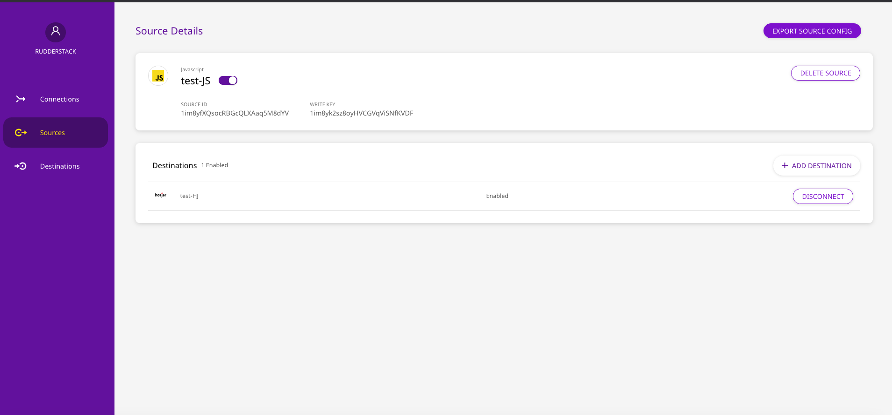

# Config Generator

RudderStack's Control Plane manages the configuration of your sources and destinations.


For more information on the Control Plane, refer to RudderStack's [**architecture**](rudderstack-architecture.md).


The easiest way to manage these configurations is through RudderStack's [**self-hosted web app**](https://app.rudderstack.com/). It is free, requires no setup, and has some advanced features like [**Live Events**](../user-guides/how-to-guides/live-destination-event-debugger.md) and [**Transformations**](../adding-a-new-user-transformation-in-rudderstack/).

However, if you don't wish to sign up for RudderStack and want to self-host these configurations instead, you can use the open-source Config Generator to set up your own Control Plane. You can then manage the source and destination configurations locally by exporting to or importing from a JSON file.

## Setting Up the Control Plane

To set up your self-hosted Control Plane using the Config Generator, follow these steps:


Make sure you have [**Node.js**](https://nodejs.org/en/download/) installed before setting up the Config Generator.


* Clone the [**RudderStack Config Generator**](https://github.com/rudderlabs/config-generator) ****repository. 
* Next, open your terminal, navigate to the Config Generator folder, and run the following commands:  


  * `npm install`
  * `npm start`

 

* Upon successful setup, you can access the dashboard at [**http://localhost:3000**](http://localhost:3000) by default.


## Exporting Workspace Configuration

After adding the required sources and destinations in the dashboard, you can export your workspace configuration by simply clicking the **EXPORT** button. The configuration is then exported and saved as a JSON file. This workspace configuration is required to start the RudderStack server.


For more information on adding sources and destinations in RudderStack, refer to the [**How to Add a Source and Destination in RudderStack**](../connections/adding-source-and-destination-rudderstack.md) guide.


## Starting RudderStack With the Workspace Configuration File

For RudderStack to pick up the exported workspace configuration file, follow the steps for your preferred RudderStack setup.

### Docker

If you want to set up RudderStack ****on ****Docker, follow these steps:

* Download and open [**`rudder-docker.yml`**](https://raw.githubusercontent.com/rudderlabs/rudder-server/master/rudder-docker.yml).
* In the `environment` section under `backend` service, uncomment the following lines:

```text
- RSERVER_BACKEND_CONFIG_CONFIG_FROM_FILE=true
- RSERVER_BACKEND_CONFIG_CONFIG_JSONPATH=<workspace_config_filepath_in_container>
```

* Then, replace `<workspace_config_filepath_in_container>`  in the line above with your preferred container file path. By default, you can set it to `/etc/rudderstack/workspaceConfig.json`. 
* In the `volumes` section under the `backend` service, uncomment the following line:

```text
- <absolute_path_to_workspace_config>:<workspace_config_filepath_in_container>
```

* Then, replace `<absolute_path_to_workspace_config>` with the local path of your `workspaceConfig.json`\(where your workspace configuration file is saved locally\). Also, replace  `<workspace_config_filepath_in_container>`  with the container file path that you set above.


Value for `<workspace_config_filepath_in_container>`should be the same as the value provided for the  `RSERVER_BACKEND_CONFIG_CONFIG_JSONPATH` variable. Otherwise, your workspace configuration won't be loaded and you will get an error.


Your `rudder-docker.yml` should look like the following:


* Finally, navigate to the directory where you want to install RudderStack and run the following command:

  ```text
  docker-compose -f rudder-docker.yml up
  ```

* Once you have successfully followed the steps above, [**send test events**](installing-and-setting-up-rudderstack/sending-test-events.md) to verify the installation.

### Kubernetes

* Clone the [**repository**](https://github.com/rudderlabs/rudderstack-helm) containing the RudderStack Helm chart by running the following command:

  ```bash
  $ git clone git@github.com:rudderlabs/rudderstack-helm.git

  ```

* Navigate to the folder containing the Helm chart.

  ```bash
  $ cd rudderstack-helm/
  ```

* Open the `values.yaml` file. 
* Set the parameter `controlPlaneJSON` to `true`.  
* Export the workspace configuration from the dashboard by following the steps in the [**Exporting Workspace Configuration**](https://docs.rudderstack.com/get-started/config-generator#exporting-workspace-configuration) section above. 
* Finally, run the following command:

```text
$ helm install my-release ./ --set backend.controlPlaneJSON=true
```


Refer to the [**Configuration**](https://docs.rudderstack.com/get-started/installing-and-setting-up-rudderstack/kubernetes#configuration) section for information on the parameters that can be configured during deployment.


* Once you have completed these steps above successfully, [**send test events**](installing-and-setting-up-rudderstack/sending-test-events.md) to verify the installation.

### Developer Machine Setup

* First, set up the database in your preferred directory using the following commands:

```bash
createdb jobsdb
createuser --superuser rudder
psql "jobsdb" -c "alter user rudder with encrypted password 'rudder'";
psql "jobsdb" -c "grant all privileges on database jobsdb to rudder";
```

* Next, clone the [**RudderStack server**](https://github.com/rudderlabs/rudder-server) repository.  
* Then, run `git submodule init` and `git submodule update` to fetch the `rudder-transformer` repository.  
* Next, navigate to the Transformer directory using the following command:

```bash
cd rudder-transformer
```

* Install dependencies using the command `npm i` . Then, start the destination transformer using the following command:

```bash
node destTransformer.js
```

* Navigate back to the main directory using the command `cd rudder-server`.  
* Next, copy the `sample.env` to the main directory using the following command:

```bash
cp config/sample.env .env
```

* Then, go to the `config` folder and open `config.yaml`.  
* Under `[BackendConfig]`, look for `configFromFile` and set it to `true`. 
* Also, change the value of `configJSONPath` to the local path of your `workspaceConfig.json`\(where your workspace configuration file is saved locally\), as shown:


* Finally, run the RudderStack server using the following command:

  ```bash
  go run -mod=vendor main.go
  ```

* Once you have completed these steps above successfully, [**send test events**](installing-and-setting-up-rudderstack/sending-test-events.md) to verify the installation.

## Using Hosted Control Plane for Device Mode Destinations


To know more about the difference between **Cloud mode** and **Device mode** in RudderStack, read the ****[**RudderStack connection modes**](https://docs.rudderstack.com/get-started/rudderstack-connection-modes) guide.


RudderStack's [**web**](https://app.gitbook.com/@rudderlabs/s/rudderlabs-1/~/drafts/-MJRY7Fz5shtM06WXlym/rudderstack-sdk-integration-guides/rudderstack-javascript-sdk), [**Android**](https://app.gitbook.com/@rudderlabs/s/rudderlabs-1/~/drafts/-MJRY7Fz5shtM06WXlym/rudderstack-sdk-integration-guides/rudderstack-android-sdk) and [**iOS**](https://docs.rudderstack.com/rudderstack-sdk-integration-guides/rudderstack-ios-sdk) ****SDKs expect the source configurations and the associated device mode destination configurations for initialization.


By default, RudderStack SDKs fetch the source configuration from [**https://api.rudderlabs.com/sourceConfig**](https://api.rudderlabs.com/sourceConfig).


### What is the Control Plane URL?

Since the RudderStack SDKs need the source configuration and RudderStack's Data Plane or the SDKs are not aware of it by default, you must serve the configuration on your web servers and point the SDKs to the same. This configuration must be available at `<CONTROL_PLANE_URL>/sourceConfig`

To do so, follow these steps:

* Set up your Control Plane using the RudderStack Config Generator. 
* Go to the dashboard, set up your source, and export the source configuration by clicking the **EXPORT SOURCE CONFIG** button, as shown:



* Host the exported file on your own server at `/sourceConfig`. Provide the base URL of your server that is serving this file in SDK initialization code snippet:  
  * **JavaScript SDK**: Instructions [**here**](https://github.com/rudderlabs/rudder-sdk-js#self-hosted-config-plane). 
  * **Android SDK**: Instructions [**here**](https://docs.rudderstack.com/rudderstack-sdk-integration-guides/rudderstack-android-sdk#configuring-your-rudderstack-client). 
  * **iOS SDK**: Instructions [**here**](https://docs.rudderstack.com/rudderstack-sdk-integration-guides/rudderstack-ios-sdk#configuring-the-rudderstack-client).
  * **Flutter SDK**: Instructions [**here**](https://docs.rudderstack.com/rudderstack-sdk-integration-guides/rudderstack-flutter-sdk#configuring-the-rudderstack-client).


RudderStack SDKs fetch the configuration by appending the `/sourceConfig` path to the base URL provided above.


* The SDKs will fetch the config from `<CONTROL_PLANE_URL>/sourceConfig`. 

A sample exported source config is shown below:

```text
{
  "source": {
    "config": {},
    "id": "1im8yfXQsocRBGcQLXAaq5M8dYV",
    "name": "test-JS",
    "writeKey": "1im8yk2sz8oyHVCGVqViSNfKVDF",
    "enabled": true,
    "sourceDefinitionId": "1TW48i2bIzEl1HPf825cEznfIM8",
    "deleted": false,
    "createdAt": "Mon Oct 12 2020 16:51:54 GMT+0530 (India Standard Time)",
    "updatedAt": "Mon Oct 12 2020 16:51:54 GMT+0530 (India Standard Time)",
    "sourceDefinition": {
      "id": "1TW48i2bIzEl1HPf825cEznfIM8",
      "name": "Javascript",
      "displayName": "Javascript",
      "category": null,
      "createdAt": "2019-11-12T12:39:19.885Z",
      "updatedAt": "2020-06-18T11:54:06.114Z"
    },
    "destinations": [
      {
        "id": "1im927dBatOkbj1oPCV5JntGMj7",
        "name": "test-HJ",
        "enabled": true,
        "config": {
          "siteID": "dd41289"
        },
        "destinationDefinition": {
          "config": {
            "destConfig": {
              "web": [
                "useNativeSDK"
              ],
              "defaultConfig": [
                "siteID"
              ]
            },
            "secretKeys": [],
            "excludeKeys": [],
            "includeKeys": [
              "siteID"
            ],
            "supportedSourceTypes": [
              "web"
            ]
          },
          "id": "1SxbQXdfQ2NzIdqNO3GceshF4V0",
          "name": "HOTJAR",
          "displayName": "Hotjar",
          "createdAt": "2019-10-31T07:49:37.450Z",
          "updatedAt": "2020-09-05T10:02:39.744Z"
        }
      }
    ]
  },
  "metadata": {
    "version": "1.0.2"
  }
}
```

## FAQs

#### For a self-hosted environment, how to get the Control Plane URL?

To use the Control Plane URL to initialize your SDKs, follow these steps:

* \*\*\*\*[**Set up**](https://docs.rudderstack.com/how-to-guides/rudderstack-config-generator#setting-up-the-rudderstack-config-generator) ****the Control Plane using the RudderStack Config Generator. 
* Go to dashboard, configure the source, and export the source configuration by clicking the **EXPORT SOURCE CONFIG** button as shown:


* Host the exported file on your own server such that the configuration is available at  `<CONTROL_PLANE_URL>/sourceConfig`. 


This solution assumes that you have already [**set up RudderStack**](installing-and-setting-up-rudderstack/) locally and are hosting your own RudderStack backend \(Data Plane\).


## Contact Us

In case you come across any issues while setting up or using the RudderStack Config Generator, please feel free to [**contact us**](mailto:%20docs@rudderstack.com). You can also start a conversation on our [**Slack**](https://resources.rudderstack.com/join-rudderstack-slack) channel.

