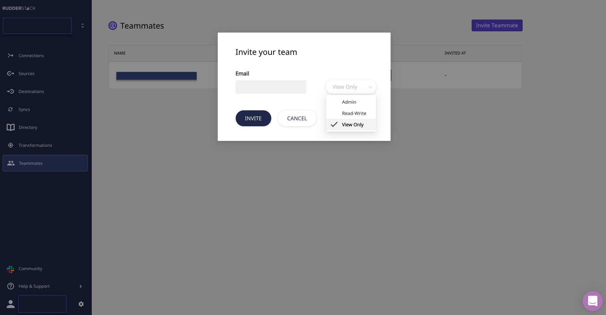

# User Management

RudderStack's user management feature lets you add and manage other users in your current workspace and enables easier collaboration between you and other members of your team or organization.

You can invite up to 3 users in your <a href="https://app.rudderlabs.com/signup?type=freetrial">RudderStack Cloud Free</a> plan. You can increase this limit by upgrading to a Pro or Enterprise plan.

Refer to the table below for specifics on the number of teammates you can add to your current workspace in each plan:

| **Plan**                         | **Number of Teammates** |
| :------------------------------- | :---------------------- |
| **RudderStack Cloud Free**       | 3                       |
| **RudderStack Cloud Pro**        | 10                      |
| **RudderStack Cloud Enterprise** | Unlimited               |

  Check our <a href="https://rudderstack.com/pricing/">pricing</a> page for a
  complete list of the supported features or <a href="http://app.rudderstack.com/upgrade">log in</a> to upgrade now.

## How to Invite a User

To invite a user in your current workspace, follow these steps:

- Click on the **Teammates** option on the left nav bar and click on **Invite Teammate**, as shown:

<!--  -->

- Enter the email address of the user you want to invite and select the privileges you want to assign to them. Then, click on **Invite**.

<!--  -->

## User Permissions

An invited user can be assigned one of the following three roles:

<table>
  <thead>
    <tr>
      <th style="text-align:left">Role</th>
      <th style="text-align:left">Description</th>
    </tr>
  </thead>
  <tbody>
    <tr>
      <td style="text-align:left">
        <b>View-only</b>
      </td>
      <td style="text-align:left">
        

        

          This user has read-only access to
           
          all the options in the workspace.
        

      </td>
    </tr>
    <tr>
      <td style="text-align:left">
        <b>Read-write</b>
      </td>
      <td style="text-align:left">
        

        

          This user has complete access to all the RudderStack workspace options
           
          included in the plan except team management
           
          (adding / removing users and modifying user permissions).
        

      </td>
    </tr>
    <tr>
      <td style="text-align:left">
        <b>Admin</b>
      </td>
      <td style="text-align:left">
        

        

          This user has complete access to all the RudderStack features and
          options
           
          as a part of the plan, including team management.
        

      </td>
    </tr>
  </tbody>
</table>

The detailed permissions for each of the above roles are listed in the following sections.

### View-only User

A user with this role has read-only access to all the RudderStack workspace features.

This role has the following permissions:

#### Connections

See the following guides to learn more about these features:
<li>
<a href="https://rudderstack.com/docs/connections/">Connections</a>
</li>
<li>
<a href="https://rudderstack.com/docs/transformations/">Transformations</a>
</li>

| Option       | View | Add | Modify | Delete |
| :----------- | :--- | :-- | :----- | :----- |
| Sources      | Yes  | No  | No     | No     |
| Destinations | Yes  | No  | No     | No     |

Users with this role can view the settings of all the destinations. However, secrets like access keys are hidden from them.

| Option          | View | Add | Modify | Delete |
| :-------------- | :--- | :-- | :----- | :----- |
| Connections     | Yes  | No  | No     | No     |
| Transformations | Yes  | No  | No     | No     |

View-only users can run tests on existing transformations but they cannot add, modify, or delete transformations. They can also view any secrets, like API keys in the transformation code.

Other permissions for this role include:

#### Live Events

- Can view live events at both the source and destination level.

View-only users can look at events that might contain sensitive information, like the PII of users. In some cases, they can also view the API keys and other API secrets of the destinations.

#### Syncs

- Cannot sync the Cloud Extract and Warehouse Actions sources
- Can view all the details related to the sync, including the history of the syncs.

#### Audit Logs

- Cannot view all the audit logs.

#### Team

- Can view all the members of the team and their roles.
- Cannot invite new users to the team or change the role/permissions of any existing user.

### Read-Write User

A user with the read-write role has all the permissions associated with a view-only user. They also have some additional permissions related to different workspace features and options, as mentioned below:

#### Connections

| Option          | View | Add | Modify | Delete |
| :-------------- | :--- | :-- | :----- | :----- |
| Sources         | Yes  | Yes | Yes    | Yes    |
| Destinations    | Yes  | Yes | Yes    | Yes    |
| Connections     | Yes  | Yes | Yes    | Yes    |
| Transformations | Yes  | Yes | Yes    | Yes    |

See the following guides for more information on these options:
<li>
<a href="https://rudderstack.com/docs/connections/">Connections</a>
</li>
<li>
<a href="https://rudderstack.com/docs/transformations/">Transformations</a>
</li>  

Other permissions for this role include:

#### Live Events

- Can view live events at both the source and destination level.

#### Syncs

- Can sync the Cloud Extract and Warehouse Actions sources
- Can view all the details related to the sync, including the history of the syncs.

#### Audit Logs

- Can view all the audit logs.

#### Team

- Can view all the members of the team and their roles.
- Cannot invite new users to the team or change the role/permissions of any existing user.

The user with the read-write role has all the permissions as an admin, except the team management options. Refer to the **Admin** section below to know more about these features.

### Admin

This role has complete access to the RudderStack workspace, including all the options and features in the current plan.

The permissions for this role are as listed below:

#### Connections

| Option          | View | Add | Modify | Delete |
| :-------------- | :--- | :-- | :----- | :----- |
| Sources         | Yes  | Yes | Yes    | Yes    |
| Destinations    | Yes  | Yes | Yes    | Yes    |
| Connections     | Yes  | Yes | Yes    | Yes    |
| Transformations | Yes  | Yes | Yes    | Yes    |

See the following guides for more information on these options:
<li>
<a href="https://rudderstack.com/docs/connections/">Connections</a>
</li>
<li>
<a href="https://rudderstack.com/docs/transformations/">Transformations</a>
</li>

#### Live Events

- Can view live events at both the source and destination level.

#### Syncs

- Can sync the Cloud Extract and Warehouse Actions sources.
- Can view all the details related to the sync, including the history of the syncs.

#### Audit Logs

- Can view all the audit logs.

#### Team

- Can view all the members of the team and their roles.
- Can invite a new user to the team.
- Can delete any pending invitation.
- Can edit the role of an existing member.
- Can modify the roles of all the members \(including other admins\).
- Can remove any member from the workspace.

## Contact Us

For more information on this feature, feel free to [**contact us**](mailto:%20docs@rudderstack.com). You can also talk to us in our [**Slack**](https://rudderstack.com/join-rudderstack-slack-community) community, we will be happy to help you.
