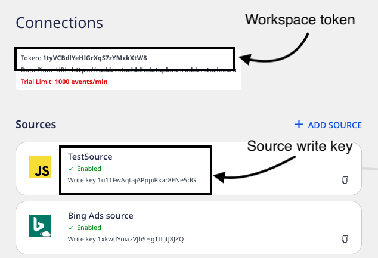

# Glossary

This guide lists the definitions of the RudderStack-related terms that you are likely to encounter throughout the documentation and while using RudderStack.

## Audit logs

Audit Logs is RudderStack's [enterprise]( https://rudderstack.com/pricing/)feature that gives you a detailed log of the user activities happening within your RudderStack workspace. These activities include the various user operations related to sources, destinations, transformations, and more.

For more information on the audit logs feature, refer to the [Audit Logs](https://rudderstack.com/docs/rudderstack-cloud/audit-logs/) guide.

## Cloud Extract

[Cloud Extract](https://rudderstack.com/docs/cloud-extract-sources/) is RudderStack's ELT feature that lets you collect your raw events and data from various third-party cloud platforms such as Google Analytics, Marketo, Facebook Ads, Stripe, etc. and send it to your data warehouse with a user-specified frequency.

For more information on the various Cloud Extract sources and how to set them up in RudderStack, refer to the [Cloud Extract](https://rudderstack.com/docs/cloud-extract-sources/) guide.

## Connection (Pipeline)

A connection is a one-to-one directional flow of events between a RudderStack source and a destination.

For more information on sources and destinations in RudderStack, refer to the [RudderStack Cloud](https://rudderstack.com/docs/rudderstack-cloud/) section.

You can set up different types of connections in RudderStack to send your events, based on the type of source:

* **Event Stream**:  One source to many destinations
* **Cloud Extract**: Multiple sources to one warehouse destination
* **Reverse ETL**: One warehouse source to one downstream destination (mainly due to the mappings required when setting up the connection).

## Connection modes (cloud mode and device mode)

You can send the event data from your sources to your desired destinations via RudderStack in two ways:

* **Cloud mode**: In this mode, the RudderStack SDKs track and send the event data directly to the RudderStack server for processing. RudderStack processes this data and routes it to the desired destination. This mode is useful when you want to leverage the [Transformations](#transformations) feature to transform your events before sending them over to the destinations.
* **Device mode**: In this mode, you can send the source events to the destinations using the native client-specific libraries on your website/mobile app. These libraries allow RudderStack to use the data you collect on your device to call the destination APIs without sending it to the RudderStack server first. This mode is useful when you want to send the events to a destination as-is, without any transformation.

These two modes are commonly referred to as RudderStack connection modes.

For more information, refer to the [RudderStack connection modes](https://rudderstack.com/docs/rudderstack-cloud/rudderstack-connection-modes/) guide.

## Control plane

The control plane manages the configuration of your sources and destinations. The interface for the control plane is the [RudderStack web app](https://app.rudderstack.com/).

For more information on the control plane, refer to the [RudderStack architecture](https://rudderstack.com/docs/get-started/rudderstack-architecture/) guide.

## Control Plane Lite

RudderStack's control plane offers an intuitive UI to configure your event data sources and destinations.

If you want to self-host these configurations, you can use the open source Control Plane Lite utility to set up your control plane. You can then manage the source and destination configurations locally by exporting to or importing them from a JSON file.

For information on Control Plane Lite and how to use it, refer to the [Control Plane Lite](https://rudderstack.com/docs/rudderstack-open-source/control-plane-lite/) guide.

## Customer Data Platform

A Customer Data Platform (CDP) is a software/collection of tools that unifies and persists all the customer-specific records across multiple data sources in a centralized location accessible to other tools/platforms. A CDP lets you build a comprehensive customer profile and use the insights for a variety of use-cases.

## Data governance

RudderStack's [Data Governance](https://rudderstack.com/docs/data-governance/) feature gives you the ability to access all your events and their metadata programmatically and identify any inconsistencies in them. This includes vital information related to the event schema, event payload versions, data types, and more.

## Data plane

The data plane is RudderStack's core engine responsible for:

* Receiving and buffering the event data
* Transforming the events into the required destination format
* Relaying the events to the destination

For more information on the data plane, refer to the [RudderStack architecture](https://rudderstack.com/docs/get-started/rudderstack-architecture/) guide.

The data plane is intentionally separated from the control plane to give you complete ownership of your data. Depending on how RudderStack is deployed, you can set up your control plane and data plane via one of the following approaches:

* [RudderStack Cloud](https://rudderstack.com/docs/rudderstack-cloud/): RudderStack hosts both control plane and data plane
* [RudderStack Open Source](https://rudderstack.com/docs/rudderstack-open-source/): RudderStack hosts the control plane and the user hosts the data plane. Alternatively, the user hosts both the control plane and the data plane.

## Data Regulation API

[Data Regulation](https://www.rudderstack.com/docs/rudderstack-api/data-regulation-api/) is RudderStack's enterprise feature that lets you programmatically suppress user data identified by a user ID. With this feature, you can block all the user data for all the sources and destinations in RudderStack.

Refer to the [Data Regulation API](https://www.rudderstack.com/docs/rudderstack-api/data-regulation-api/) guide for more information.

## Destination

A destination is a tool or application where you want to send the data via RudderStack.

RudderStack currently supports over 150 destinations. These include [data warehouses](https://rudderstack.com/docs/data-warehouse-integrations/), [analytics](https://rudderstack.com/docs/destinations/analytics/) platforms, [CRMs](https://rudderstack.com/docs/destinations/crm/), [marketing](https://rudderstack.com/docs/destinations/marketing/) platforms, and more.

Refer to the [Destinations](https://rudderstack.com/docs/destinations/) guide for the complete list of the supported destinations.

## ELT (Extract, Load, Transform)

The ELT \(Extract, Load, Transform\) process can be defined as:

* Extract: Obtaining data from the source platform or application.
* Load: Replicating the data from the source into the target system, typically a data warehouse or a data lake.
* Transformation: Transforming the data in the desired format according to the business requirement/use-case.

Refer to the [RudderStack blog](https://rudderstack.com/blog/rudderstack-cloud-extract-makes-cloud-to-warehouse-pipelines-easy) to read more about ELT and how RudderStack facilitates it via the [Cloud Extract](https://rudderstack.com/docs/cloud-extract-sources/) feature.

## Event

Events are the fundamental components of clickstream data. They correspond to the user actions on websites or mobile apps such as clicks, page/screen views, logins, registrations, etc.

Tracking events in real-time helps businesses to better understand the users and their product journey. This, in turn, allows businesses to deliver better recommendations, send relevant push notifications, and enhance user experience.

Check out the [RudderStack blog post](https://rudderstack.com/blog/clickstream-analytics-gamechanger-for-ecommerce) to read more about clickstream analytics.

## Event spec

The RudderStack event spec helps you plan your event data and provides various options for tracking your events across all the RudderStack SDKs and APIs. As RudderStack has a unified event semantic for different destination platforms, you can easily translate your event data to different downstream tools by following this spec.

For more information on the RudderStack event spec, refer to the [Event Spec](https://rudderstack.com/docs/rudderstack-api/api-specification/rudderstack-spec/) guide.

## Event Stream

RudderStack's [Event Stream](https://rudderstack.com/docs/stream-sources/) feature lets you collect your event data from all of your web and mobile apps and route it to a wide array of customer tools and data warehouses via RudderStack.

For more information on the various Event Stream sources supported by RudderStack, refer to the [Event Stream](https://rudderstack.com/docs/stream-sources/) guide.

## Live Events

RudderStack's [Live Events](https://rudderstack.com/docs/rudderstack-cloud/live-events) feature offers a debugger that shows the live events collected from your sources and sent to the connected destinations in real-time. With this feature, you can easily debug any errors in the failing events at a destination level and reduce your troubleshooting time and efforts.

Broadly speaking, this feature can be further classified into two categories:

* [Source Live Events](https://rudderstack.com/docs/rudderstack-cloud/live-events#source-live-events): This feature gives you real-time visibility into the source events collected by RudderStack. This way, you can confirm if your source is configured correctly and is collecting & sending data as expected. 
* [Destination Live Events](https://rudderstack.com/docs/rudderstack-cloud/live-events#destination-live-events): When routing events to a destination, sometimes events don't show up in your destination. This feature gives you real-time visibility into the destination's responses and helps you troubleshoot the problem.

## Reverse ETL

Reverse ETL is the process of routing the data residing in your data warehouse to various downstream tools within your customer data stack. This includes various SaaS marketing, analytics, sales, and customer support tools.

Check out the [RudderStack blog](https://rudderstack.com/blog/reverse-etl-is-just-another-data-pipeline) to read more about the Reverse ETL. For more information on the supported Reverse ETL sources and setting them up in RudderStack, refer to the [Reverse ETL documentation](https://rudderstack.com/docs/reverse-etl/).

## SDK

RudderStack offers client-side SDK support for your web, mobile, and server-side sources and lets you track your event data seamlessly.

Refer to the [SDK documentation](https://rudderstack.com/docs/stream-sources/rudderstack-sdk-integration-guides/) for more details.

## Source

A source is a platform or an application \(web, mobile, server-side, or a third-party cloud app\) from where RudderStack tracks and collects your event data.

For more information on RudderStack sources, refer to the [Sources](https://rudderstack.com/docs/rudderstack-cloud/sources) guide.

## Visual Data Mapper

The Visual Data Mapper(VDM) is a Reverse ETL feature. It offers an intuitive UI to map your data warehouse columns to specific destination fields without any second-guessing.

For more information on RudderStack sources, refer to the [Visual Data Mapper](https://rudderstack.com/docs/reverse-etl/features/visual-data-mapper/) guide.

## Teammates

RudderStack's Teammates (user management) feature enables you to add and manage other users in your current RudderStack workspace. It facilitates easier collaboration between you and other team members of your organization while using RudderStack.

For more information on this feature, refer to the [Teammates](https://rudderstack.com/docs/rudderstack-cloud/teammates/) guide.

## Transformations

RudderStack's [Transformations](https://www.rudderstack.com/docs/transformations/) feature lets you leverage your custom JavaScript functions that you can use to implement a variety of use-cases like: 

  * Filtering or sampling events
  * Implementing a static logic to enrich your events
  * Removing any sensitive PII information from your customer events, and a lot more.

For more details on this feature and how to use it, refer to the [Transformations](https://rudderstack.com/docs/transformations/) guide.

## Warehouse destination

RudderStack supports sending events to all the leading data warehouses like Redshift, Azure Synapse, BigQuery, Snowflake, PostgreSQL, ClickHouse, and SQL Server. These are called the warehouse destinations.

For more information on how to set up these warehouse destinations, refer to the [Warehouse Destinations](https://rudderstack.com/docs/data-warehouse-integrations) guides.

## Warehouse schema

When sending your events to a data warehouse via RudderStack, you need not define a schema for the event data before sending it from your source. Instead, RudderStack automatically does that for you by following a predefined warehouse schema. This schema defines the different tables and columns created based on different events.

Refer to the [Warehouse Schema documentation](https://rudderstack.com/docs/data-warehouse-integrations/warehouse-schemas/) for more details.

## Token

The token (also referred to as the workspace token) is a unique identifier of your RudderStack workspace. You can find it by logging in to the RudderStack web app.

## Write key

The write key (also referred to as the source write key) is a unique identifier for your source. It is used while sending events from a source to your specified destination via RudderStack.

## Contact us

For any questions on any of the topics covered in this guide, you can [contact us](mailto:%20docs@rudderstack.com). You can also start a conversation in our [Slack](https://rudderstack.com/join-rudderstack-slack-community) community.
