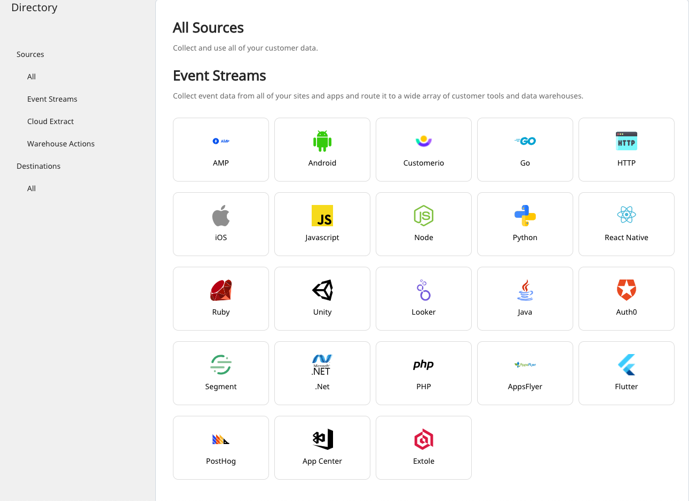
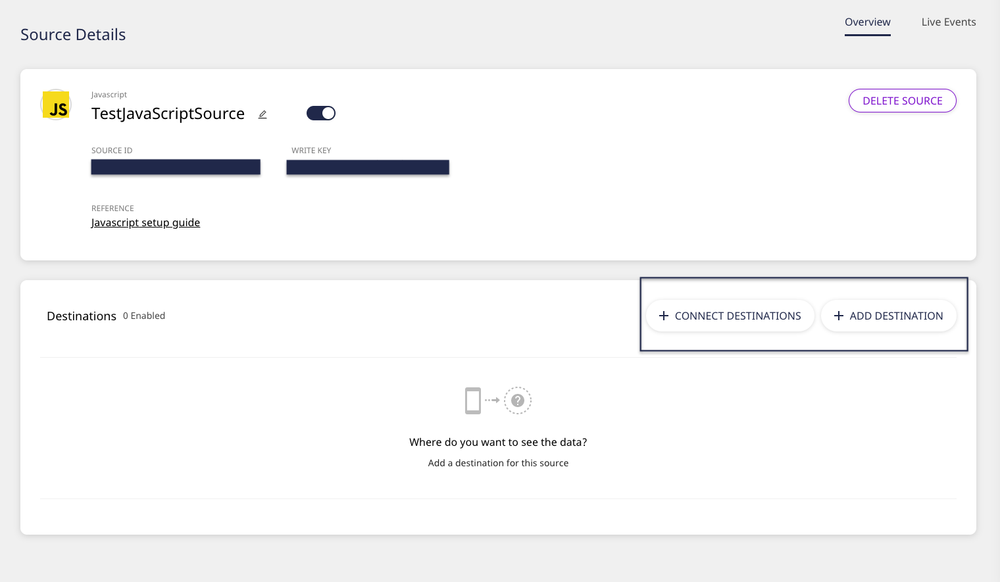

# Get Started

## What is RudderStack?

[**RudderStack**](https://rudderstack.com/) is a **customer data platform** to capture, process, and sync all of your event, product, and warehouse data to all the tools across your customer data stack.

RudderStack's backend is written in Go, with a simple, user-friendly UI written in React.js.

RudderStack is enterprise-ready and provides a powerful transformation framework to process your event data on the fly.

**Start building a better, warehouse-first CDP that delivers complete, unified data to every part of your marketing and analytics stack. Sign up for <a href="https://app.rudderlabs.com/signup?type=freetrial"> RudderStack Cloud Free</a> today.**

  Do you have any questions about RudderStack? Join our <a href="https://rudderstack.com/join-rudderstack-slack-community">Slack community</a>
  and start a conversation today.

## Why RudderStack?

- **Segment API-compatible**: RudderStack is fully compatible with the Segment API. So you don't need to change your app if you are using Segment. Simply integrate the RudderStack SDKs into your app and your events will keep flowing as before \(including your data warehouse\).
- **Processing Flexibility**: With RudderStack's powerful JavaScript-based event transformation framework, you can enhance or transform your event data by combining it with your other internal data.
- **Stand-alone System**: RudderStack runs as a single Go binary with the dependencies being on a PostgreSQL server and a Node.js service. There is no other dependency required to run RudderStack.
- **Platform-independent**: RudderStack is Kubernetes-native and can run on any Kubernetes cluster with our Helm charts. RudderStack is cloud-agnostic and can run on stand-alone machines in all popular cloud platforms, namely AWS, Microsoft Azure, GCP, and others.
- **High Performance**: On a single m4.2xlarge AWS EC2 instance, RudderStack can process 3000 events/second.
- **Enhanced Telemetry**: To help us improve RudderStack, we collect performance and diagnostic metrics about how you use RudderStack, and how it is working. **No customer data is present in the metrics**. For more technical details, please check out our GitHub wiki page on [**Telemetry**](https://github.com/rudderlabs/rudder-server/wiki/RudderStack-Telemetry).
- **Unlimited Events**: Event volume-based pricing of most of the commercial systems is broken. With RudderStack, you are able to collect as much data as possible without worrying about overrunning event budgets.

## RudderStack in 5 Minutes

Get up and running with RudderStack in no time by following these steps:

- Sign up for [**RudderStack Cloud**](https://app.rudderlabs.com/signup?type=freetrial).
- You will then get access to this dashboard for setting up your data pipelines:

<!--Connections Dashboard](../assets/1 (22).png" />-->

Connections Dashboard

- Click on **Add Source** to set up a data source.

  For more information on sources in RudderStack, check out the <a href="https://rudderstack.com/docs/connections/">Connections</a> guide.

- Choose the data source from the list of available sources. RudderStack supports the following three types of sources:
  - [**Event Streams**](https://rudderstack.com/docs/stream-sources/): With these sources, you can collect your event data from all of your web, mobile, and server-side apps and route it to a wide array of customer tools and data warehouses.
  - [**Cloud Extract**](https://rudderstack.com/docs/cloud-extract-sources/): With these sources, you can build ELT pipelines from cloud apps to your data warehouse.
  - [**Warehouse Actions**](https://rudderstack.com/docs/warehouse-actions/): With this option, you can leverage the enriched data residing in your data warehouse as a data source for your whole customer data stack.

<!--RudderStack Sources](../../docs..//screen-shot-2021-06-01-at-1.53.46-pm.png" />-->

RudderStack Sources

- Once you have configured the data source, add a destination in RudderStack by clicking on the **Add Destination** button.

<!--Destination Configuration Button-->

Destination Configuration Button

- From the list of destinations, choose the destination you want to configure for the source.
- Configure the destination by entering the relevant connection settings. For detailed information on the required settings, refer to that destination's [**documentation**](https://rudderstack.com/docs/destinations/).

  You can transform your events in RudderStack before sending them to the
  specified destinations. Read our <a href="https://rudderstack.com/docs/transformations/">Transformations</a> guide for more information on this feature.

Here's a quick walkthrough on how to send data from your website to various cloud tools via RudderStack:

<!--https://www.youtube.com/watch?v=BEQltd_5A_k&ab_channel=RudderStack-->

<YouTube 
  videoId={'BEQltd_5A_k'}
  opts={{playerVars: {rel: 0}}}
/>

## Useful Links

- Check out some [**sample applications**](https://github.com/rudderlabs/rudder-samples/) that demonstrate various RudderStack use-cases.
- Read more about RudderStack's underlying architecture and familiarize yourself with RudderStack's core backend and terms such as **Control Plane** and **Data Plane**.

<a class="pageRef" href="./rudderstack-architecture">
  

    
      <svg
        preserveAspectRatio="xMidYMid meet"
        height="1em"
        width="1em"
        fill="none"
        xmlns="http://www.w3.org/2000/svg"
        viewBox="0 0 24 24"
        strokeWidth="2"
        strokeLinecap="round"
        strokeLinejoin="round"
        stroke="currentColor"
        class="rightRefArrow"
      >
        <g>
          <line x1="5" y1="12" x2="19" y2="12"></line>
          <polyline points="12 5 19 12 12 19"></polyline>
        </g>
      </svg>
    
    Architecture
  

</a>

- You can set up open-source RudderStack on the platform of your choice, in your own development environment.

<a class="pageRef" href="./installing-and-setting-up-rudderstack/">
  

    
      <svg
        preserveAspectRatio="xMidYMid meet"
        height="1em"
        width="1em"
        fill="none"
        xmlns="http://www.w3.org/2000/svg"
        viewBox="0 0 24 24"
        strokeWidth="2"
        strokeLinecap="round"
        strokeLinejoin="round"
        stroke="currentColor"
        class="rightRefArrow"
      >
        <g>
          <line x1="5" y1="12" x2="19" y2="12"></line>
          <polyline points="12 5 19 12 12 19"></polyline>
        </g>
      </svg>
    
    Install and Set Up RudderStack
  

</a>

- Learn about data governance in RudderStack.

<a class="pageRef" href="https://rudderstack.com/docs/data-governance/">
  

    
      <svg
        preserveAspectRatio="xMidYMid meet"
        height="1em"
        width="1em"
        fill="none"
        xmlns="http://www.w3.org/2000/svg"
        viewBox="0 0 24 24"
        strokeWidth="2"
        strokeLinecap="round"
        strokeLinejoin="round"
        stroke="currentColor"
        class="rightRefArrow"
      >
        <g>
          <line x1="5" y1="12" x2="19" y2="12"></line>
          <polyline points="12 5 19 12 12 19"></polyline>
        </g>
      </svg>
    
    Data Governance
  

</a>

## Contact Us

If you want to know more about RudderStack, feel free to [**contact us**](mailto:%20docs@rudderstack.com). You can also see [**RudderStack in action**](https://app.rudderstack.com/signup?type=freetrial) to check out all the cool features the platform has to offer.

For community support, you can always start a conversation in our [**Slack**](https://rudderstack.com/join-rudderstack-slack-community) community. We will be happy to help you!
