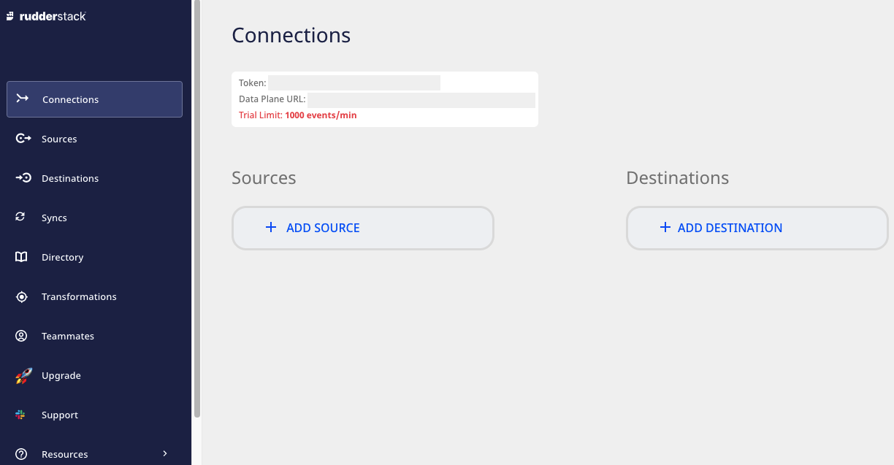
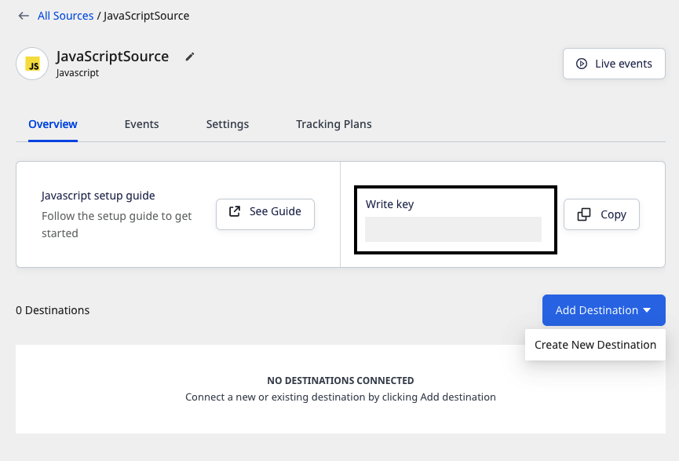
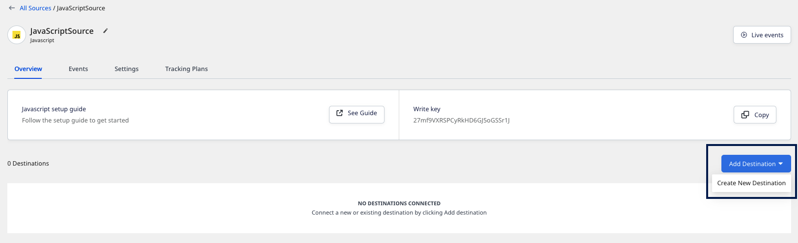

# Get Started

The easiest way to get started with RudderStack is to set up a source, connect it to a destination, and see your event data flow in no time.

## Quick start

Follow these steps to set up a connection in RudderStack:

1. Sign up for [RudderStack Cloud](https://app.rudderstack.com/signup?type=freetrial).
2. You can then access the dashboard for setting up your data pipelines:

3. Click on **Add Source** to set up a data source.

For more information on sources in RudderStack, check out the <a href="https://rudderstack.com/docs/rudderstack-cloud/sources/">Sources</a> guide.

4. Choose the data source from the list of available sources. RudderStack supports the following three types of sources:

    - [Event Streams](https://rudderstack.com/docs/stream-sources/): Collect your event data from all the web, mobile, and server-side apps, then route it to a wide array of customer tools and data warehouses.
    - [Cloud Extract](https://rudderstack.com/docs/cloud-extract-sources/): Build ELT pipelines from cloud apps to your data warehouse.
    - [Reverse ETL](https://rudderstack.com/docs/reverse-etl/): Leverage your warehouse as a data source for your entire customer data stack.

5. Once you have configured the data source, you will see the following source details page.

Note the source <strong>Write key</strong>. This is required for integrating the RudderStack SDK with your source app.

6. Then, add a destination by clicking on the **Add Destination** button and selecting **Create new destination**.

7. From the list of destinations, select the destination you want to configure for the source. RudderStack currently supports **over 150** destinations, including [event stream](https://www.rudderstack.com/docs/destinations/) and [warehouse](https://www.rudderstack.com/docs/data-warehouse-integrations/) destinations.
8. Configure the destination by entering the relevant connection settings. For detailed information on these settings, refer to the destination-specific [documentation](https://rudderstack.com/docs/destinations/).

You can also transform your events in RudderStack before sending them to the destinations. Read the <a href="https://rudderstack.com/docs/transformations/">Transformations</a> guide for more information on this feature.

## In this section

<a class="pageRef" href="rudderstack-architecture/">
  

    
      <svg
        preserveAspectRatio="xMidYMid meet"
        height="1em"
        width="1em"
        fill="none"
        xmlns="http://www.w3.org/2000/svg"
        viewBox="0 0 24 24"
        strokeWidth="2"
        strokeLinecap="round"
        strokeLinejoin="round"
        stroke="currentColor"
        class="rightRefArrow"
      >
        <g>
          <line x1="5" y1="12" x2="19" y2="12"></line>
          <polyline points="12 5 19 12 12 19"></polyline>
        </g>
      </svg>
    
    
      RudderStack Architecture
    
  

</a>

<a class="pageRef" href="cloud-vs-open-source/">
  

    
      <svg
        preserveAspectRatio="xMidYMid meet"
        height="1em"
        width="1em"
        fill="none"
        xmlns="http://www.w3.org/2000/svg"
        viewBox="0 0 24 24"
        strokeWidth="2"
        strokeLinecap="round"
        strokeLinejoin="round"
        stroke="currentColor"
        class="rightRefArrow"
      >
        <g>
          <line x1="5" y1="12" x2="19" y2="12"></line>
          <polyline points="12 5 19 12 12 19"></polyline>
        </g>
      </svg>
    
    
      RudderStack Cloud vs RudderStack Open Source
    
  

</a>

<a class="pageRef" href="glossary/">
  

    
      <svg
        preserveAspectRatio="xMidYMid meet"
        height="1em"
        width="1em"
        fill="none"
        xmlns="http://www.w3.org/2000/svg"
        viewBox="0 0 24 24"
        strokeWidth="2"
        strokeLinecap="round"
        strokeLinejoin="round"
        stroke="currentColor"
        class="rightRefArrow"
      >
        <g>
          <line x1="5" y1="12" x2="19" y2="12"></line>
          <polyline points="12 5 19 12 12 19"></polyline>
        </g>
      </svg>
    
    
      Glossary
    
  

</a>

## See also

- [RudderStack Cloud](https://rudderstack.com/docs/rudderstack-cloud/): Familiarize yourself with RudderStack. Know more about sources, destinations, and connections.
- [Glossary](https://rudderstack.com/docs/get-started/glossary/): Understand the definitions of the different terms that you are likely to encounter while using RudderStack.
- [Sources](https://rudderstack.com/docs/rudderstack-cloud/sources/): Start tracking your event data by integrating RudderStack with your web, mobile, and server-side apps.
- [Destinations](https://rudderstack.com/docs/rudderstack-cloud/destinations/): Send your event data to over 150 tool and warehouse destinations.
- [Transformations](https://rudderstack.com/docs/transformations) : Customize the event data before routing it to your preferred destinations.
- [Event spec](https://www.rudderstack.com/docs/rudderstack-api/api-specification/rudderstack-spec/): Plan your event data and explore various options for tracking your events across all the RudderStack SDKs and APIs.
- [RudderStack API](https://www.rudderstack.com/docs/rudderstack-api/): Work with different RudderStack API depending on your use-case.

## Contact us

For more information on any of the sections covered in this guide, you can [contact us](mailto:%20docs@rudderstack.com) or start a conversation in our [Slack](https://rudderstack.com/join-rudderstack-slack-community) community.
