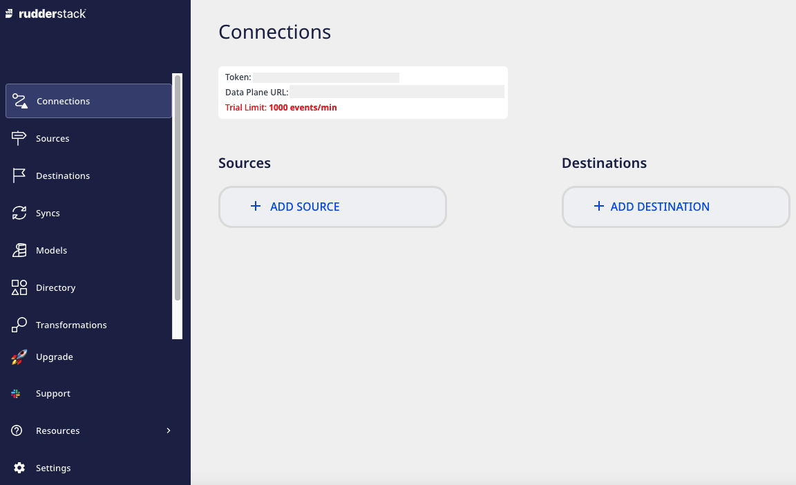

# Get Started

[RudderStack](https://rudderstack.com/) is a **customer data platform** for developers. It captures, processes, and syncs your event, product, and warehouse data to all the tools across your customer data stack. It is an enterprise-ready solution and also provides powerful transformations to customize your event data on the fly.

## RudderStack in 5 minutes

The easiest way to get started with RudderStack is to set up a source, connect it to a destination, and see your event data flow in no time.

1. Sign up for [RudderStack Cloud](https://app.rudderstack.com/signup?type=freetrial).
2. You will then get access to this dashboard for setting up your data pipelines:

3. Click on **Add Source** to set up a data source.

For more information on sources in RudderStack, check out the <a href="https://rudderstack.com/docs/rudderstack-cloud/sources/">Sources</a> guide.

4. Choose the data source from the list of available sources. RudderStack supports the following three types of sources:

    - [Event Streams](https://rudderstack.com/docs/stream-sources/): Collect your event data from all of your web, mobile, and server-side apps, then route it to a wide array of customer tools and data warehouses.
    - [Cloud Extract](https://rudderstack.com/docs/cloud-extract-sources/): Build ELT pipelines from cloud apps to your data warehouse.
    - [Reverse ETL](https://rudderstack.com/docs/reverse-etl/): Leverage your warehouse as a data source for your entire customer data stack.

5. Once you have configured the data source, add a destination in RudderStack by clicking on the **Add Destination** button.

6. From the list of destinations, choose the destination you want to configure for the source.
7. Configure the destination by entering the relevant connection settings. For detailed information on the required settings, refer to that destination's [documentation](https://rudderstack.com/docs/destinations/).

You can transform your events in RudderStack before sending them to the specified destinations. Read the <a href="https://rudderstack.com/docs/transformations/">Transformations</a> guide for more information on this feature.

Here's a quick walkthrough on how to send data from your website to various cloud tools via RudderStack:

## See also

- [RudderStack Cloud](https://rudderstack.com/docs/rudderstack-cloud/): Familiarize yourself with the RudderStack product. Know more about sources, destinations, and connections in RudderStack.
- [Glossary](https://rudderstack.com/docs/get-started/glossary/): Understand the definitions of the different terms that you are likely to encounter while using RudderStack.
- [Sources](https://rudderstack.com/docs/rudderstack-cloud/sources/): Start tracking your event data by integrating RudderStack with your web, mobile, and server-side apps.
- [Destinations](https://rudderstack.com/docs/rudderstack-cloud/destinations/): Send your event data to over 150 tool and warehouse destinations.
- [Transformations](https://rudderstack.com/docs/transformations) : Customize the event data before routing it to your preferred destinations.
- [Event spec](https://www.rudderstack.com/docs/rudderstack-api/api-specification/rudderstack-spec/): Plan your event data and explore various options for tracking your events across all the RudderStack SDKs and APIs.

## Contact us

For more information on any of the sections covered in this guide, you can [contact us](mailto:%20docs@rudderstack.com) or start a conversation in our [Slack](https://rudderstack.com/join-rudderstack-slack-community) community.
