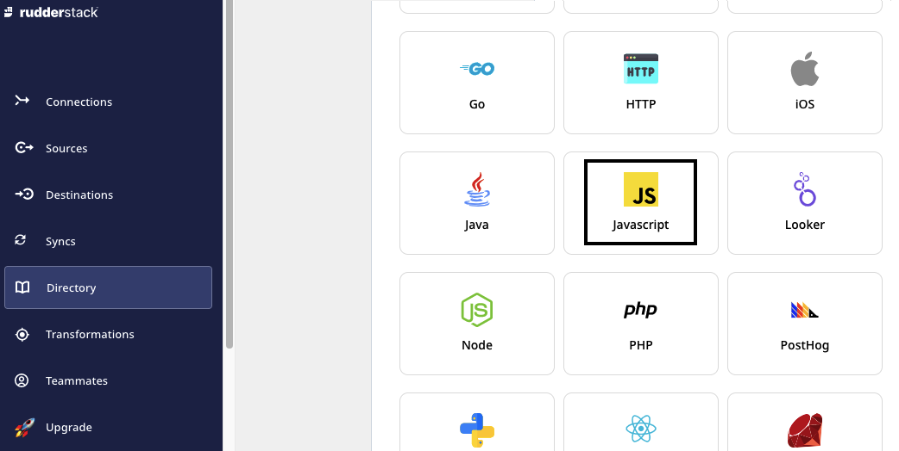

# Get Started

[**RudderStack**](https://rudderstack.com/) is a **customer data platform** which captures, processes, and syncs your event, product, and warehouse data to all the tools across your customer data stack. It is an enterprise-ready solution and also provides powerful transformations to customize your event data on the fly.

## Quick Start

RudderStack supports sending event data from over x sources and destinations. 

The below steps demonstrate how to add a JavaScript source, Google Analytics destination and establish a connection between them:

1. [**Sign-up**](https://app.rudderstack.com/signup) on RudderStack web app to access the RudderStack dashboard.

2. Click on [**Add Source**](https://www.rudderstack.com/docs/connections/adding-source-and-destination-rudderstack/) to set up a data source.

3. Choose `JavaScript` source, then provide a name to configure it successfully. 

4. Add destination by clicking **Add Destination** > **Create New destination**. 

5. Select `Google Analytics` and click **Next**. 

6. Configure [connection settings](https://www.rudderstack.com/docs/destinations/analytics/google-analytics-ga/#getting-started) for `Google Analytics`.

The connection between JavaScript source and Google Analytics destination  will look like below in RudderStack dashboard:

## See also

- [**RudderStack Cloud**](https://rudderstack.com/docs/rudderstack-cloud/) - Learn more about sources, destinations and connections
 - [**Live Events**](https://rudderstack.com/docs/rudderstack-cloud/live-events/) - View data flowing through RudderStack in real-time

- [**Transformations**]("https://rudderstack.com/docs/transformations/") - Use custom JavaScript functions to transform your events before sending them to specified destinations

- [**Warehouse Actions**](https://rudderstack.com/docs/warehouse-actions/) - Send your warehouse data to desired destinations using reverse-ETL

- [**Cloud Extract**](https://rudderstack.com/docs/cloud-extract-sources/) - Build efficient ETL pipelines from your cloud apps to data warehouse

- [**RudderStack APIs**](https://rudderstack.com/docs/rudderstack-api)

- [**How to Send Data in 5 Minutes Using RudderStack**]("https://rudderstack.com/blog/how-to-send-data-in-5-minutes-using-rudderstack/")

## Contact us

For more information on any of the sections covered in this guide, you can [**contact us**](mailto:%20docs@rudderstack.com) or start a conversation in our [**Slack**](https://rudderstack.com/join-rudderstack-slack-community) community.
