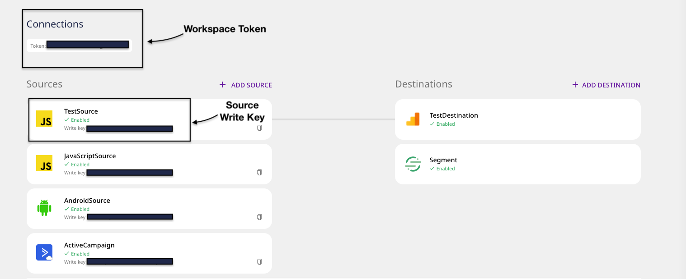

# Sending Test Events


This guide assumes you have already [**installed and set up RudderStack**](./).


There are two ways in which you can send test events to verify your RudderStack installation:

* Using the bundled shell script
* Using RudderStack's HTTP API

## Bundled Shell Script

In our [**GitHub repository**](https://github.com/rudderlabs/rudder-server), we have bundled a shell script that generates test events. Follow the steps below:

### Clone the Repository

Before sending test events to verify your RudderStack installation, clone the RudderStack [**GitHub repository**](https://github.com/rudderlabs/rudder-server) by running the following command:

```bash
git clone https://github.com/rudderlabs/rudder-server.git
```

Then, follow the sections below to send events to test your RudderStack installation.

### Get the Source Write Key

#### **Option 1: If you have signed up for** [**RudderStack Cloud**](https://app.rudderstack.com/)**, follow these steps to get your source write key:**

* Set up a source and a destination in RudderStack by following this [**guide**](../../connections/adding-source-and-destination-rudderstack.md). 
* You can find the write key in the dashboard, as shown:



The **write key** is different from your **workspace token**. The write key is associated with the source, while the workspace token is associated with your RudderStack workspace.




#### **Option 2: If you are self-hosting RudderStack and have set up the control plane using the** [**RudderStack Config Generator**](../config-generator.md)**, you can find the source write key by following these steps:**

* Set up a source and a destination by following this [**guide**](../../connections/adding-source-and-destination-rudderstack.md). 
* You can find the write key associated with the source in the dashboard as shown:


### Send Test Events

#### Option 1: If you're using RudderStack Cloud, follow these steps:

* In your terminal, navigate to the folder where RudderStack is installed. 
* Then, run the following command after replacing `<YOUR_WRITE_KEY>` with the source write key obtained in the previous section:

```bash
./scripts/generate-event <YOUR_WRITE_KEY> https://hosted.rudderlabs.com/v1/batch
```

* You can then check your destination to verify that events are delivered. You can also view the live events via RudderStack's [**Live Events**](../../user-guides/how-to-guides/live-destination-event-debugger.md) ****tab.

#### Option 2: If you have set up open-source RudderStack in your environment, follow these steps:

* In your terminal, navigate to the folder where RudderStack is installed. 
* Then, run the following command after replacing `<YOUR_WRITE_KEY>` with the source write key obtained in the previous section, and `<DATA_PLANE_URL>` with your Data Plane URL.

```bash
./scripts/generate-event <YOUR_WRITE_KEY> <DATA_PLANE_URL>/v1/batch
```

An example is as shown:


* You can then check your destination to verify that the events are delivered.


Note that unlike RudderStack Cloud, the Control Plane set up using the open-source [**Config Generator**](../config-generator.md) does not let you view live events.


If you supply an invalid source write key or Data Plane URL, you will get the following error:


## Using the HTTP API

* Import this [**Postman collection**](https://www.getpostman.com/collections/480307c55ad2b9dd4e27). ****
* Edit the variables `source_write_key` and `data_plane_url` in this collection with your source write key and your RudderStack Data Plane URL. 
* RudderStack uses Basic Authentication for authenticating all the HTTP requests. The HTTP Basic Authentication requires a user name and password where: 
  * The user name is the `source_write_key`
  * The password is an empty string \(`""`\) 
* Now you can test all the supported requests.

### Getting the Source Write Key

#### **If you have signed up for** [**RudderStack Cloud**](https://app.rudderstack.com/)**, follow these steps to get your source write key:**

* Set up a source in RudderStack by following this [**guide**](../../connections/adding-source-and-destination-rudderstack.md). 
* You can find the write key in the dashboard, as shown:



The **write key** is different from your **workspace token**. The write key is associated with the source, while the workspace token is associated with your RudderStack workspace.



#### **If you are self-hosting RudderStack and have set up the control plane using the** [**RudderStack Config Generator**](../config-generator.md)**, you can find the source write key by following these steps:**

* Set up a source by following this [**guide**](../../connections/adding-source-and-destination-rudderstack.md). 
* You can find the write key associated with the source in the dashboard as shown:


### Getting the Data Plane URL


Follow [**this section**](https://docs.rudderstack.com/get-started/installing-and-setting-up-rudderstack#what-is-a-data-plane-url-where-do-i-get-it) for details on how to get your Data Plane URL.



Refer to the [**HTTP API guide**](https://docs.rudderstack.com/rudderstack-api/http-api-specification) for more information on the supported calls.


## Contact Us

If you come across any issues while sending test events to verify your RudderStack installation, you can [**contact us**](mailto:%20docs@rudderstack.com) or start a conversation on our [**Slack**](https://resources.rudderstack.com/join-rudderstack-slack) channel.

