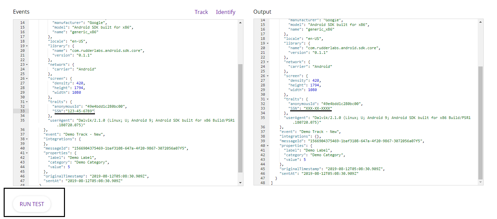

# How to Add User Transformations in RudderStack

## Introduction

With RudderStack, you can now implement your own custom transformation functions that leverage the event data, to implement specific use-cases based on your business requirements.  You can find more information on these user transformation functions in our [GitHub repository](https://github.com/rudderlabs/sample-user-transformers).

In this guide, we walk you through the steps involved in creating and testing your user transformation functions in RudderStack.


**Please note that the user transformations only work for the cloud mode destinations.** 

**To know more about the cloud mode in RudderStack, check out the** [**RudderStack Connection Modes**](https://docs.rudderstack.com/get-started/rudderstack-connection-modes) **guide.**


## Creating a User Transformation

Please follow the steps mentioned below:

* Log into your [RudderStack dashboard](https://app.rudderstack.com/)
* Click on the [Transformations](https://app.rudderstack.com/transformations) Link at the bottom of the left panel in the dashboard, as shown:


* Click on the **Create New** option as shown:


* In the following screen, please enter the name you would like to assign to the custom transformation. Enter the transformation function's code in the **Transformation** window, as shown in the figure below:


* You need to add your user transformation's code within the `transform` function in the **Transformation** window. You can also add other functions and call them from within `transform`. 



 You can copy-paste the entire code of any of the functions in [this repository](https://github.com/rudderlabs/sample-user-transformers) into the **Transformation** window. Do remember to delete the pre-populated `transform` function in such cases, before pasting your code.


* You can also test your transformation function by running a test, as shown:



## Accessing Metadata

RudderStack injects a function `metadata(event)` into your transformations. This allows you to access environment variables that will help in customizing your transformations.

`metadata()` takes the event as input and returns the metadata of the event.   


The following are the properties, if available, present in the metadata response:

<table>
  <thead>
    <tr>
      <th style="text-align:left">Property name</th>
      <th style="text-align:left">Description</th>
    </tr>
  </thead>
  <tbody>
    <tr>
      <td style="text-align:left"><code>sourceId</code>
      </td>
      <td style="text-align:left">
        <p>SOURCE ID from RudderStack dashboard (this is different from the write
          key).</p>
        <p>Refer to the image below.</p>
      </td>
    </tr>
    <tr>
      <td style="text-align:left"><code>destinationId</code>
      </td>
      <td style="text-align:left">DESTINATION ID from the RudderStack dashboard</td>
    </tr>
    <tr>
      <td style="text-align:left"><code>messageId</code>
      </td>
      <td style="text-align:left">Unique ID for each event</td>
    </tr>
    <tr>
      <td style="text-align:left"><code>sessionId</code>
      </td>
      <td style="text-align:left">If sessions are enabled, this has the value of session ID</td>
    </tr>
  </tbody>
</table>

```javascript
function transform(events) {
  events = events.map(ev => {
      const meta = metadata(ev);
      ev.sourceId = meta.sourceId
      return ev;
  });
  return events
}
```


## External API requests

You can make any external API requests in your transformer functions and use the response to enrich your events data. RudderStack injects an asynchronous `fetch(url)` function into your transformations. It makes an API call to the given url and returns the response in JSON format. 

Examples of how to use `fetch` function in transformations are as shown:



```javascript
async function transform(events) {
    const res = await fetch("any_api_endpoint");
    events.map(e=>{
        e.response = JSON.stringify(res);
        return e;
    })
    return events;
}
```



```javascript
async function transform(events) {
    const res = await fetch("post_url", {
        method: "POST", // POST, PUT, DELETE, GET, etc.
        body: JSON.stringify(events),
        headers: {
         "Content-Type": "application/json;charset=UTF-8",
        },
    });
    events.map(e=>{
        e.response = JSON.stringify(res);
        return e;
    })
    return events;
}
```



```javascript
async function transform(events) {
    const res = await fetch("post_url", {
        method: "POST", // POST, PUT, DELETE, GET, etc.
        headers: {
         "Content-Type": "application/json;charset=UTF-8",
         "Authorization": "Bearer <your_authorization_token>"
        },
        body: JSON.stringify(events),
    });
    events.map(e=>{
        e.response = JSON.stringify(res);
        return e;
    })
    return events;
}
```



You can check out the [Clearbit enrichment example](https://github.com/rudderlabs/sample-user-transformers/blob/master/EnrichWithClearbit.js) which uses the `fetch` function.


Use batch API requests instead of a separate API request for each event whenever possible for improved performance.


## Limits

Take into account the memory and time limits when adding a new user transformation. Each invocation of the user transformation should not exceed these limits. User transformation fails when these limits are exceeded.

**Memory limit:** 128 MB

**Time limit:** 4 Seconds

## Contact Us

If you want to know more about user transformations in RudderStack, feel free to [contact us](mailto:%20contact@rudderstack.com). You can also talk to us on our [Slack](https://resources.rudderstack.com/join-rudderstack-slack) channel.

