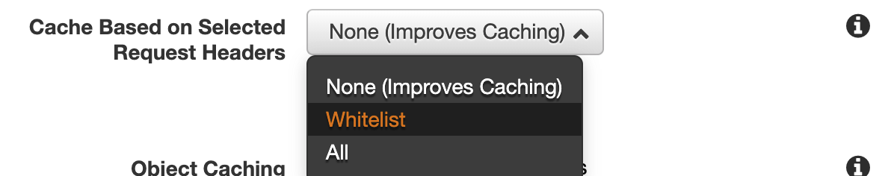
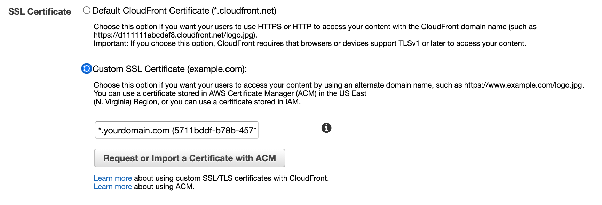

# How to Use Custom Domains

## Overview

If you wish to use your own domain to route your events and/or proxy our JavaScript SDK, there are three endpoints you can proxy via your own CDN. You will need access to your domain’s DNS settings as well as your CDN settings.

The 3 endpoints are:

1. `cdn.rudderlabs.com` for loading the Javascript SDK
2. `api.rudderlabs.com` for fetching the source configuration based on your `writeKey`
3. `events.rudderlabs.com` for sending events to the RudderStack server

To use your own domain for these, you’ll need to route traffic through your CDN.


Note that you will incur CDN charges for this traffic if you choose to use your own domain.


For each endpoint, you'll need to create a CDN distribution and add a CNAME record on your domain for the distribution domain. The examples below are using CloudFront, but the settings should be similar regardless of your CDN.

## Setup for serving SDK

You'll start by creating a new distribution for serving the JavaScript SDK.

### Settings


| Field | Setting |
| :--- | :--- |
| Origin Domain Name | `cdn.rudderlabs.com` |
| Origin Protocol Policy | HTTPS Only |

**Default Cache Behavior Settings**

| **Field** | Setting |
| :--- | :--- |
| Viewer Protocol Policy | Redirect HTTP to HTTPS |
| Allowed HTTP Methods | `GET`, `HEAD`, `OPTIONS`, `PUT`, `POST`, `PATCH`, `DELETE` |
| Cache and origin request settings | Use legacy cache settings |
| Forward Cookies | All |
| Query String Forwarding and Caching | Forward all, cache based on all |

**Distribution Settings**

| Field | Setting |
| :--- | :--- |
| Alternate Domain Names \(CNAMEs\) | `<subdomain.yourdomain.com>` |
| SSL Certificate | Custom SSL Certificate \(more info\) |
| Custom SSL Client Support | Clients that support SNI |

**Click Create Distribution and wait for CloudFront to be deployed.**


### **Add CNAME Record to DNS**

Once your distribution is deployed, you’ll need to create a CNAME record on your domain for the subdomain you wish to use and the distribution url.

| **Name** | Value |
| :--- | :--- |
| Subdomain you wish to use \(which was used in the creation of the distribution\). This will vary based on your DNS provider but will typically be just the subdomain. Example: for `cdn.yourdomain.com` you would use `cdn` | The CDN URL for the distribution created. Example: `d3jlkfchu4u.cloudfront.net` |


### Serving the SDK

Once setup and DNS propagation has completed, you’ll be able to change the URL for the SDK.

Before:

```markup
 <script src="https://cdn.rudderlabs.com/v1/rudder-analytics.min.js"></script>
```

After:

```markup
<script src="https://subdomain.yourdomain.com/v1/rudder-analytics.min.js"></script>
```

## Setup for Sending Events

Normally all events are sent to `events.rudderlabs.com`. To have events routed through your own domain, you’ll need to setup a proxy to that and then use your own url for `DATA_PLANE_URL` when initializing the SDK.

### Settings

The settings for sending events will be the same as the settings for serving the JavaScript SDK except for the following:

| Field | Setting |
| :--- | :--- |
| Origin Domain Name | `events.rudderlabs.com` |
| Alternate Domain Names \(CNAMEs\) | `<subdomain.yourdomain.com>` |

### **Add CNAME Record to DNS**

The settings for the CNAME record will be the same as the settings for serving the JavaScript SDK. You'll need to use the newly created distribution domain and the subdomain you set for it.

### **Sending Events**

Once setup and DNS propagation has completed, you’ll want to use the newly created url as your `DATA_PLANE_URL` when initiating the sdk. 

Before:

```javascript
rudderanalytics.load("1iYTYFYkfteuXxTj3eEt5CmeLvO", "https://hosted.rudderlabs.com")
```

After:

```javascript
rudderanalytics.load("1iYTYFYkfteuXxTj3eEt5CmeLvO", "https://subdomain.yourdomain.com")
```

You should be able to confirm in the network tab of your browser console that events going to `/track`, `/identify` and `/page` are being routed through your own domain and not the rudderstack.com domain. 

## **Setup for fetching sourceConfig**

When the javascript SDK is loaded, it uses the `writeKey` for your selected source to fetch the Source Configuration from RudderStack. This determines which native sdks may be needed and which destinations are used.

The call to fetch the sourceConfig is sent to `api.rudderstack.com` with the `writeKey` for your source used an authorization header. For this reason, this distribution will be slightly different as we will need to explicitly whitelist the Authorization header to make sure it is sent along with each request. 

### **Settings**

The settings for sending events will be the same as the settings for serving the JavaScript SDK except for the following:

| Field | Setting |
| :--- | :--- |
| Origin Domain Name | `api.rudderlabs.com` |
| Alternate Domain Names \(CNAMEs\) | `<subdomain.yourdomain.com>` |

We also need to add a Whitelisting for the Authorization headers in **Default Cache Behavior Settings**.

As with serving the JavaScript SDK and Sending events, you'll choose Use legacy cache settings


Under Cache Based on Selected Request Headers, you'll choose Whitelist.



Choose Authorization and Add &gt;&gt; to whitelist the Authorization Header


### Add CNAME Record to DNS

The settings for the CNAME record will be the same as the settings for serving the JavaScript SDK. You'll need to use the newly created distribution domain and the subdomain you set for it.

### Fetching the sourceConfig

To use a custom URL to fetch the sourceConfig, we need to add it as an option when loading the JavaScript SDK.

```javascript
rudderanalytics.load("1iYTYFYkfteuXxTj3eEt5CmeLvO", "https://hosted.rudderlabs.com", 
  { 
    configUrl: 'https://subdomain.yourdomain.com' 
  }
);
```

## Custom SSL Certificates

To use your own domain, you'll need to Request or Import a certificate with your CDN provider. The following are the steps to use AWS Certificate Manager with CloudFront:

When choosing your SSL certificate on CloudFront, you'll be given the option to do so:



From there you'll choose your subdomain or use a wildcard domain \(`*.yourdomain.com`\) to be able to setup multiple subdomains. 

ACM will guide you through verifying by email or DNS TXT records and you'll be able to choose your own domain for SSL certificates once verified.

## Contact Us

For more information on any of the sections in this guide, please feel free to [contact us](mailto:%20docs@rudderstack.com). You can also start a conversation on our [Slack](https://resources.rudderstack.com/join-rudderstack-slack) channel, we will be happy to help you.


