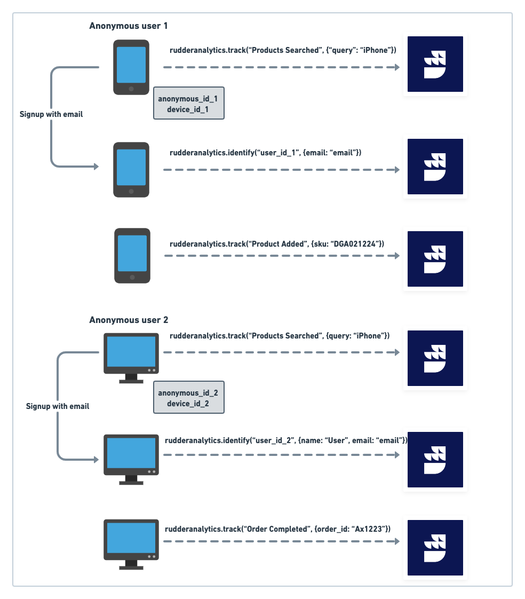
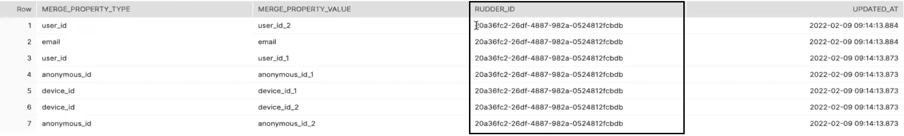
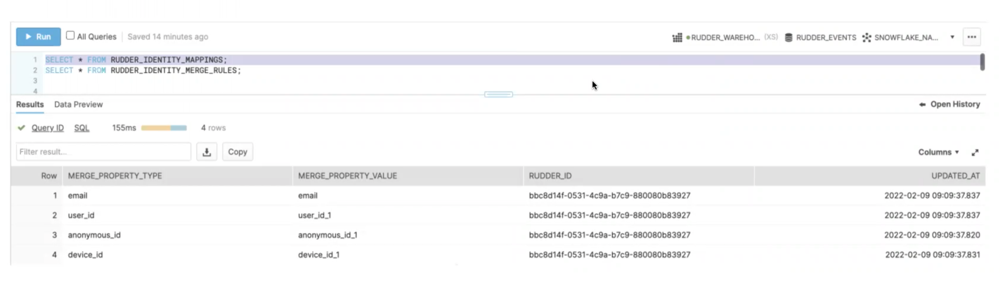
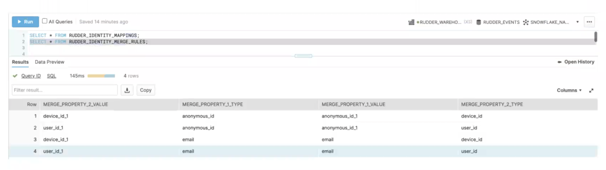

# Identity Resolution

Across a user's product journey, multiple identifiers get associated with them, for example, email ID, phone number, device IDs, anonymous ID, account usernames, and more. **Identity resolution** is the process of matching these different identifiers across multiple devices and digital touchpoints to build a cohesive and omnichannel customer profile. A unified customer view enables businesses to deliver relevant messaging and enhance the user's customer journey.

<div class="successBlock">

With RudderStack's warehouse-first architecture, you can send all your cross-platform data to your warehouse and perform identity resolution on it.
</div>

This guide walks you through RudderStack's identity resolution feature in detail.

## How identity resolution works

Identity resolution involves using an **identity graph** - a database that houses and brings together all the different user identifiers and various aspects of their customer journeys into a single customer view. The identity graph collects and continually updates the customer profile with multiple identifiers mentioned above, like email, phone number, device IDs, etc.

The following three steps summarize the identity resolution process:

1. Collect the user identifiers across various touchpoints (device IDs, email addresses, cookies, etc.)
2. Connect these identifiers to an identity graph to build a unified user profile.
3. Activate this profile by connecting it to various analytics, marketing, CRM tools as per the business requirement.

## Identity resolution in RudderStack

In modern businesses, the identity graph used for cross-device identity stitching can be quite large, sometimes consisting of hundreds of millions of nodes. As you gather more data, this number scales rapidly. In such a scenario, storing the identity graph in your data warehouse makes a lot of sense from a storage and scalability perspective.

With RudderStack, you can build an identity graph on top of your enriched warehouse data. You can then store this graph in your warehouse as a table. RudderStack then creates a unique virtual ID (`RUDDER_ID`), associates it with all the relevant user identifiers, and updates it continuously as new data comes into your warehouse.

### Use case 

This use case gives a quick walkthrough of a user's product journey on an e-Commerce app integrated with RudderStack. You will see how RudderStack can be used to track and merge different user identifiers to build a unified customer profile.

1. The user **anonymously** searches for a particular product on their mobile app - in this case, an iPhone. Here, RudderStack identifies the user with `anonymous_id_1` and the device with `device_id_1`.
2. After browsing through the app, the user adds a product to their cart and **logs in** using their email. Here, RudderStack generates an `identify` event and associates `anonymous_id_1` with the user's email ID `email` (user's unique identifier). Note that RudderStack also generates a `track` call with the details around the browsing activity and updates to the cart.

Then, the user does not proceed with the purchase and drops off, for some reason.

3. Later, the same user fires up their laptop and browses through the website of the e-Commerce brand **anonymously**. Again, RudderStack generates an `anonymous_id_2` corresponding to the user and a device ID `device_id_2`.
4. The user then **logs in** with their email and password. RudderStack then generates an `identify` call associating the same `email` with `anonymous_id_2`. The user then proceeds to complete the purchase. A `track` call is then generated with the details around the purchase.

The above workflow is visually represented in the following image:



RudderStack has a `merge` API that you can leverage to connect and merge these different user identities in the warehouse and associate them to a single customer profile:



<div class="successBlock">

You can also leverage RudderStack's <a href="#user-transformations">Transformations</a> feature to merge different identifiers before sending the data to the warehouse.
</div>

## Merging identifiers with RudderStack

RudderStack gives you two options to merge user identifiers and build an identity graph:

- Using the Merge API
- Leveraging user transformations

### `merge` API

As discussed in the use case above, RudderStack provides a `merge` API to connect and merge these different user identities in the warehouse.

The `merge` event structure is as shown:

{
    "type": "merge",
    "mergeProperties": [
        {
            "type": "merge_property_type_1",
            "value": "merge_property_value_1"
        },
        {
            "type": "merge_property_type_2",
            "value": "merge_property_value_2"
        }
    ]
}

Here, `"type": "merge_property_type_*"` corresponds to a unique user identifier like email address, phone number, device ID, anonymous ID, etc. that can be merged and connected to a given user profile. 

### User transformations

As an alternative to the `merge` API, you can also use [custom transformations](https://www.rudderstack.com/docs/transformations/) to merge user identifiers in your event data before sending it to the warehouse destination.

A sample transformation is as shown:

```javascript
function transform(events) {
  const mergeEvents = [];
  events.forEach((ev) => {
    if (ev.type === "track" && ev.event === "<EVENT_NAME>") {
      let mergeEvent = {
        type: "merge",
        //mergeProperties expects an array of two objects with each mergeProperty type and value
        mergeProperties: [{
            type: "email",
            value: "email"
          },
          {
            type: "deviceID",
            value: "device-id-1"
          }
        ]
      }
      mergeEvents.push(mergeEvent)
    }
  })
  return events.concat(mergeEvents)
}
```

### What happens in the warehouse?

Once you call the `merge` API or leverage the user transformations to merge the user identifiers and send the data to the warehouse destination, RudderStack creates the following two tables in your warehouse.

The `RUDDER_IDENTITY_MAPPINGS` table contains the nodes (user identifiers and their values) associated with a given identity graph (customer profile). Each node has a  `RUDDER_ID` associated with it, as shown:



On the other hand, the `RUDDER_IDENTITY_MERGE_RULES` table contains all the edges that connect two different identifiers (nodes).



## Enriching the identity graph

As the user logs into more devices and different identifiers are associated with them, RudderStack can easily track and merge them into the same virtual ID (`RUDDER_ID`) in the warehouse.

This allows you to enrich the user profile with more information across various digital touchpoints without worrying about the size or the scale. You can use this information to deliver personalized product and user experiences.

## Contact us

For queries on any of the sections covered in this guide, you can [**contact us**](mailto:%20docs@rudderstack.com) or start a conversation on our [**Slack**](https://rudderstack.com/join-rudderstack-slack-community) channel.
