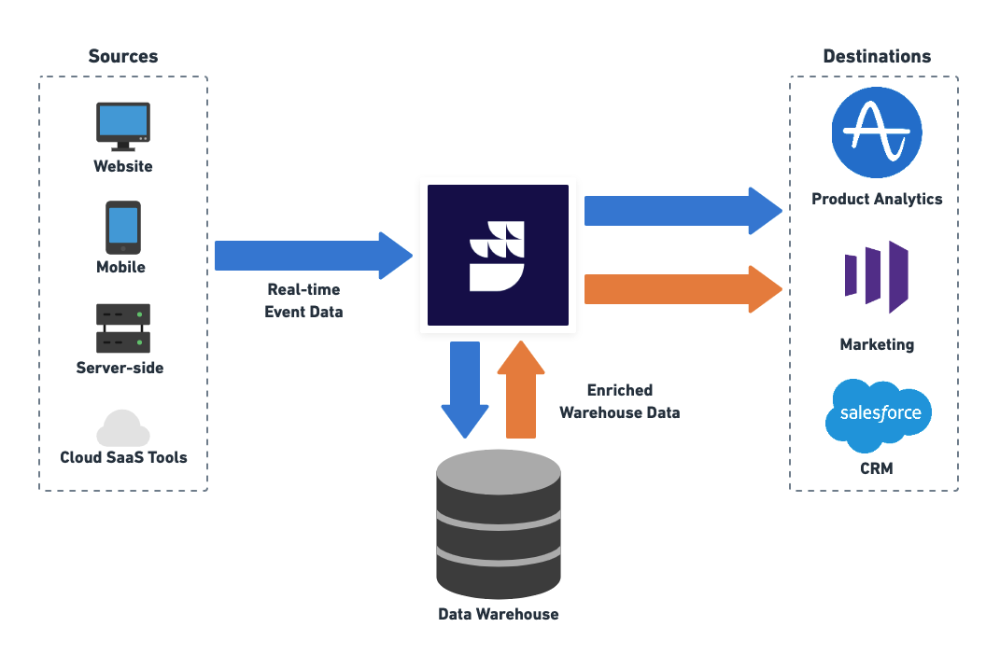

# Home

[**RudderStack**](https://rudderstack.com/) is a **customer data platform(CDP) for developers**. It lets you deploy data pipelines which collect event data from every app, website and SaaS platform, and send it to your data warehouse and other downstream business tools.

<a href="https://app.rudderstack.com/signup">Sign up</a> for RudderStack and build a warehouse-first CDP that delivers complete, unified data to every part of your customer data stack.

## Quickstart guides

    <a href="https://www.rudderstack.com/docs/stream-sources/rudderstack-sdk-integration-guides/">
        

            <h3>SDK Guides</h3>
            
Integrate RudderStack with your web, mobile, and server-side apps and start tracking event data in no time.

        

    </a>
    <a href="https://www.rudderstack.com/docs/destinations/">
        

            <h3>Event Stream Destinations</h3>
            
Integrate RudderStack with your third-party tools/platforms and send your event data in near real-time.

        

    </a>
    <a href="https://www.rudderstack.com/docs/data-warehouse-integrations/">
        

            <h3>Warehouse Destinations</h3>
            
Integrate RudderStack with your preferred data warehouse and make it the single source of truth for all your customer data.

        

    </a>

## Product onboarding

    <a href="https://www.rudderstack.com/docs/rudderstack-cloud/">
        

            <h3>RudderStack Cloud</h3>
            
Familiarize yourself with RudderStack Cloud and the different dashboard options available to you once you sign up.

        

    </a>
    <a href="https://www.rudderstack.com/docs/rudderstack-open-source/">
        

            <h3>RudderStack Open Source</h3>
            
Set up open source RudderStack in your own environment.

        

    </a>

## RudderStack deep-dive

    <a href="https://www.rudderstack.com/docs/cloud-extract-sources/">
        

            <h3>Cloud Extract</h3>
            
Build efficient ETL pipelines by ingesting data from your cloud apps and sending them to your data warehouse.

        

    </a>
    <a href="https://www.rudderstack.com/docs/reverse-etl/">
        

            <h3>Reverse ETL</h3>
            
Leverage the enriched customer data residing in your data warehouse and route it to your preferred downstream destinations.

        

    </a>
    <a href="https://www.rudderstack.com/docs/data-governance/">
        

            <h3>Data Governance</h3>
            
Access you events and their metadata programmatically and fix any inconsistencies.

        

    </a>
    <a href="https://www.rudderstack.com/docs/transformations/">
        

            <h3>Transformations</h3>
            
Code custom JavaScript functions to customize your event data before sending it to your destinations.

        

    </a>
    <a href="https://www.rudderstack.com/docs/rudderstack-api/api-specification/rudderstack-spec/">
        

            <h3>RudderStack Event Spec</h3>
            
Detailed technical description of the supported event calls and the related semantics. 

        

    </a>

## Need help?

    <a href="https://www.rudderstack.com/docs/user-guides/migration-guides/">
        

            <h3>Migration Guides</h3>
            
Migrating from Segment? Refer to these guides for help.

        

    </a>
    <a href="https://www.rudderstack.com/docs/user-guides/how-to-guides/">
        

            <h3>How-to Guides</h3>
            
This section includes some common RudderStack use-cases. It also covers some quick solutions to the common problems you might encounter while working with your event data.

        

    </a>

## Contribute

We would love to see you contribute to RudderStack. Read the [**contributing guidelines**](https://github.com/rudderlabs/rudder-server/blob/master/CONTRIBUTING.md) for more information.

    <a href="https://www.rudderstack.com/docs/user-guides/contributors-guides/">
        

            <h3>Contributor's Guides</h3>
            
We've designed some helpful guides just to simplify the contribution process for you.

        

    </a>

## License

The [**RudderStack server**](https://github.com/rudderlabs/rudder-server) is released under the [**AGPLv3 License**](https://www.gnu.org/licenses/agpl-3.0-standalone.html).

Refer to the <a href="https://rudderstack.com/blog/rudderstacks-licensing-explained">RudderStack’s Licensing Explained</a> blog post for more information.

## Contact us

For any information, you can [**contact us**](mailto:%20docs@rudderstack.com) or start a conversation in our [**Slack**](https://rudderstack.com/join-rudderstack-slack-community) community.
