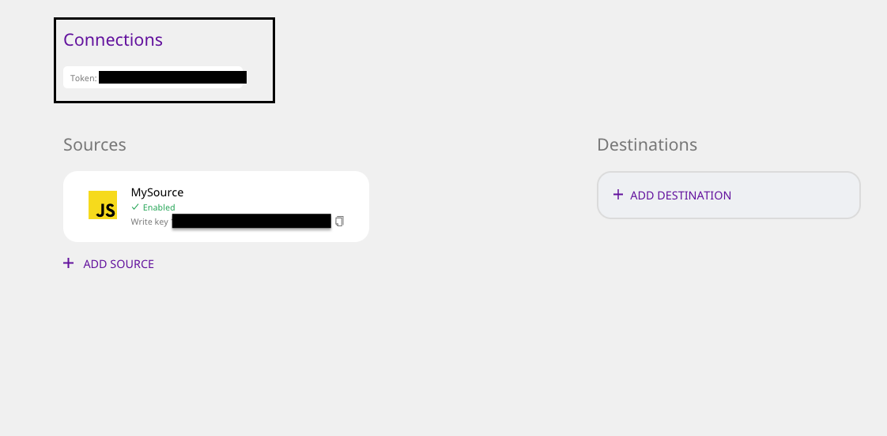

# Docker


The Docker setup is the easiest and the fastest way to set up RudderStack.


Please follow these steps to set up RudderStack on Docker:

* Go to the [RudderStack dashboard](https://app.rudderlabs.com/signup) and set up your account. Copy your workspace token from the top of the page.

* Download the `rudder-docker.yml` [docker-compose](https://raw.githubusercontent.com/rudderlabs/rudder-server/master/rudder-docker.yml) file.
* Replace `<your_workspace_token>` in the above file with your token. 
* Run the command `docker-compose -f rudder-docker.yml up`
* Once you have successfully followed the steps above, follow our guide on [**How to Send Test Events**](https://docs.rudderstack.com/getting-started/installing-and-setting-up-rudderstack#how-to-send-test-events) in order to test if there are any issues with the installation.

## Contact Us

In case you have any queries or come across any issues while setting up RudderStack on your hosted demo account, please feel free to [contact us](mailto:%20docs@rudderstack.com). You can also start a conversation on our [Slack](https://resources.rudderstack.com/join-rudderstack-slack) channel, and we will be happy to help you.

