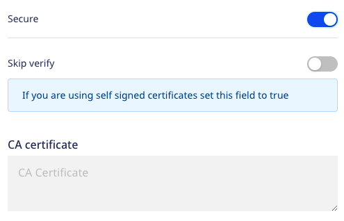

# ClickHouse

[ClickHouse](https://clickhouse.tech/) is an open-source, column-oriented database management system mainly used for online analytical processing \(OLAP\). It lets you generate analytical reports that are updated in real-time using SQL queries. ClickHouse is highly scalable, fast, and built for high performance.

RudderStack supports ClickHouse as a source from which you can ingest data and route it to your desired downstream destinations.

## Setting up the ClickHouse source in RudderStack

To set up ClickHouse as a source in RudderStack, follow these steps:

### Naming the source

1. Log into your [RudderStack dashboard](https://app.rudderstack.com/).
2. From the left panel, go to **Source** > **New Source** > **Reverse ETL**.  Then, select **ClickHouse**, as shown:

3. Assign a name to your source.

### Configuring the connection credentials

1. Enter the relevant settings in the **Connection Credentials** section as listed below:

- **Host** - Enter the host name of your ClickHouse service.
- **Port** - Enter the port number of your ClickHouse service.
- **Database** - Enter the database name in your ClickHouse instance from where the data is to be imported.
- **User** - Enter the name of the user having the required read/write access to the above database.
- **Password** - Enter the password for the above user.
- **Secure** - Enabling this setting establishes a secure connection and displays additional settings as shown below:

  - **Skip Verify** - Skips certificate verification. Enable this setting if you are using self-signed certificates.
  - **CA certificate** -  Certificate contents of the certificate which needs to be verified while establishing a secure connection.

If you've configured ClickHouse as a source before, you can select the existing credentials from <strong>Use existing credentials</strong> option.

2. Click on **Continue** to proceed.

### Schedule settings

1. Specify the **Schedule Settings** to schedule the data syncs from your ClickHouse instance.

RudderStack lets you schedule data syncs for your Reverse ETL sources and specify how and when the syncs will run. For more information on the <strong>Basic</strong>, <strong>CRON</strong>, and <strong>Manual</strong> schedule types, refer to the <a href="https://www.rudderstack.com/docs/reverse-etl/common-settings/sync-schedule-settings/">Sync Schedule Settings</a> guide.

2. After specifying the schedule type and run settings, click on **Continue** to finish the setup.

ClickHouse is now successfully configured as a source in your RudderStack dashboard. You can further connect this source to your preferred destination by clicking on **Add Destination** button, as shown:

  
If you have already configured a destination in RudderStack, choose the <strong>Use Existing Destination</strong> option which will take you to the <strong>Schema</strong> tab in the source settings. To add a new destination from scratch, select the <strong>Create New Destination</strong> option which will take you to the destination configuration page.

## Specifying the data to import

While connecting a destination to your Reverse ETL source, you can use the default JSON mapping or the [Visual Data Mapping](https://www.rudderstack.com/docs/reverse-etl/features/visual-data-mapper/) feature.

For more information on the data import settings, refer to the <a href="https://www.rudderstack.com/docs/reverse-etl/common-settings/importing-data-using-tables/">Importing Data using Tables</a> guide.

## Contact us

For queries on any of the sections covered in this guide, you can [contact us](mailto:%20docs@rudderstack.com) or start a conversation in our [Slack](https://rudderstack.com/join-rudderstack-slack-community) community.
