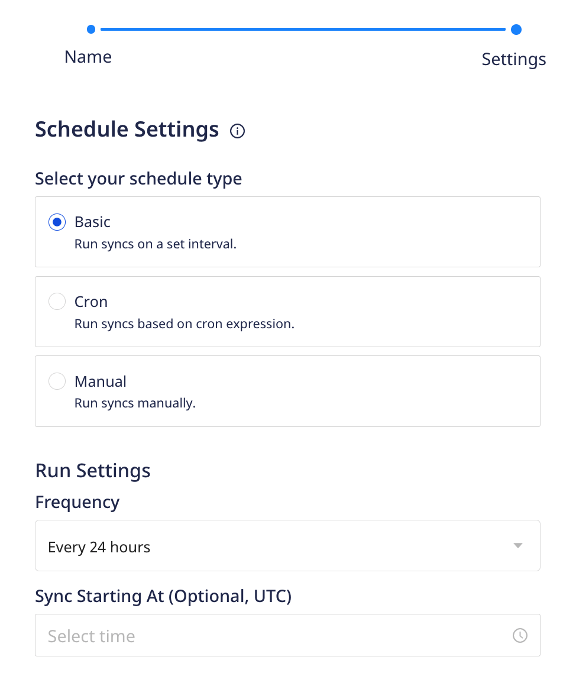
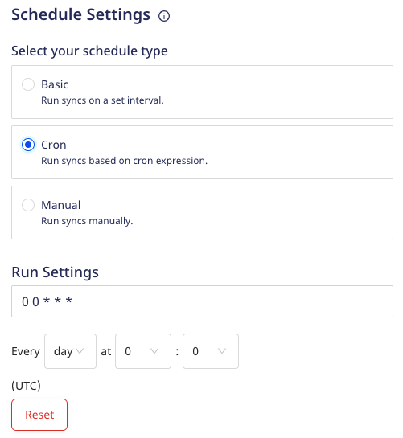
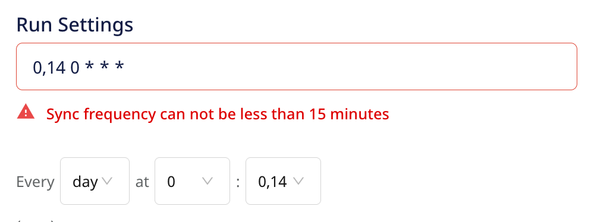
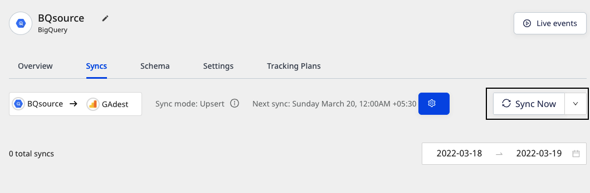
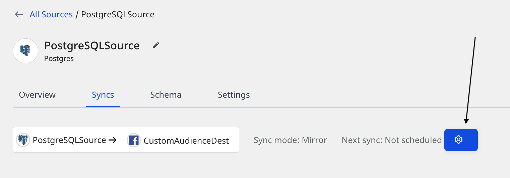

# Sync Schedule

RudderStack lets you set a schedule for importing data from your Reverse ETL sources while setting them up in your dashboard. It lets you specify the schedule type that defines how and when the syncs will run.

RudderStack supports the following three schedule types:

| Schedule type      | Description                                               |
| :------------------| :---------------------------------------------------------|
| Basic              | Run syncs at a given time interval and specified time.    |
| CRON               | Run syncs based on a CRON expression defined by the user. |
| Manual             | Run syncs manually.                                       |

## Basic

This schedule type lets you run the data syncs at a set interval. You can specify the sync frequency as well as the time(in UTC) when you want the sync to start.

- **Frequency** - You can choose the data sync frequency from the following options:
  - 30 minutes
  - 1 hour
  - 3 hours
  - 6 hours
  - 12 hours
  - 24 hours

- **Sync Starting At** - Specify the time at which the data sync should start.

## CRON 

This schedule type lets you define a custom CRON expression and runs the data syncs based on this setting. 

You can use the <a href="https://crontab.guru/">CRON scheduler utility</a> to specify your sync schedule.

The sync frequency specified under <strong>Run Settings</strong> needs to be greater than or equal to 15 minutes. Otherwise, you will encounter an error as shown below:

 
 

## Manual 

This schedule type lets you run your data syncs manually. RudderStack won't sync the data until you explicitly trigger it.

To trigger a sync manually, go to the **Syncs** tab in your Reverse ETL source details page and click on **Sync Now**, as shown:

To programmatically schedule and trigger a sync from outside RudderStack, refer to the <a href="https://www.rudderstack.com/docs/reverse-etl/features/airflow-provider/">RudderStack Airflow Provider</a> documentation.

## Sync modes behavior

The following sections explain the behavior of the two sync modes(Upsert and Mirror) when a sync schedule is set in RudderStack.

### Upsert mode

For [upsert mode](https://www.rudderstack.com/docs/reverse-etl/common-settings/sync-modes/#upsert), you can trigger a new sync anytime by pressing the **Sync Now** button. Multiple syncs can run simultaneously.

RudderStack takes a snapshot of the data and syncs it at a later point once the pending syncs are completed.

### Mirror mode

For [mirror mode](https://www.rudderstack.com/docs/reverse-etl/common-settings/sync-modes/#mirror-mode), you can run only one sync at any given point of time. A new sync starts only after the previous one is completed.

Suppose you have a sync scheduled for every 30 minutes. If there is a sync running for more than 30 minutes, then the next scheduled sync will be skipped when using the mirror mode.

## FAQ

### Can I change my sync schedule type?

Yes, you can. 

1. Go to the **Syncs** tab in your Reverse ETL source details page and click on the settings button as shown:

2. Then, select your new sync schedule type.

Alternatively, you can also go to the **Settings** tab and click on the **Edit sync schedule** button to define your new schedule type.

### I'm unable to run a sync manually and get the message "Your pipeline is paused. Make sure that the source and at least one destination is enabled". What do I do?

This message appears when either your Reverse ETL source, the connected destination, or both are disabled. Go to the **Settings** tab to verify if the source and destination are enabled for data syncs.

### What happens if I don't set the Sync Starting At time?

RudderStack considers strict time windows to schedule syncs if you do not explicitly set the time under **Sync Starting At**.

Suppose you create a source at 12:30 hrs UTC, specify the **Frequency** as 3 hours, and do not specify any time under **Sync Starting At**. In this case, as the time falls in the 12:00-13:00 time window, RudderStack will run the next sync at 15:00 hrs UTC (12:00 + 03:00 = 15:00 hrs).

## Contact us

For queries on any of the sections covered in this guide, you can [**contact us**](mailto:%20docs@rudderstack.com) or start a conversation in our [**Slack**](https://rudderstack.com/join-rudderstack-slack-community) community.
