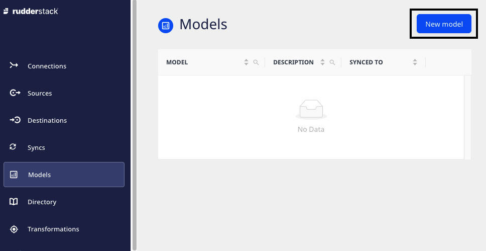
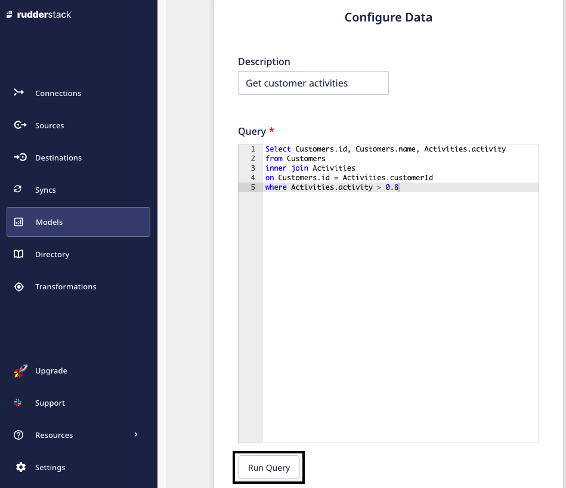
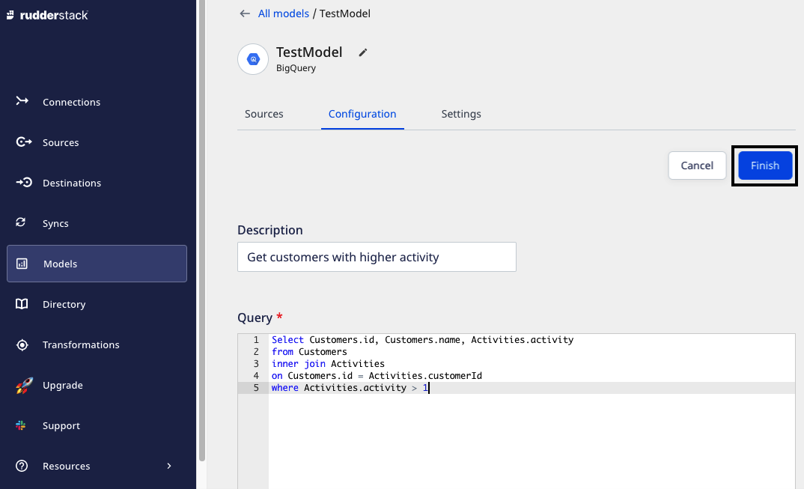

# Models

RudderStack's **Models** feature lets you create models by defining custom SQL queries. You can then run these queries on your warehouse and send the resulting data to specific destinations. You can create as many models and reuse them with their corresponding Reverse ETL sources.

With this feature, you can:

* Build models with complex SQL queries via an intuitive UI.
* Manage the views of all the models synced to different destinations in one place.
* Reuse the existing models in multiple connections.

  
Models is a <a href="https://www.rudderstack.com/docs/reverse-etl/">Reverse ETL</a> feature. For more information on setting up your Reverse ETL sources using models, refer to the <a href="https://www.rudderstack.com/docs/reverse-etl/common-settings/importing-data-using-models/">Importing Data using Models</a> guide.

Currently, RudderStack supports this feature for the following Reverse ETL sources:
<ul>
<li><a href="https://www.rudderstack.com/docs/reverse-etl/amazon-redshift/">Amazon Redshift</a></li> 
<li><a href="https://www.rudderstack.com/docs/reverse-etl/google-bigquery/">Google BigQuery</a></li>
<li><a href="https://www.rudderstack.com/docs/reverse-etl/postgresql/">PostgreSQL</a> </li>
<li><a href="https://www.rudderstack.com/docs/reverse-etl/snowflake/">Snowflake</a></li>
</ul>

You can find the **Models** option in the left navigation bar of the RudderStack dashboard that lets you view all the existing models, as shown:

## Creating a new model

Follow these steps to create a model:

1. Log in to the **RudderStack dashboard**.

2. Click on **Models** in the left navigation bar and select **New model**.

3. Select the Reverse ETL source for the model and click on **Next**.

4. Enter a name for the model.
5. Select your existing warehouse credentials or click on **Create Credentials from Scratch** and enter the warehouse-specific details.
 

Your warehouse account must have the necessary user permissions for RudderStack to access it. For more information on these user permissions, refer to the <strong>Granting Permissions</strong> section of the relevant <a href="https://www.rudderstack.com/docs/reverse-etl/">Reverse ETL</a> source.

Once you select or add your warehouse credentials and click on <strong>Next</strong>, RudderStack will validate them before you can proceed with the setup. For more information on these validations, refer to the <a href="#faq">FAQ</a> section below.

6. Next, enter the **Description** for the model. Then, add your custom SQL query in the **Query** section. 
7. Click on **Run Query** to preview the result.

The <strong>Preview</strong> section displays the preview of the 50 resultant rows in a paginated format.

8. Click on **Next** to create the model.

Once a model is created, you can use it to send the data from a Reverse ETL source to a specified destination. For more information and detailed steps, refer to the <a href="https://www.rudderstack.com/docs/reverse-etl/common-settings/importing-data-using-models/">Importing Data using Models</a> guide.

## Updating an existing model

Follow these steps to update an existing model:

1. Click the model you want to update and select the **Configuration** tab.
2. Click on **Edit Configuration** and make the required changes in  **Description** and **Query**.
3. If you have edited the query, click on **Run Query** to see if the new query generates the desired result.
4. Finally, click on **Finish** to save your changes.

  
If you update a model's query, you also need to check and update the relevant JSON mapping or <a href="https://www.rudderstack.com/docs/reverse-etl/features/visual-data-mapper/">Visual Data Mapping</a>. To validate if the query is running fine, you can manually trigger a full sync.

## Model details

To get details about an existing model, you can click on it to see the options listed below:

- **Rename**: Lets you rename the model by clicking on the edit icon next to the model's name.

- **Sources**: Displays the sources associated with the model. To know more on how to use a model with a source, refer to the [Setting Up Connections Using Models](https://www.rudderstack.com/docs/reverse-etl/features/models/) guide.
- **Configuration**: Displays and lets you edit the SQL **Query** and **Description**.
- **Settings**: This option contains the following two settings:

   - **Permanently delete the model**: Lets you delete the model by clicking on the **Delete** button. The **Delete** button is only enabled when no source is using the model.
   - **Credentials**: Lets you edit the credentials used for the model.

After editing the credentials, it is recommended to validate the query by running it and fetching the preview via the <strong>Configuration</strong> tab as explained in the <a href="https://www.rudderstack.com/docs/reverse-etl/features/models/#updating-an-existing-model">Updating an existing model</a> section above.

## FAQ

### What do the three validations under Verifying Credentials imply?

When setting up a Reverse ETL source, once you proceed after entering the connection credentials, you will see the following three validations under the **Verifying Credentials** option:

These options are explained below:

* **Verifying Connection**: This option indicates that RudderStack is trying to connect to the warehouse with the information specified in the connection credentials. 

If this option gives an error, it means that one or more fields specified in the connection credentials are incorrect. Verify your credentials in this case.

* **Able to List Schema**: This option checks if RudderStack is able to fetch all the schema details using the provided credentials. 
* **Able to Access RudderStack Schema**: This option implies that RudderStack is able to access the RudderStack schema that you have created by successfully running the commands in the **User Permissions** section of the relevant [Reverse ETL source](https://www.rudderstack.com/docs/reverse-etl/). 

If this option gives an error, verify if you have successfully created the RudderStack schema and given RudderStack the required permissions to access it.

## Contact us

For more information on any of the sections covered in this guide, you can [**contact us**](mailto:%20docs@rudderstack.com) or start a conversation in our [**Slack**](https://rudderstack.com/join-rudderstack-slack-community) community.
