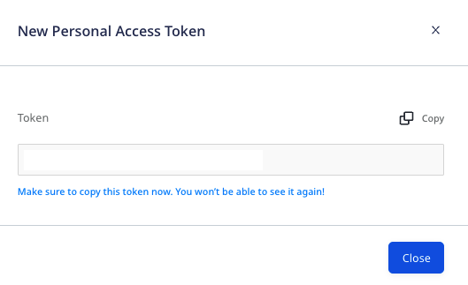

# Personal Access Tokens

To consume all the public RudderStack APIs, you will need an access token associated with your RudderStack account. This guide describes the steps to generate your **personal access token** and the operations associated with it.

## Generating a personal access token

Follow these steps to generate a personal access token:

1. Log into your [RudderStack dashboard](https://app.rudderstack.com/).
2. Go to **Settings** > **Personal access tokens**, as shown

3. Click on **Generate new token**.
4. Enter your **Token name** and select the permissions (**Role**) associated with this token, from the dropdown:

5. Then, click on **Generate**.
6. Copy and save the personal access token details securely.

Make sure you copy the generated token. You will not be able to see the token details again once you close this window.

## Deleting a personal access token

To delete an existing token, click on the corresponding **Delete** option next to that token, and confirm by clicking on **Yes, delete**.

To delete all the existing tokens, click on the **Revoke all** button on the top right and click on **Yes, delete**.

## Permissions

RudderStack Cloud users with the[**Read-Write**](https://www.rudderstack.com/docs/rudderstack-cloud/teammates/#read-write) or [**Admin**](https://www.rudderstack.com/docs/rudderstack-cloud/teammates/#admin) access permissions can create their own access tokens and use them.

## Contact us

For queries on any of the sections covered in this guide, you can [contact us](mailto:%20docs@rudderstack.com) or start a conversation in our [Slack](https://rudderstack.com/join-rudderstack-slack-community) community.
