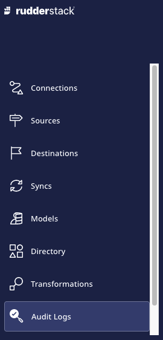
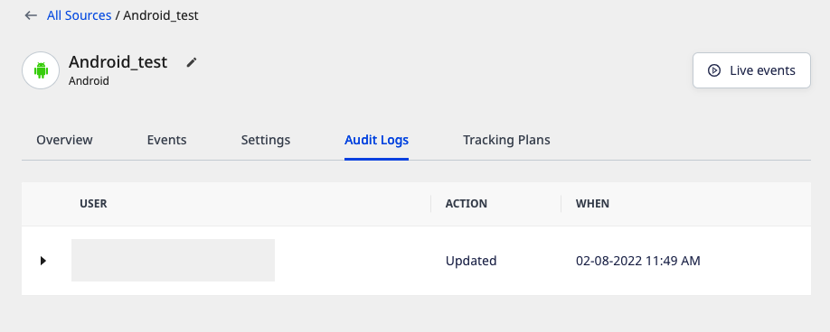
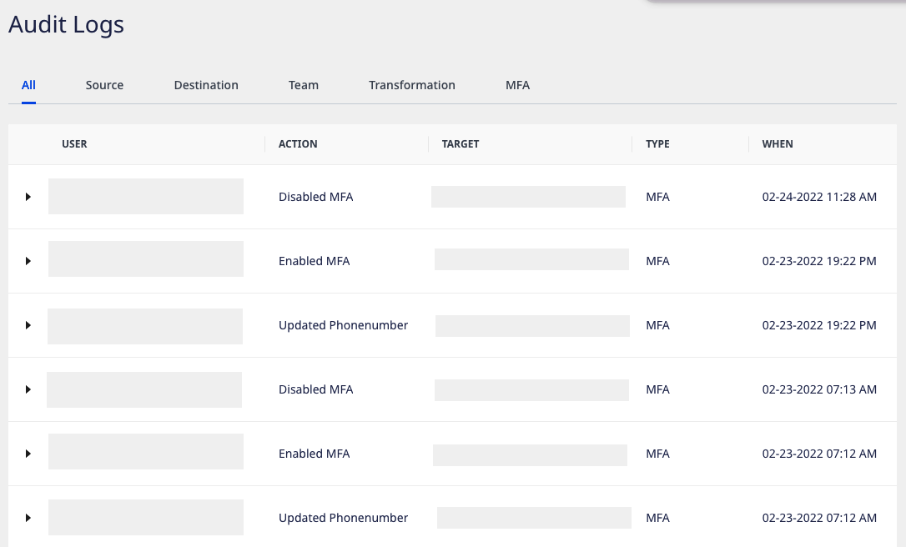

# Audit Logs

**Audit Logs** can be used to track the user activities within your RudderStack workspace. It provides transparency by capturing the user actions such as creation or modification of sources, destinations, transformations, and multi-factor authentication (MFA).

The Audit Logs feature is available for the enterprise-only plan users. For more information on this plan and its features, refer to the RudderStack <a href="https://rudderstack.com/pricing/"><strong>pricing</strong></a> page.

## Accessing the audit logs

The workspace-related audit logs can only be accessed by the users having <a href="https://rudderstack.com/docs/rudderstack-cloud/teammates/#admin">admin</a> or <a href="https://rudderstack.com/docs/rudderstack-cloud/teammates/#read-write-user">read-write</a> access.

You can access the workspace-related audit logs by clicking on the **Audit Logs** in the left navigation bar of the RudderStack dashboard, as shown:

 

For audit logs related to a specific source or destination, you can go to the source/destination details page and click on the **Audit Logs** option, as shown:

## Audit logs details

The audit logs capture the following information:

- **User**: Name and email of the user in the RudderStack workspace.
- **Action**: User action performed on the entity.
- **Target**: Entity name, that is, the name assigned to the source, destination, transformation, etc.
- **Type**: Entity type, that is, source, destination, transformation, teammate, etc.
- **When**: Timestamp when the user action was performed.

The following sections detail the various user actions captured by the audit logs based on the target type, that is, sources, destinations, transformations, teams, or MFA (multi-factor authentication).

## Source audit

|**Action**    |**Description**                                    |
|:-------------|:--------------------------------------------------|
| Created      |User created a source in the dashboard.            |
| Updated      |User updated the source settings in the dashboard. |
| Updated Name |User updated the source name in the dashboard.     |
| Deleted      |User deleted the source from the dashboard.        |

## Destination audit

|**Action**              |**Description**                                                          |
|:-----------------------|:------------------------------------------------------------------------|
| Created                | User created a destination in the dashboard.                            |
| Updated                | User updated the destination settings in the dashboard.                 |
| Updated Name           | User updated the destination name in the dashboard.                     |
| Deleted                | User deleted the destination from the dashboard.                        |
| Connect Source         | User connected a source to the destination.                             |
| Disconnect Source      | User disconnected a source from the destination.                        |
| Added Transformation   | User added a transformation to the destination.                         |
| Deleted Transformation | User removed/disconnected a transformation from the destination.        |

## Transformation audit

|**Action**    |**Description**                                     |
|:-------------|:---------------------------------------------------|
| Created      |User created a new transformation in the dashboard. |
| Updated      |User updated the transformation.                    |
| Deleted      |User deleted the transformation from the dashboard. |

 
These audits apply to the <a href="https://rudderstack.com/docs/transformations/#libraries">transformation libraries</a> as well.

## Team audit

|**Action**          |**Description**                                                                             |
|:-------------------|:-------------------------------------------------------------------------------------------|
| Invited            | User invited a new user to join the current RudderStack workspace.                         |
| Accepted           | New user accepted the invitation to join the workspace.                                    |
| Cancelled          | User cancelled the invitation to join the workspace.                                       |
| Changed Permission | User changed the permissions for a specific user (identified by `userId`) in the workspace.|
| Deleted            | User removed/deleted a user(identified by `userId`) from the workspace.                    |

## Multi-Factor Authentication(MFA) audit

|**Action**           |**Description**                                |
|:--------------------|:----------------------------------------------|
| Enabled MFA         | User enabled MFA for his account.             |
| Disabled MFA        | User disabled MFA for his account.            |
| Updated Phonenumber | User updated their phone number used for MFA. |

## Contact us

For more information on this feature, you can [contact us](mailto:%20docs@rudderstack.com) or start a conversation in our [Slack](https://rudderstack.com/join-rudderstack-slack-community) community.
