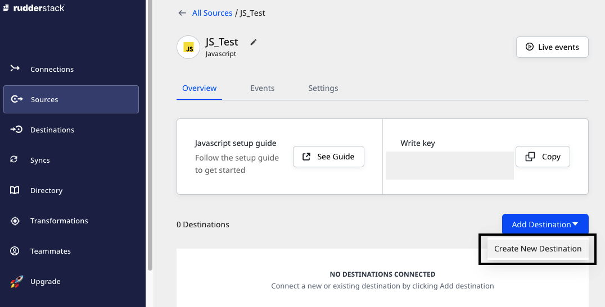
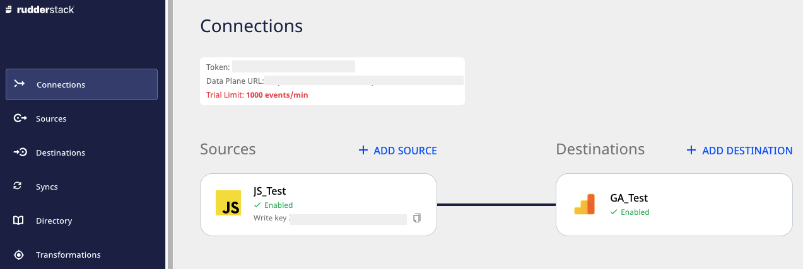

# Connections

RudderStack lets you set up connections to build efficient data pipelines across your entire customer data stack. You can add your preferred event data sources and destinations and establish connections between them to send your event data.

The Connections option also displays the below information:
- Token
- Data Plane URL

## Token

A Token is a unique identifier associated with your current RudderStack workspace. It is useful when you want to <a href="https://rudderstack.com/docs/get-started/installing-and-setting-up-rudderstack/">install and set up open-source RudderStack</a> or accessing various <a href="https://rudderstack.com/docs/rudderstack-api">RudderStack API</a>.

## Data Plane URL

Refer to the [**RudderStack Architecture**](https://rudderstack.com/docs/get-started/rudderstack-architecture/) guide for more information the RudderStack Data Plane.

The **Data Plane URL** is required for routing and processing the events to the RudderStack backend. You can use the one displayed in the dashboard while using [**RudderStack Cloud Free**](https://app.rudderlabs.com/signup?type=freetrial). While using the [**pro or enterprise**](https://rudderstack.com/pricing) version, you can [**contact us**](https://rudderstack.com/join-rudderstack-slack-community) for the Data Plane URL with the email ID you used to sign up for RudderStack.

However, if you are using the **open-source** version of RudderStack, you are required to set up your own Data Plane by [**installing and setting up RudderStack**](https://rudderstack.com/docs/get-started/installing-and-setting-up-rudderstack/) in your preferred environment. 

An open-source Data Plane URL looks like `http:localhost:8080` where `8080` is typically the port where your RudderStack Data Plane is hosted.  

## Setting up a connection

Setting up a connection in RudderStack involves the following steps:

### Step 1: Adding a source

1. Log in to the **RudderStack dashboard**.

2. Click on **Add Source** and select the source you want to set up.

3. Assign a name to the source, and click **Next**.
4. Configure the source with the relevant connection settings.

### Step 2: Adding a destination connected to source

1. Click **Add Destination** > **Create New Destination** from the **Source Details** window.

2. Select the destination you want to configure with the source and click **Next**.

3. Configure the destination with the relevant connection settings.

You can view this connection in the RudderStack dashboard by clicking on the **Connections** tab in the left navigation bar, as shown:

You can also send your data from one source to multiple destinations, as shown:

## Contact us

For queries on any of the sections covered in this guide, you can [**contact us**](mailto:%20docs@rudderstack.com) or start a conversation in our [**Slack**](https://rudderstack.com/join-rudderstack-slack-community) community.
