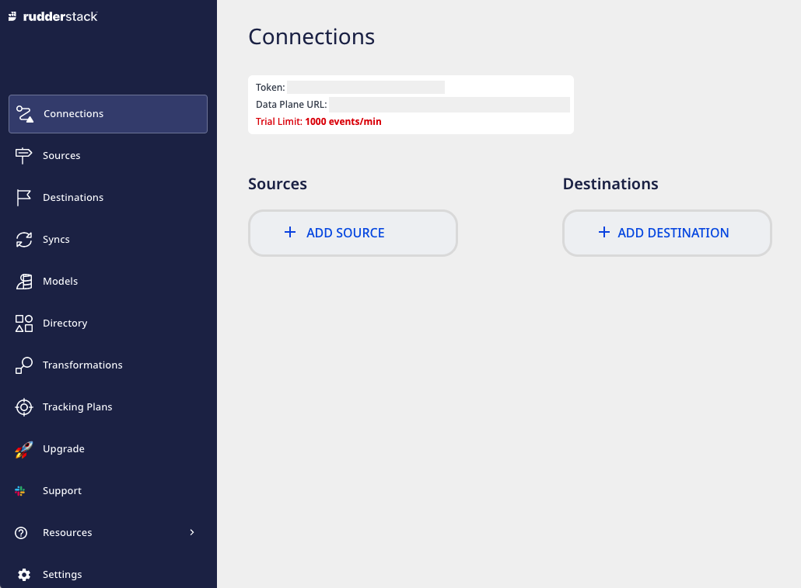
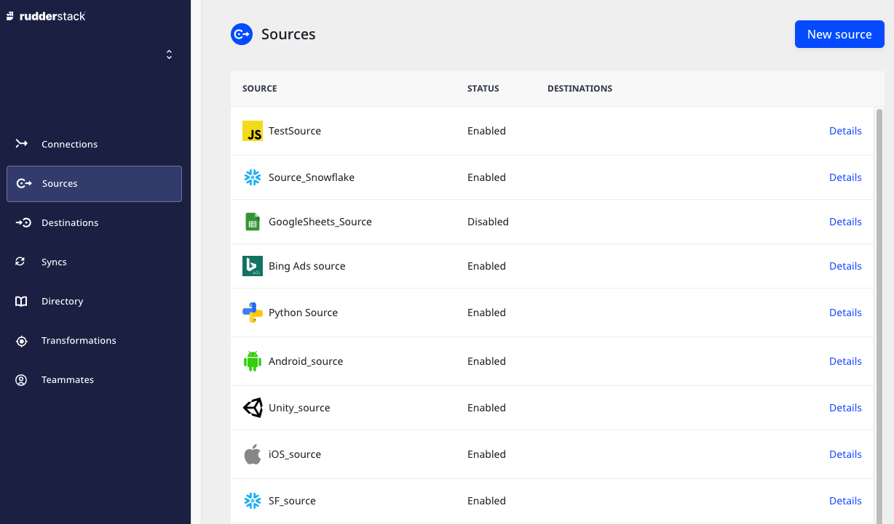
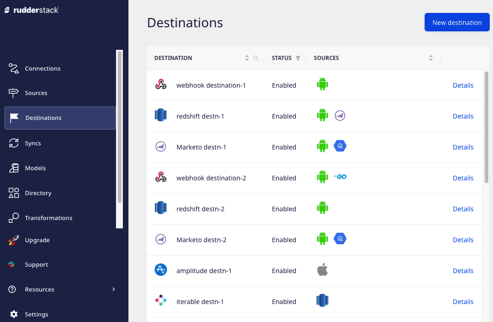
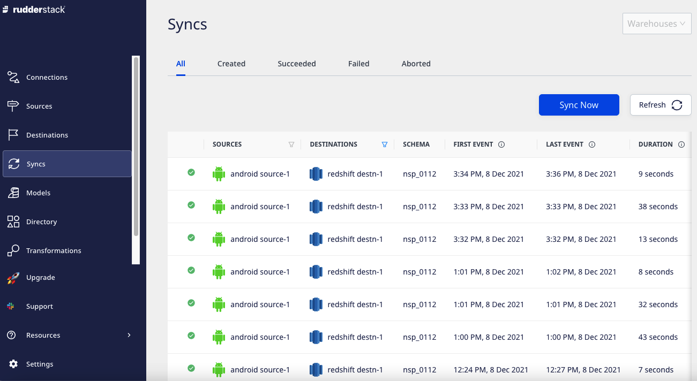
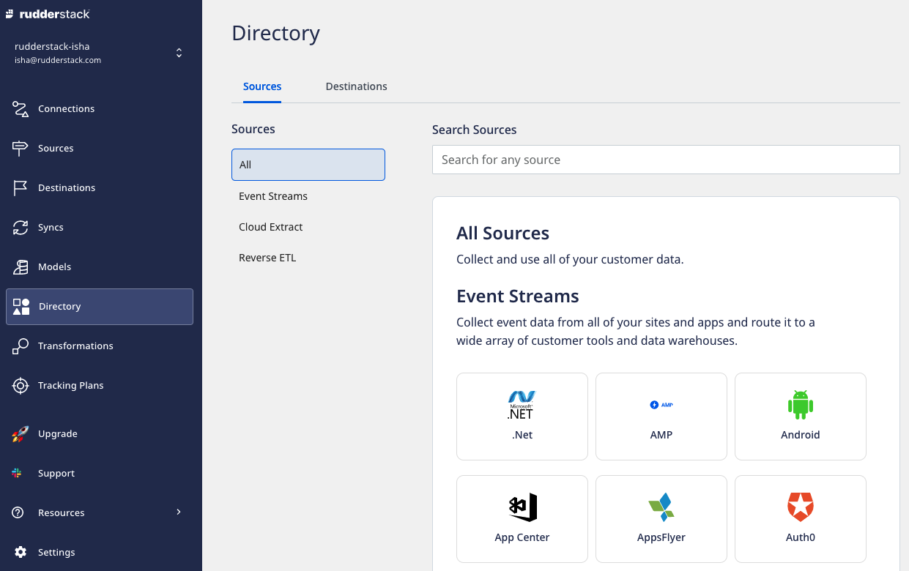
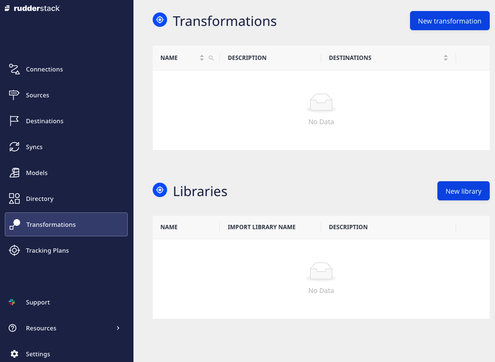
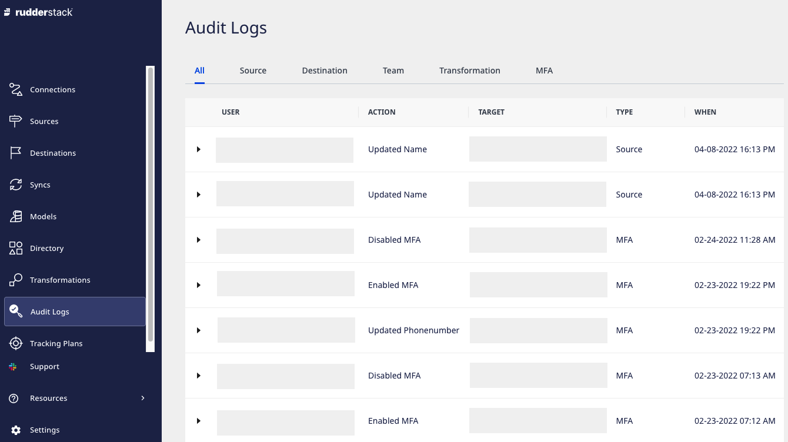
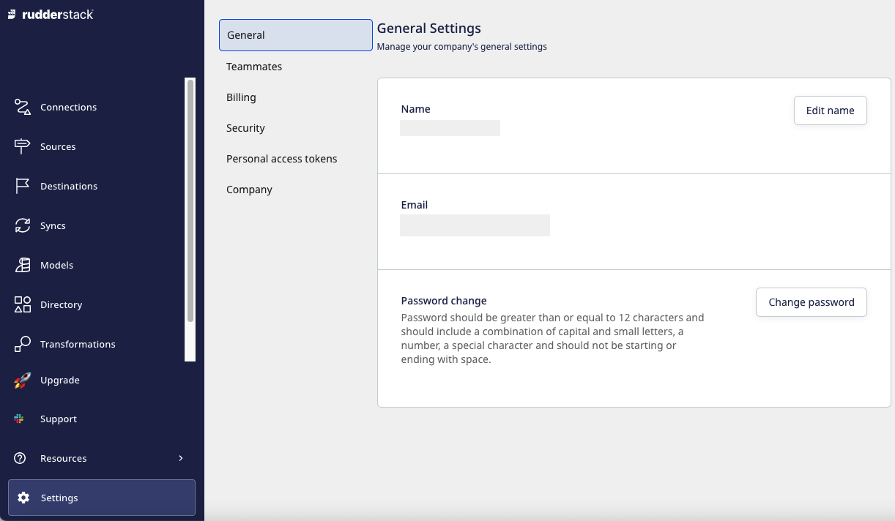

# Dashboard Overview

Once you [sign up](https://app.rudderstack.com/signup) for RudderStack Cloud, you are presented with a dashboard that lets you set up and manage all your event data sources, destinations, and connections through an easy-to-use UI.

This guide walks you through all the dashboard options to get started with RudderStack Cloud in no time.

## Connections

This option lets you set up your data pipelines by connecting different sources and destinations across your entire customer data stack.

The **Token** and **Data Plane URL** options are explained below:

### Token

A token (also referred to as a **workspace token**) is a unique identifier associated with your current RudderStack workspace.

### Data plane URL

For routing and processing the events to the RudderStack backend, a **data plane URL** is required.

Refer to the <a href="https://rudderstack.com/docs/get-started/rudderstack-architecture/">RudderStack Architecture</a> guide for more information the RudderStack data plane.

Here's how to get the Data Plane URL:

* If you're using [RudderStack Cloud Free](https://app.rudderlabs.com/signup?type=freetrial), the data plane URL is provided in the dashboard itself. 
* If you're using [RudderStack Pro or Enterprise](https://rudderstack.com/pricing), [contact us](https://rudderstack.com/join-rudderstack-slack-community) for the data plane URL with the email ID you used to sign up for RudderStack.
* If you're using [RudderStack Open Source](https://app.rudderstack.com/signup?type=opensource), you are required to set up your own data plane by [installing and setting up RudderStack](https://rudderstack.com/docs/rudderstack-open-source/installing-and-setting-up-rudderstack/) in your preferred environment.

An open source data plane URL looks like `http:localhost:8080` where `8080` is typically the port where your RudderStack data plane is hosted.

## Sources

This option lists all the configured sources in your workspace. You can add a new source by clicking on the **New Source** button, as shown:

Refer to the <a href="https://rudderstack.com/docs/rudderstack-cloud/connections/">Sources</a> guide for more details on setting up a source in RudderStack.

## Destinations

This option lists all the configured destinations where you can send your event data. You can add a new destination by clicking on the **New Destination** button, as shown:

Refer to the <a href="https://rudderstack.com/docs/rudderstack-cloud/connections/">Destinations</a> guide for more details on setting up a destination in RudderStack.

## Syncs

This option provides detailed metrics on the events synced to the warehouse destinations. You can also filter the event data based on a specific source or destination by using the filter option in the header or sync the data manually by using the **Sync Now** button.

## Models

This feature lets you define custom SQL queries which can be executed on your warehouse. You can then use RudderStack to send the resulting data to specific destinations.

Refer to the <a href="https://www.rudderstack.com/docs/reverse-etl/features/models/">Models</a> guide for more details on setting up a new model in RudderStack.

## Directory

**Directory** acts as a catalogue for all the sources ([Event Stream](https://rudderstack.com/docs/stream-sources/), [Cloud Extract](https://rudderstack.com/docs/cloud-extract-sources/) and [Reverse ETL](https://www.rudderstack.com/docs/reverse-etl/)) and destinations ([Warehouse](https://www.rudderstack.com/docs/data-warehouse-integrations/) and [Event Stream](https://www.rudderstack.com/docs/destinations/)) supported by RudderStack.

## Transformations

With this option, you can write your own JavaScript functions to transform your events. You can also create your own **Libraries** to reuse a transformation's code for other transformations.

Refer to the <a href="https://rudderstack.com/docs/transformations/">Transformations</a> guide to learn more about this feature.

## Audit Logs

Audit logs can be used to track the user activities within your RudderStack workspace. It is available only for the [Enterprise users](https://www.rudderstack.com/pricing/).

Refer to the <a href="https://rudderstack.com/docs/rudderstack-cloud/audit-logs/">Audit Logs</a> guide to learn more about this feature.

## Tracking Plans

**Tracking Plans** is an **enterprise feature** lets you proactively monitor and act on non-compliant event data coming into your RudderStack sources based on the predefined plans. It ensures data quality and validates your expected events against the live events that are delivered to RudderStack with real-time validation.

Refer to the <a href="rudderstack.com/docs/data-governance/tracking-plans/">Tracking Plans</a> guide for more information on creating and using tracking plans in RudderStack.

## Settings

This option lets you manage the settings and various details related to your RudderStack account.

### General

It displays the general account settings like name, email and password. You can also edit the name and password using the respective options. 

### Teammates

This option displays all your teammates with their access permissions in the current RudderStack workspace. You can also invite new teammates by using the **Invite Teammate** button.

Refer to the <a href="https://rudderstack.com/docs/rudderstack-cloud/teammates/">Teammates</a> guide for more details on this option.

RudderStack Cloud Free allows you to invite up to 3 members in your workspace. To increase this limit, you will be required to upgrade to the Pro or Enterprise plan. Refer to the <a href="https://rudderstack.com/pricing/">RudderStack Pricing Page</a> for details on these plans.

### Billing

It displays the billing information of your RudderStack account. You can change the existing plan or contact sales to get more information.

### Security

This option lets you set up 2-Factor authentication to receive verification codes via SMS.

### Personal access token

This option lets you generate a personal access token associated with your account. It is required to use all the RudderStack APIs.

Refer to the <a href="https://www.rudderstack.com/docs/transformations/api-access-token/">Personal Access Token</a> guide for more details on this option.

### Company

It lets you view and edit your workspace and company name associated with RudderStack.

## Contact us

For queries on any of the sections covered in this guide, you can [contact us](mailto:%20docs@rudderstack.com) or start a conversation in our [Slack](https://rudderstack.com/join-rudderstack-slack-community) community.
