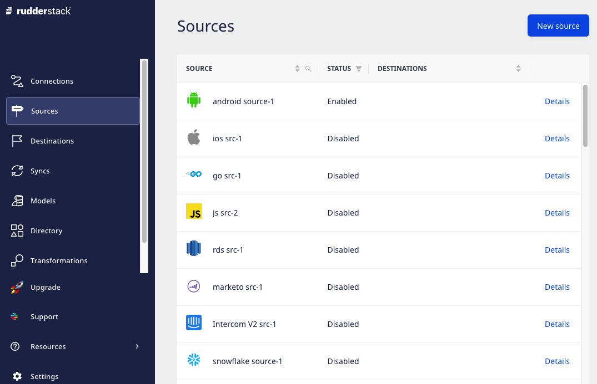

# Dashboard Overview

Once you [sign up](https://app.rudderstack.com/signup) for RudderStack Cloud, you are presented with a dashboard that lets you set up and manage all your event data sources, destinations, and connections through an easy-to-use, intuitive UI.

## Connections

This option lets you configure and connect different sources and destinations to build efficient data pipelines across your entire customer data stack. You can add a source and destination by clicking on the respective buttons as shown:

The **Token** and **Data Plane URL** options observed in the above image are explained below:

### Token

A token is a unique identifier associated with your current RudderStack workspace. It is useful when you want to install and set up open-source RudderStack or accessing various RudderStack API.

See the <a href="https://rudderstack.com/docs/get-started/installing-and-setting-up-rudderstack/">Install and Set up RudderStack</a> guide for steps on installing open-source RudderStack in your preferred development environment.

See the <a href="https://rudderstack.com/docs/rudderstack-api">RudderStack API</a> guide for details on various available RudderStack API and how to use them.

### Data Plane URL

Refer to the <a href="https://rudderstack.com/docs/get-started/rudderstack-architecture/">RudderStack Architecture</a> guide for more information the RudderStack Data Plane.

For routing and processing the events to the RudderStack backend, a **Data Plane URL** is required. 

Here's how to get the Data Plane URL:

* If you're using [RudderStack Cloud Free](https://app.rudderlabs.com/signup?type=freetrial), the data plane URL is provided in the dashboard itself. 
* If you're using the [pro or enterprise](https://rudderstack.com/pricing) version of RudderStack, [**contact us**](https://rudderstack.com/join-rudderstack-slack-community) for the Data Plane URL with the email ID you used to sign up for RudderStack.
* If you're using the **open-source** version of RudderStack, you are required to set up your own Data Plane by [installing and setting up RudderStack](https://rudderstack.com/docs/get-started/installing-and-setting-up-rudderstack/) in your preferred environment. 

An open-source Data Plane URL looks like `http:localhost:8080` where `8080` is typically the port where your RudderStack Data Plane is hosted.  

## Sources

This option lists all your configured sources. You can also add a new source by clicking on the **New Source** button.

  Refer to the <a href="https://rudderstack.com/docs/rudderstack-cloud/connections/">Sources</a> guide for more details
  on setting up sources in RudderStack.

## Destinations

This option lists all the configured destinations where you can send your event data. You can also add a new destination by clicking on the **New Destination** button.

Refer to the <a href="https://rudderstack.com/docs/rudderstack-cloud/connections/">Destinations</a> guide for more details on destinations and how to set up a new destination in RudderStack.

## Syncs

This option provides the detailed metrics of events data synced to warehouse destinations. You can also filter the event data based on a specific source or destination by using the filter option in the header or sync the data manually by using the **Sync Now** button.

## Models

The **Models** feature lets you define custom SQL queries which can be executed on your warehouse to send the resulting data to specific destinations.

Refer to the <a href="https://www.rudderstack.com/docs/reverse-etl/features/models/">Models</a> guide for more details on models and how to set up a new model in RudderStack.

## Directory

**Directory** acts as a catalogue for all the source ([Event Streams](https://rudderstack.com/docs/stream-sources/), [Cloud Extract](https://rudderstack.com/docs/cloud-extract-sources/) and [Reverse ETL](https://www.rudderstack.com/docs/reverse-etl/)) and destination (**Warehouse** and **Cloud**) platforms supported by RudderStack.

You can also use this option to directly add a source or destination by clicking on it and configuring its settings.

## Transformations

With this option, you can write your own JavaScript functions to transform your events in a destination-specific format. You can also create your own **Libraries** to reuse a transformation's code for other transformations.

Refer to the <a href="https://rudderstack.com/docs/transformations/">Transformations</a> guide to learn more about this feature.

## Audit Logs

This option can be used to track the user activities within your RudderStack workspace and is available only for the [Enterprise plan](https://www.rudderstack.com/pricing/) users.

Refer to the <a href="https://rudderstack.com/docs/rudderstack-cloud/audit-logs/">Audit Logs</a> guide to learn more about this feature.

## Tracking Plans

**Tracking Plans** feature lets you proactively monitor and act on non-compliant event data coming into your RudderStack sources based on the predefined plans. It ensures data quality and validates your expected events against the live events that are delivered to RudderStack with real-time validation.

Refer to the <a href="rudderstack.com/docs/data-governance/tracking-plans/">Tracking Plans</a> guide for more details on how to create and use tracking plans in RudderStack.

## Settings

This option lets you manage the settings and various details related to your RudderStack account.

### General

It displays the general account settings like name, email and password. You can also edit the name and password using the respective options. 

### Teammates

This option displays all your teammates with their access permissions in the current RudderStack workspace. You can also invite new teammates by using the **Invite Teammate** button.

Refer to the <a href="https://rudderstack.com/docs/rudderstack-cloud/teammates/">Teammates</a> guide for more details on this option.

  RudderStack Cloud Free allows you to invite up to 3 members in your workspace.
  To increase this limit, you will be required to upgrade to the Pro or
  Enterprise plan. Check out our <a href="https://rudderstack.com/pricing/">pricing page</a> for details on
  these plans, or <a href="http://app.rudderstack.com/upgrade">log in</a> to upgrade now.

### Billing

It displays the billing information of your RudderStack account. You can change the existing plan or contact sales to get more information.

### Security

This option lets you set up 2-Factor authentication to receive verification codes via SMS.

### Personal access token

This option lets you generate a personal access token associated with your account. It is required to use all the public RudderStack APIs.

Refer to the <a href="https://www.rudderstack.com/docs/transformations/api-access-token/">Access Token</a> guide for more details on this option.

### Company

It lets you view and edit your workspace and company name associated with RudderStack.

## Contact Us

For queries on any of the sections covered in this guide, you can [contact us](mailto:%20docs@rudderstack.com) or start a conversation in our [Slack](https://rudderstack.com/join-rudderstack-slack-community) community.
