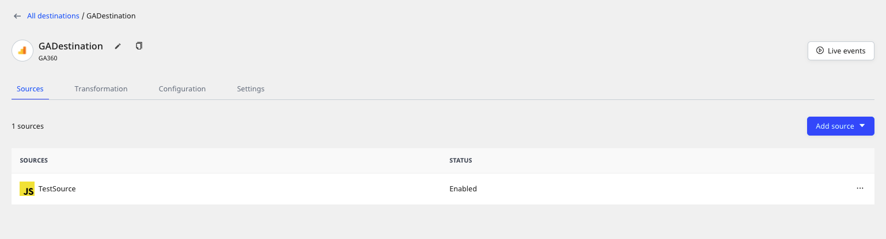

# Destinations

A **destination** is a cloud tool or platform where you want to send the data via RudderStack.

RudderStack currently supports over a hundered <a href="https://rudderstack.com/docs/destinations/">destinations</a>. These include <a href="https://rudderstack.com/docs/data-warehouse-integrations/">data warehouses</a>, <a href="https://rudderstack.com/docs/destinations/crm/">CRMs</a>, <a href="https://rudderstack.com/docs/destinations/analytics/">analytics</a> and <a href="https://rudderstack.com/docs/destinations/marketing/">marketing</a> platforms, and more.

RudderStack Cloud provides **Destinations** option in the left navigation bar that allows you to view all the configured destinations in the RudderStack dashboard:

## Adding a destination

Follow these steps to add a destination in RudderStack:

1. Log in to the **RudderStack dashboard**.

2. Click on **New Destination** and select the destination you want to set up in RudderStack.

 
3. Assign a name to the destination and click on **Next**.
4. Click on **Add Source** to connect a source with this destination. Refer to the detailed steps for [Adding a source](https://www.rudderstack.com/docs/rudderstack-cloud/sources/#adding-a-source).

Alternatively, you can select an existing source (if any) for this destination and click on Next.

5. Configure the destination with the relevant connection settings. Refer to the specific [**destination documentation**](https://rudderstack.com/docs/destinations/) for more details on these settings.

6. Click on **CREATE NEW TRANSFORMATION** if you want to add a [**transformation**](https://rudderstack.com/docs/transformations/). Otherwise, click on **Next**.

The destination should be configured successfully.

### Destination details

To get details about a configured destination, click on it to see following view on the dashboard:

These options can be explained as follows:

- **Rename**: Lets you rename the destination by clicking the edit icon next to the destination's name.

- **Sources**: Displays all the sources connected to a destination and their status (enabled/disabled). You can also connect a new source by clicking on the **Add source** button.

- **Transformation**: Lets you add an existing transformation to the destination via this option.

To add a new transformation, go to the <strong>Transformations</strong> option in the left navigation bar and click on <strong>New Transformation</strong>.

- **Events**: Displays all the latest metrics related to the event delivery such as number of events successfully delivered, failed events, etc. You can also filter these by source and time period.

- **Configuration**: Lets you change the existing configuration of a destination.

- **Settings**: This option provides additional destination-related details, such as:
  
  - **Enabled**: Lets you enable or disable sending data to the destination via this option.
  - **Destination ID**: Unique identifier associated with your destination.
  - **Permanently delete destination**: Lets you delete the destination by clicking on the **Delete** button.

Before you delete a destination, make sure there are no sources connected to it.

### Cloning a destination

You can duplicate an existing destination by following these steps:

1. Click on the **Duplication Destination** option in the **Destination Details** page.

2. Assign a name to the new destination and click on **Next**.

3. Connect the destination to a source.

The new destination is successfully configured.

## Contact us

For more information on any of the sections covered in this guide, you can [**contact us**](mailto:%20docs@rudderstack.com) or start a conversation in our [**Slack**](https://rudderstack.com/join-rudderstack-slack-community) community.
