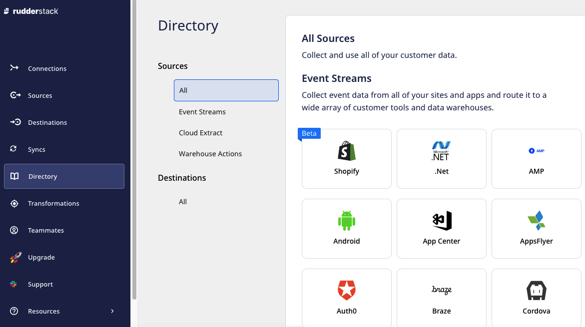

# Directory

Directory acts as a catalogue for all the source ([Event Streams](https://rudderstack.com/docs/stream-sources/), [Cloud Extract](https://rudderstack.com/docs/cloud-extract-sources/), [Warehouse Actions](https://rudderstack.com/docs/warehouse-actions/)) and destination platforms supported by RudderStack. It can be located on the left navigation bar in RudderStack Cloud as shown below.

You can also use this option to directly add a source or destination by clicking on the desired platform and configuring its settings.

## Contact Us

For more information on this option, you can [**contact us**](mailto:%20docs@rudderstack.com) or start a conversation in our [**Slack**](https://rudderstack.com/join-rudderstack-slack-community) community.
