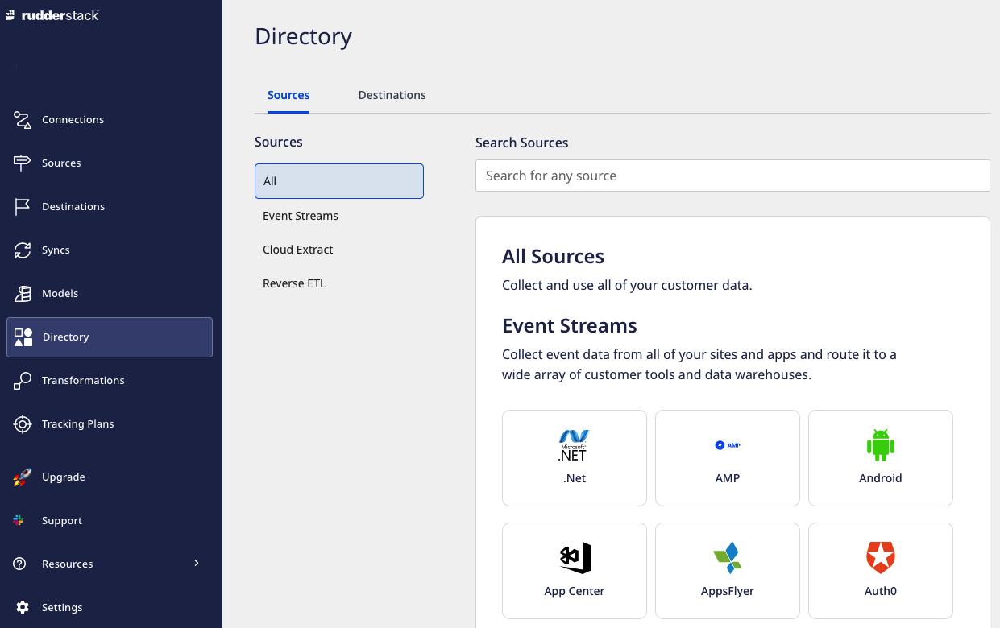

# Directory

**Directory** acts as a catalogue for all the source ([Event Streams](https://rudderstack.com/docs/stream-sources/), [Cloud Extract](https://rudderstack.com/docs/cloud-extract-sources/) and [Reverse ETL](https://www.rudderstack.com/docs/reverse-etl/)) and destination (**Warehouse** and **Cloud**) platforms supported by RudderStack. It can be located in the left navigation bar in the RudderStack dashboard, as shown:

You can also use this option to directly add a source or destination by clicking on it and configuring its settings.

## Contact Us

For more information on this option, you can [contact us](mailto:%20docs@rudderstack.com) or start a conversation in our [Slack](https://rudderstack.com/join-rudderstack-slack-community) community.
