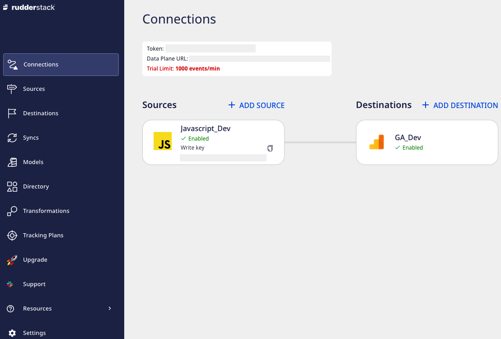

# RudderStack Cloud

RudderStack Cloud is a front-end web application that lets you set up data pipelines between your preferred sources and destinations and sends your event data.

You can easily [sign-up](https://app.rudderstack.com/signup)  on the web app to access the RudderStack dashboard. It lets you set up and manage the event data sources, destinations, and connections through an easy-to-use, intuitive UI.

The below image shows a JavaScript source and Google Analytics destination configured in the RudderStack dashboard.

Refer to the following sections to understand the features and functionalities provided by RudderStack Cloud  and how to use them to set efficient, real-time data pipelines.

<a class="pageRef" href="https://www.rudderstack.com/docs/get-started/sources/">
  

    
      <svg
        preserveAspectRatio="xMidYMid meet"
        height="1em"
        width="1em"
        fill="none"
        xmlns="http://www.w3.org/2000/svg"
        viewBox="0 0 24 24"
        strokeWidth="2"
        strokeLinecap="round"
        strokeLinejoin="round"
        stroke="currentColor"
        class="rightRefArrow"
      >
        <g>
          <line x1="5" y1="12" x2="19" y2="12"></line>
          <polyline points="12 5 19 12 12 19"></polyline>
        </g>
      </svg>
    
    
      Sources
    
  

</a>

<a class="pageRef" href="https://www.rudderstack.com/docs/get-started/destinations/">
  

    
      <svg
        preserveAspectRatio="xMidYMid meet"
        height="1em"
        width="1em"
        fill="none"
        xmlns="http://www.w3.org/2000/svg"
        viewBox="0 0 24 24"
        strokeWidth="2"
        strokeLinecap="round"
        strokeLinejoin="round"
        stroke="currentColor"
        class="rightRefArrow"
      >
        <g>
          <line x1="5" y1="12" x2="19" y2="12"></line>
          <polyline points="12 5 19 12 12 19"></polyline>
        </g>
      </svg>
    
    
      Destinations
    
  

</a>

<a class="pageRef" href="https://www.rudderstack.com/docs/get-started/connections/">
  

    
      <svg
        preserveAspectRatio="xMidYMid meet"
        height="1em"
        width="1em"
        fill="none"
        xmlns="http://www.w3.org/2000/svg"
        viewBox="0 0 24 24"
        strokeWidth="2"
        strokeLinecap="round"
        strokeLinejoin="round"
        stroke="currentColor"
        class="rightRefArrow"
      >
        <g>
          <line x1="5" y1="12" x2="19" y2="12"></line>
          <polyline points="12 5 19 12 12 19"></polyline>
        </g>
      </svg>
    
    
      Connections
    
  

</a>

<a class="pageRef" href="https://www.rudderstack.com/docs/rudderstack-cloud/live-events/">
  

    
      <svg
        preserveAspectRatio="xMidYMid meet"
        height="1em"
        width="1em"
        fill="none"
        xmlns="http://www.w3.org/2000/svg"
        viewBox="0 0 24 24"
        strokeWidth="2"
        strokeLinecap="round"
        strokeLinejoin="round"
        stroke="currentColor"
        class="rightRefArrow"
      >
        <g>
          <line x1="5" y1="12" x2="19" y2="12"></line>
          <polyline points="12 5 19 12 12 19"></polyline>
        </g>
      </svg>
    
    
      Live Events
    
  

</a>

<a class="pageRef" href="https://www.rudderstack.com/docs/get-started/syncs/">
  

    
      <svg
        preserveAspectRatio="xMidYMid meet"
        height="1em"
        width="1em"
        fill="none"
        xmlns="http://www.w3.org/2000/svg"
        viewBox="0 0 24 24"
        strokeWidth="2"
        strokeLinecap="round"
        strokeLinejoin="round"
        stroke="currentColor"
        class="rightRefArrow"
      >
        <g>
          <line x1="5" y1="12" x2="19" y2="12"></line>
          <polyline points="12 5 19 12 12 19"></polyline>
        </g>
      </svg>
    
    
      Syncs
    
  

</a>

<a class="pageRef" href="https://www.rudderstack.com/docs/get-started/directory/">
  

    
      <svg
        preserveAspectRatio="xMidYMid meet"
        height="1em"
        width="1em"
        fill="none"
        xmlns="http://www.w3.org/2000/svg"
        viewBox="0 0 24 24"
        strokeWidth="2"
        strokeLinecap="round"
        strokeLinejoin="round"
        stroke="currentColor"
        class="rightRefArrow"
      >
        <g>
          <line x1="5" y1="12" x2="19" y2="12"></line>
          <polyline points="12 5 19 12 12 19"></polyline>
        </g>
      </svg>
    
    
      Directory
    
  

</a>

<a class="pageRef" href="https://www.rudderstack.com/docs/get-started/teammates/">
  

    
      <svg
        preserveAspectRatio="xMidYMid meet"
        height="1em"
        width="1em"
        fill="none"
        xmlns="http://www.w3.org/2000/svg"
        viewBox="0 0 24 24"
        strokeWidth="2"
        strokeLinecap="round"
        strokeLinejoin="round"
        stroke="currentColor"
        class="rightRefArrow"
      >
        <g>
          <line x1="5" y1="12" x2="19" y2="12"></line>
          <polyline points="12 5 19 12 12 19"></polyline>
        </g>
      </svg>
    
    
      Teammates
    
  

</a>

<a class="pageRef" href="https://www.rudderstack.com/docs/get-started/audit-logs/">
  

    
      <svg
        preserveAspectRatio="xMidYMid meet"
        height="1em"
        width="1em"
        fill="none"
        xmlns="http://www.w3.org/2000/svg"
        viewBox="0 0 24 24"
        strokeWidth="2"
        strokeLinecap="round"
        strokeLinejoin="round"
        stroke="currentColor"
        class="rightRefArrow"
      >
        <g>
          <line x1="5" y1="12" x2="19" y2="12"></line>
          <polyline points="12 5 19 12 12 19"></polyline>
        </g>
      </svg>
    
    
      Audit Logs
    
  

</a>

## Contact us

For more information on any of the sections covered in this guide, you can [**contact us**](mailto:%20docs@rudderstack.com) or start a conversation in our [**Slack**](https://rudderstack.com/join-rudderstack-slack-community) community.
