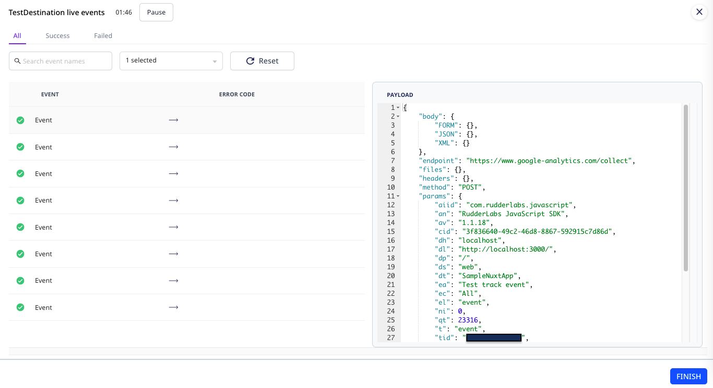
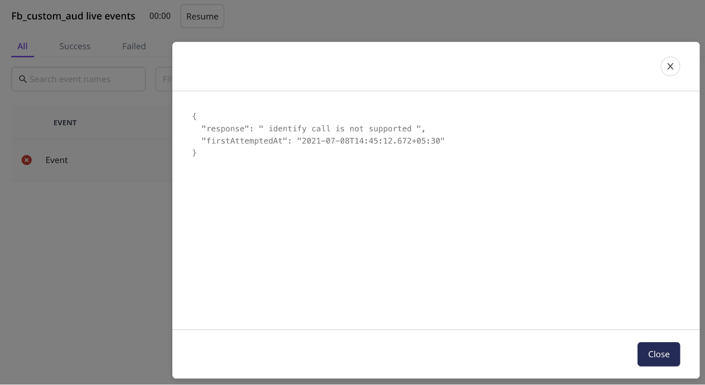

# Live Events

**Live Events** is a debugger that shows the real-time stream of events flowing from your sources to the connected destinations. You can use this feature to debug the errors in case of any failures at the destination level. 

Live Events can only be viewed for the sources and destinations configured in the RudderStack Cloud. For more information on adding a source and destination, refer to <a href="https://rudderstack.com/docs/rudderstack-cloud/connections/">**Connections**</a>.

## Source Live Events

The **Live Events** feature gives you real-time visibility into the source events collected by RudderStack. The key information includes:

- **Name** of the event
- **Type** of the event collected from the source
- **Date** and **time** of the collected event

  This feature comes in very handy when you want to check if your source is
  correctly configured. For example, you can check if the JavaScript SDK loads
  correctly on your website.

### View source Live Events

To view the live events collected from your source in real-time, follow these steps:‌

1. Select the **Connections** option from the left navigation bar and click on the source for which you want to view the live events.

2. Click on the **Live Events** button present at the top right.

3. Ingest data into RudderStack through the source and you will be able to see the collected events in the **Live Events** window.

## Destination Live Events

When routing events to a destination, it can be frustrating if the sent events do not show up in the destination and not knowing the reason for failure only makes it worse.

The **Live Events** feature gives you real-time visibility into the destination's responses. The key information includes:

- **Name** of the event
- **Error code** of the event in case of event failure. It gives the specific details related to an error including the error response and the date and time of the attempt made to send the event.

Your destination should be configured in the **Cloud mode** to view the **Live Events**.  Refer to <a href="https://rudderstack.com/docs/rudderstack-connection-modes/">Connection Modes</a> for more information on the Cloud mode.

The payload sent to the destination can be seen by clicking on an event. This is shown on the right-hand side window of the same page:

### View destination Live Events

To view the live events sent to your destination in real-time, follow these steps:

1. Select the **Connections** option from the left navigation bar and click on the destination for which you want to view the live events.

2. Click on the **Live Events** button present at the top right.

3. You should be able to see the events sent from the source to the destination in the **Live Events** window.

## View Live Events with transformations 

You can also view the **Live Events** in case a <a href="https://rudderstack.com/docs/transformations/#adding-a-transformation">**transformation**</a> is associated with a destination. RudderStack lets you view the **Live Events** before and after a transformation is applied.

RudderStack also notifies you about any dropped events or errors during the transformation along with the details, as shown in the following image:

## Use-case

Consider a scenario where some events are sent to [Facebook Custom Audience](https://rudderstack.com/docs/destinations/advertising/fb-custom-audience) platform but they are not delivered. Upon checking the **Live Events** tab for the **Facebook Custom Audience** destination, the following error is observed:

Clicking on **See full error** option displays the following error response:

As can be observed, an `identify` event is being sent to the **Facebook Custom Audience** platform, which is not supported. The [**Custom Audience documentation**](https://rudderstack.com/docs/destinations/advertising/fb-custom-audience) mentions that only `track` events are supported. As a result, when RudderStack tries sending the `identify` event to the destination, an error is thrown. RudderStack tries sending this event several times before marking it as aborted.

Live events are shown for all the destinations. However, the **payload of the events** is not shown for some destinations like the <a href="https://rudderstack.com/docs/destinations/storage-platforms/">object storage platforms</a> and the <a href="https://rudderstack.com/docs/data-warehouse-integrations/">data warehouses</a> supported by RudderStack.

## FAQ

### Why are my events failing?

Routing events to a destination can fail for various reasons. Often, it is due to the incorrect configuration of a destination. Other reasons might include incorrect/bad event payload structure, rate-limiting by the destination, etc. In some rare cases, the destination could be down too.

## Contact us

To know more about the Live Events feature, you can [**contact us**](mailto:%20docs@rudderstack.com) or start a conversation in our [**Slack**](https://rudderstack.com/join-rudderstack-slack-community) community.
