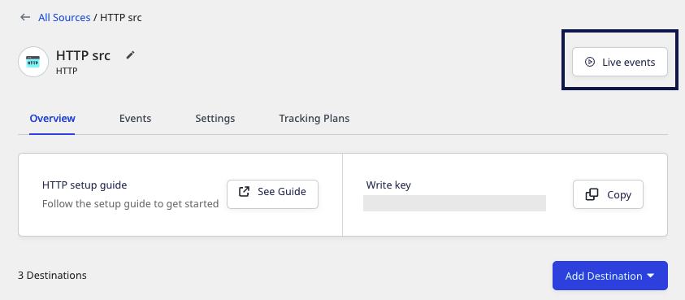
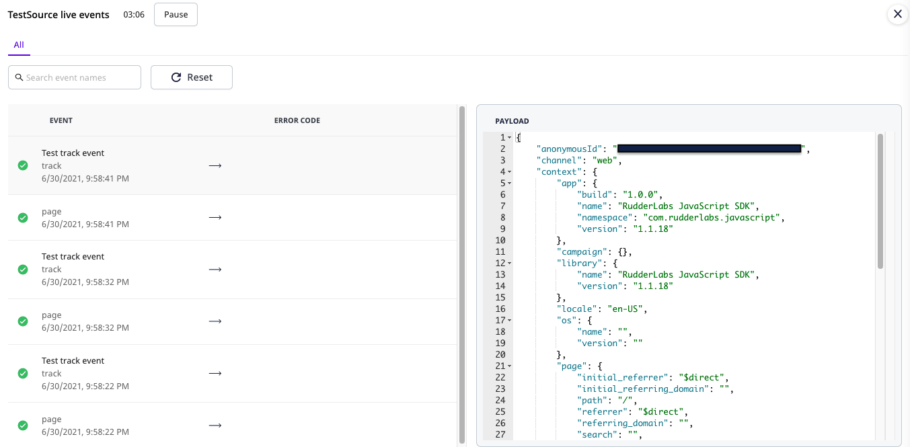
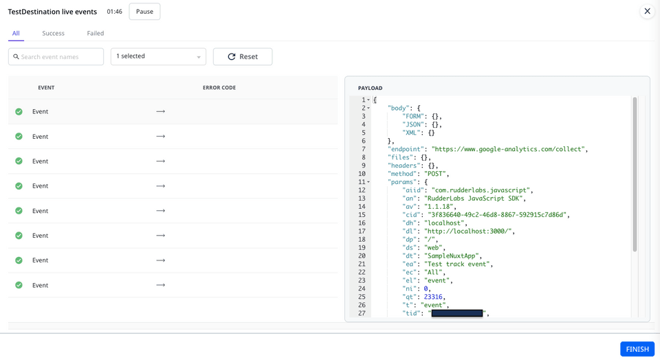
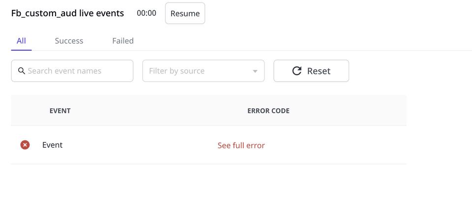
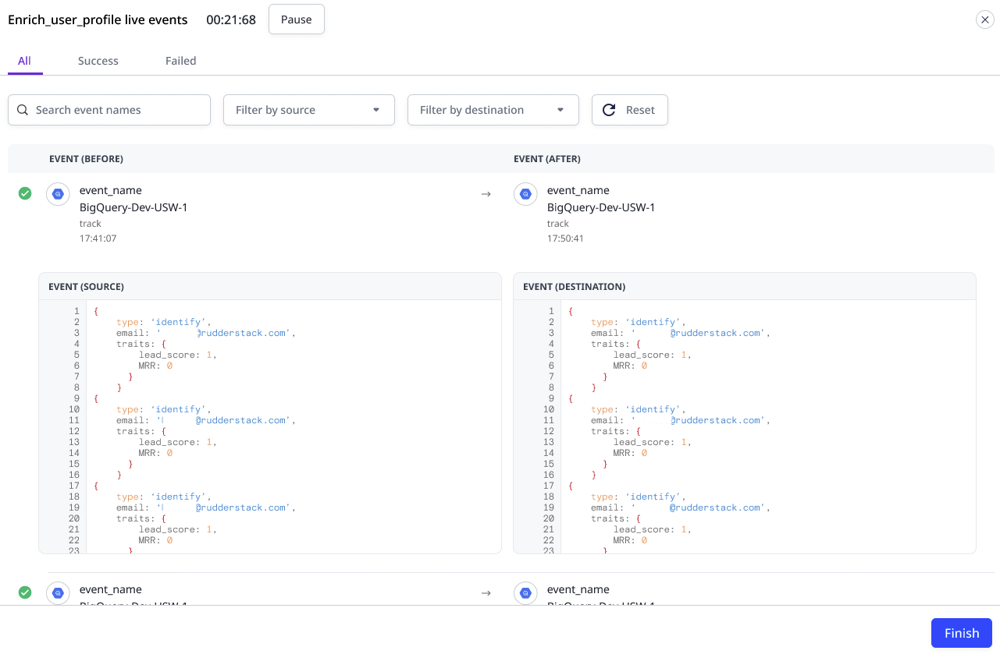
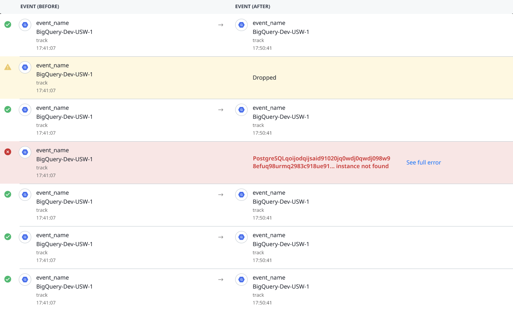

# Live Events

**Live Events** is a debugger that shows the real-time stream of events flowing from your sources to the connected destinations. You can use this feature to debug the errors in case of any failures at the destination level.

This feature is available only in <a href="https://app.rudderstack.com/signup">RudderStack Cloud</a>.

You can view the live events for cloud mode destinations only. For more information, refer to the <a href="https://www.rudderstack.com/docs/rudderstack-cloud/rudderstack-connection-modes/">Connection Modes</a> guide.

The three types of events you can view using this utility are listed in the following table:

| Live Events type | Description |
| :----------------| :------------|
| Source live events | View the source events collected by RudderStack in real-time. |
|  Destination live events | View the events sent to the destination in real-time. |
| Transformation live events | View the transformed events in real-time. | 

## Source live events

This feature provides you with the real-time visibility into the source events collected by RudderStack. The key information includes:

- **Name** of the event
- **Type** of the event collected from the source
- **Date** and **Time** of the collected event

This feature is very handy when you want to check if your source is correctly configured.

### Viewing source live events

To view the live events collected from your source in real-time, follow these steps:‌

1. Select the source for which you want to view the live events.
2. Click on **Live Events**.

3. Ingest data into RudderStack through the source. You will be able to see the collected events in the **Live Events** window.

It may take a couple of seconds before your events start showing up in the <strong>Live Events</strong> window.

## Destination live events

When routing events to a destination, there can be instances when the events do not show up in the destination. In such cases, knowing the reason for failure is helpful.

The **destination live events** feature gives you real-time visibility into the destination's responses. The key information includes:

- **Name** of the event
- **Error code** of the event in case of event failure. It gives the specific details related to an error including the error response and the date and time of the attempt made to send the event.

Your destination should be configured in the cloud mode to view the live events.  Refer to the <a href="https://rudderstack.com/docs/rudderstack-cloud/rudderstack-connection-modes/">Connection Modes</a> guide for more information on the cloud mode.

- The **Payload** sent to the destination can be seen by clicking on an event.

### Viewing destination live events

To view the live events sent to your destination in real-time, follow these steps:

1. Select the destination for which you want to view the live events.
2. Click on **Live Events**.

3. You should be able to see the events sent from the source to the destination in the **Live Events** window.

### Use case

Suppose that some events are sent to the [Facebook Custom Audience](https://rudderstack.com/docs/destinations/advertising/fb-custom-audience) platform but they are not delivered. Upon checking the **Live Events** tab for the **Facebook Custom Audience** destination, the following error is observed:

Clicking on **See full error** option displays the following error response:

As you can see, an `identify` event is sent to the **Facebook Custom Audience** destination which is not supported. The [Custom Audience documentation](https://rudderstack.com/docs/destinations/advertising/fb-custom-audience) mentions that only `track` events are supported. As a result, when RudderStack tries sending the `identify` event to the destination, an error is thrown. RudderStack tries sending this event several times before marking it as aborted.

Live events are shown for all the destinations. However, the <strong>event payload</strong> is not shown for some destinations like the <a href="https://rudderstack.com/docs/destinations/storage-platforms/">object storage platforms</a> and the <a href="https://rudderstack.com/docs/data-warehouse-integrations/">data warehouses</a>.

## Transformations live events

You can also view the live events in case a <a href="https://rudderstack.com/docs/transformations/#adding-a-transformation">**transformation**</a> is connected to a destination. RudderStack lets you view the events before and after a transformation is applied, as shown:

RudderStack also notifies you about any dropped events or errors during the transformation along with the details, as shown in the following image:

## FAQ

### Why are the events sent to the destination failing?

Routing events to a destination can fail for various reasons. Often, it is due to the incorrect configuration of a destination in the RudderStack dashboard. Some other possible reasons include:

- Incorrect/bad event payload structure
- Rate-limiting by the destination
- Network error
- Destination downtime

The [Destination Live Events](#destination-live-events) feature gives you better visibility into how your events are sent to the destination. If there are any delivery failures, the utility also gives you insights into the reasons for the failure.

## Contact us

For queries on any of the sections covered in this guide, you can [contact us](mailto:%20docs@rudderstack.com) or start a conversation in our [Slack](https://rudderstack.com/join-rudderstack-slack-community) community.
