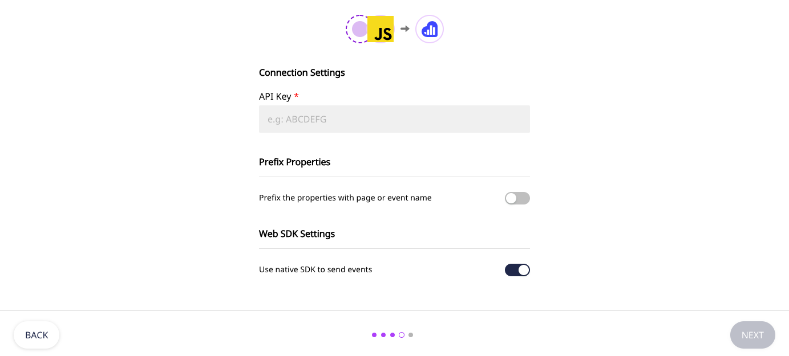
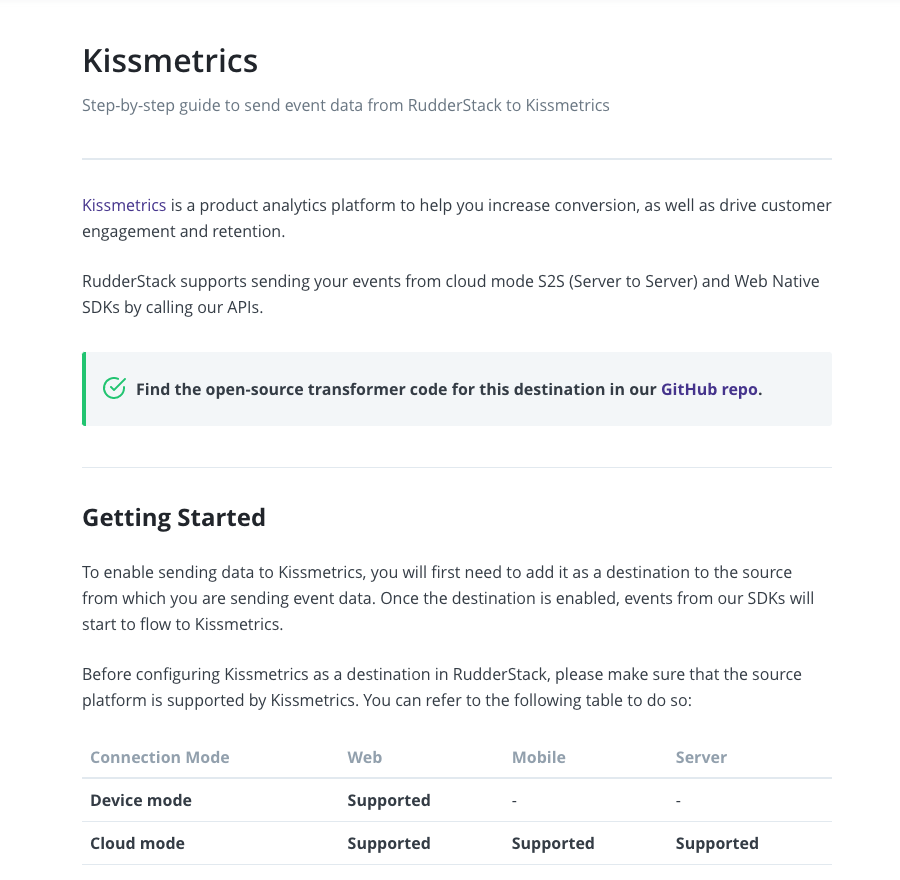

# Connection Modes: Cloud Mode vs. Device Mode

This guide clarifies and details the differences between the two main connection modes in RudderStack - **cloud mode** and **device mode**.

## What are connection modes in RudderStack?

RudderStack's workflow is quite simple - it receives the event data from the **sources** and routes this data to the **destinations**. The connection modes determine how RudderStack tracks, transforms, and routes this event data.

There are two connection modes through which you can send your event data from your source apps to the desired destinations via RudderStack:

- Cloud mode
- Device mode

## Cloud mode

In this mode, the SDK sends the event data directly to the RudderStack server. RudderStack then transforms this data and routes it to the desired destination. This transformation is done in the RudderStack backend, using RudderStack's [Transformer](https://github.com/rudderlabs/rudder-transformer) module.

When you send events via the cloud mode, you also get the flexibility to use <a href="https://rudderstack.com/docs/transformations/">RudderStack Transformations</a> to implement custom logic on the events before forwarding them to the destinations.

### How cloud mode works

1. The SDK sends the event data directly to the RudderStack server (backend).
2. RudderStack transforms this data into a destination-specific format.
3. The transformed data is then routed to the destination.

Suppose you want to analyze your website data in Google Analytics. To do so, you can use RudderStack's [JavaScript](https://rudderstack.com/docs/stream-sources/rudderstack-sdk-integration-guides/rudderstack-javascript-sdk/) SDK.

RudderStack defines a [fixed event structure](https://www.rudderstack.com/docs/rudderstack-api/api-specification/rudderstack-spec/). If you track your events in this format, RudderStack will take care of transforming the events as required by Google Analytics. You can start by [adding a JavaScript source](https://rudderstack.com/docs/rudderstack-cloud/sources/#adding-a-source) and [Google Analytics destination](https://www.rudderstack.com/docs/destinations/analytics/google-analytics-ga/) in the RudderStack dashboard.

Then, enable event tracking on your website by [adding the JavaScript SDK snippet](https://www.rudderstack.com/docs/stream-sources/rudderstack-sdk-integration-guides/rudderstack-javascript-sdk/quick-start-guide/#step-1-install-rudderstack-javascript-sdk).

The SDK will automatically track and send the events to RudderStack. RudderStack then transforms this data into the format required by Google Analytics and then sends it over.

<ul>
  <li>RudderStack's <a href="https://rudderstack.com/docs/data-warehouse-integrations/">data warehouse destinations</a> support sending data only through the cloud mode.</li>
  <li>All the RudderStack server-side SDKs support sending events only through cloud mode. This is because the server-side SDKs operate in the RudderStack backend and cannot load any additional destination-specific SDKs.</li>
</ul>

## Device mode

In the device mode, RudderStack sends the event data to the destinations directly from your client (web or mobile app). 

The RudderStack SDKs first load the native client libraries on your website or mobile app. These libraries allow RudderStack to use the data you collect on your device to call the destination APIs - without sending it to the RudderStack servers first.

You will not be able to use RudderStack's <a href="https://rudderstack.com/docs/transformations/">Transformations</a> feature when sending events via the device mode.

### How device mode works

Suppose you want to send your event data from your mobile app to Firebase via the RudderStack Android SDK (or any other mobile SDK). You can start by [adding an Android source](https://rudderstack.com/docs/rudderstack-cloud/sources/#adding-a-source) and [Firebase destination](https://www.rudderstack.com/docs/destinations/analytics/firebase/) in the RudderStack dashboard.

The RudderStack SDK will first download the Firebase SDK, transform the events natively, and then send them over to Firebase.

RudderStack Device Mode

For some destinations, you can use the [RudderStack web SDK](https://rudderstack.com/docs/stream-sources/rudderstack-sdk-integration-guides/rudderstack-javascript-sdk/) to send the events via the device mode. To do so, enable the **Use native SDK to send events** option under the destination-specific connection settings in the RudderStack dashboard, as shown:

## Which connection mode should I choose?

- Use the cloud mode if you wish to use the [Transformations](https://www.rudderstack.com/docs/transformations/) feature to transform your events before sending them to the destination.
- If you are planning to work with the destinations that record information directly on your users' devices, you should send the events via the device mode. There is a possibility that these destinations might not function correctly if they are not loaded directly on the device.

## How to check which connection mode is supported by the destination?

The easiest way to check the connection mode supported by the destination is to go refer to the individual destination's [documentation](https://rudderstack.com/docs/destinations/).

The supported connection modes are mentioned for every destination in the **Getting Started** section of their respective documentation, as seen below:

Some RudderStack destinations support sending events via both the cloud and device mode. [Google Analytics](https://rudderstack.com/docs/destinations/analytics/google-analytics-ga/), [HubSpot](https://rudderstack.com/docs/destinations/crm/hubspot/), [Intercom](https://rudderstack.com/docs/destinations/business-messaging/intercom/), [Kissmetrics](https://rudderstack.com/docs/destinations/analytics/kissmetrics/), [Branch](https://rudderstack.com/docs/destinations/attribution/branchio/), [Braze](https://rudderstack.com/docs/destinations/marketing/braze/), [Customer.io](https://rudderstack.com/docs/destinations/marketing/customer.io/), and [Facebook App Events](https://rudderstack.com/docs/destinations/advertising/facebook-app-events/) are some popular examples.

## Contact us

For queries on any of the sections covered in this guide, you can [contact us](mailto:%20docs@rudderstack.com) or start a conversation in our [Slack](https://rudderstack.com/join-rudderstack-slack-community) community.
