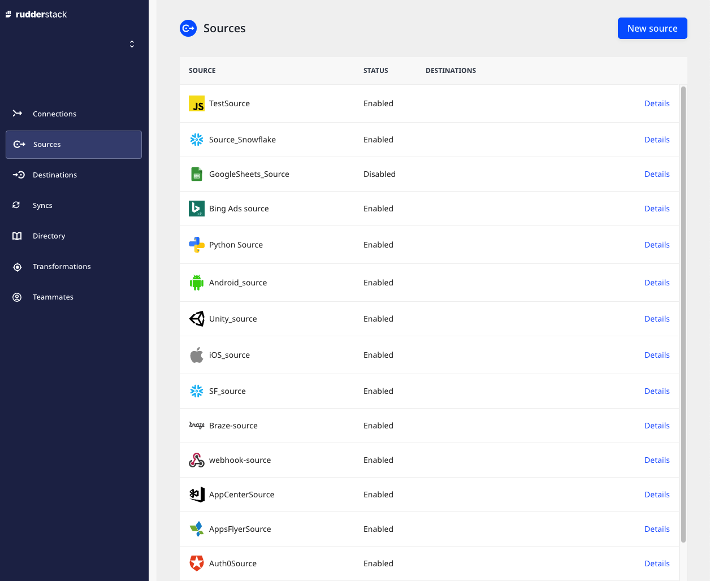
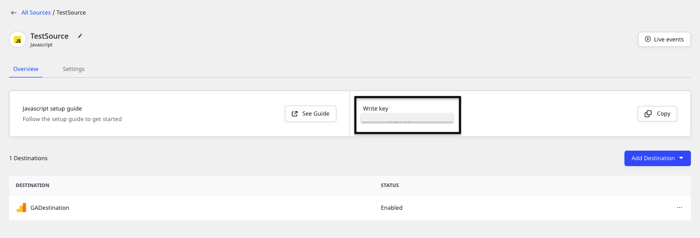

# Sources

A **source** refers to a platform or an application (web, mobile, server-side, or a third-party cloud app) from where RudderStack tracks and collects your event data.

<div class="infoBlock">

  You can configure a source for every unique source of data. You can also create multiple sources for each website or application from which you want to track the data.
</div>

RudderStack Cloud provides **Sources** option in the left navigation bar that allows you to view all the configured sources in your RudderStack dashboard:



## Adding a source

Follow these steps to add an event data source in RudderStack:

1. Log in to the **RudderStack dashboard**.


<span class="imageTitle"></span>

2. Click **Sources** in the left navigation bar and then click on **New Source**. 

3. Click on the source you want to set up in RudderStack.


<div class="successBlock">

  RudderStack sources are classified into the following three
  categories. Refer to the respective documentation for more information:
  <ul>
    <li>
      <a href="https://rudderstack.com/docs/stream-sources/">Event Streams</a>
    </li>
    <li>
      <a href="https://rudderstack.com/docs/cloud-extract-sources/">Cloud Extract</a>
    </li>
    <li>
      <a href="https://rudderstack.com/docs/warehouse-actions/">Warehouse Actions</a>
    </li>
  </ul>
</div>

4. Assign a name to the source, and click **Next**.
5. Configure the source with the relevant connection settings.

Your source should be configured successfully.

<div class="warningBlock">

  Setting up the data sources to ingest data from cloud apps might require
  some additional configuration. Refer to the relevant source documentation for
  more details.
</div>

**Important**: Note the source **Write Key**. This is required to configure the RudderStack SDK to track and collect events from the source platform.



## Source details

To get details about a configured source, click on it to see following view on the dashboard:


These options can be explained as follows:

- **Rename**: Click on the edit icon next to the source name to rename the source:

- **Write Key**: It is required to send the data from your source.

For example, you can load [**RudderStack's JavaScript SDK**](https://rudderstack.com/docs/stream-sources/rudderstack-sdk-integration-guides/rudderstack-javascript-sdk/) on your website to track and collect the events by running the following snippet:

```javascript
  rudderanalytics.load(<WRITE_KEY>, <DATA_PLANE_URL>, options);
```

- **Add Destination**: You can connect the source to a destination by clicking on this button.

<div class="infoBlock">

If you have already configured a destination in RudderStack, you can also use it by clicking on **Add Destination** > **Use Existing Destination**.
</div>

- **Live Events**: Once the source and destination are successfully configured and a connection is set up and enabled, RudderStack starts tracking and collecting events from your source. These events can be viewed in real-time using this option.

- **Events**: It displays all the latest metrics related to the event delivery such as number of events successfully delivered, failed events, etc. You can also filter these by time period.

- **Settings**: This option provides additional destination-related details, such as:  

  - **Enabled**: You can enable or disable syncing data from this source.

  - **Source ID**: This is the unique identifier associated with your source.

  - **Permanently delete source**: You can delete a source by clicking on the **Delete** button.

<div class="warningBlock">

Before deleting a source, make sure there are no destinations connected to it.
</div>


## Contact us

For more information on any of the sections covered in this guide, you can [**contact us**](mailto:%20docs@rudderstack.com) or start a conversation in our [**Slack**](https://rudderstack.com/join-rudderstack-slack-community) community.
