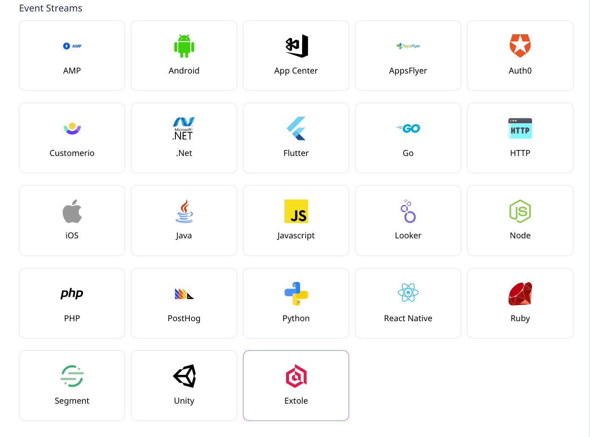
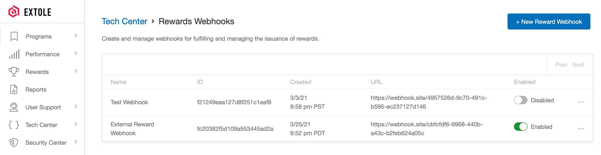

# Extole

[Extole](https://www.extole.com/) is a popular referral marketing tool that lets you offer an integrated, optimized, and effective customer experience for your audience. It allows you to create personalized marketing campaigns aimed at boosting your customer acquisition and conversion rates.

You can send your Extole events to RudderStack by simply adding a webhook pointing to RudderStack. These events includes the reward specific events `reward_earned`,`reward_fulfilled`,`reward_sent` along with other custom events from extole.

This guide helps you in setting up Extole as a source in RudderStack.

## Getting Started

In order to add Extole as a source in RudderStack, please follow these steps:

* From your [RudderStack dashboard](https://app.rudderstack.com/), click on **Add Source**. From the list of sources, select **Extole**, as shown:



* Enter the name of your source, and click on **Next**.


* Head over to your Extole account and select the `program` you want to use for RudderStack to ingest your data. Then, navigate to the **Tech Center** section from the sidebar and then select [Rewards WebHook](https://my.extole.com/tech-center/rewards-webhooks) and create a new **Reward Webhook** in the view as shown below:



* In the **URL** text box, add a URL pointing to RudderStack in the following format: `<DATA_PLANE_URL>/v1/webhook?writeKey=<YOUR_EXTOLE_SOURCE_WRITE_KEY>`

An example URL should like the following:

```http
https://hosted.rudderlabs.com/v1/webhook?writeKey=1qI4k72gLvHwg2mz24xPCv8gGGK
```


Make sure you add the `writeKey` as query parameter to the URL. This is required to prevent the webhook from failing in case of an invalid write key.


* Finally, save the endpoint.

## RudderStack Event Transformation

The events from Extole are ingested into RudderStack after converting it into a RudderStack-compatible event format. For example, the `event_id` set by Extole is set as `properties.eventId`.

The events sent by Extole are converted into a Rudderstack `track` call with a designated name and properties as the entire event received from Extole.

The event name of the events generated by Extole is kept the same while mapping to the Rudderstack event name.

RudderStack populates the following properties from Extole event payload to the RudderStack event:

| Extole Property | RudderStack Property |
| :--- | :--- |
| `event_id`, | `properties.eventId` |
| `event_time` | `originalTimestamp` |
| `reward_id` | `properties.rewardId` |
| `reward_supplier_name` | `properties.rewardSupplierName` |
| `reward_supplier_id` | `properties.rewardSupplierId` |
| `partner_reward_supplier_id` | `properties.partnerRewardSupplierId` |
| `reward_supplier_type` | `properties.partnerRewardSupplierType` |
| `person_id` | `properties.personId` |
| `partner_user_id` | `properties.partnerUserId`, `userId`, `context.traits.userId` |
| `face_value` | `properties.faceValue` |
| `face_value_type` | `properties.faceValueType` |
| `message` | `properties.message` |
| `partner_reward_id` | `properties.partnerRewardId` |
| `email` | `properties.email` |
| `data` | `properties.data` |
| `schema_version` | `properties.schemaVersion` |


All the properties of Extole Events other than `reward_earned`, `reward_fulfilled`, `reward_sent` which are sent to Rudderstack will be directly mapped to the Rudderstack event `properties`.


## Contact Us

If you come across any issues while configuring Extole as a source with RudderStack, please feel free to [contact us](mailto:%20docs@rudderstack.com). You can also start a conversation on our [Slack](https://resources.rudderstack.com/join-rudderstack-slack) channel - we will be happy to talk to you!

