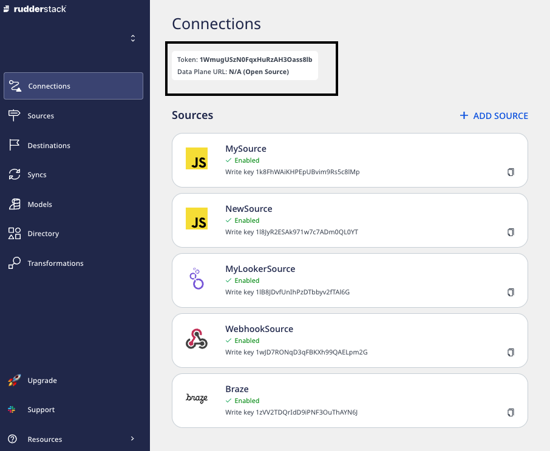

# Developer Machine Setup

This guide lists the steps required to set up the RudderStack data plane (backend) in your development environment.

## Setup prerequisites

To set up RudderStack, you will need to set up and install the following tools:

- [Go 1.17](https://golang.org/dl/) or above.
- [Node.js 14.17](https://nodejs.org/en/download/) or above.
- [PostgreSQL 11](https://www.postgresql.org/download/) or above

## RudderStack-hosted control plane

If you're using a RudderStack-hosted control plane, follow these steps to set up the data plane in your development environment:

1. Log into your [RudderStack Open Source dashboard](https://app.rudderstack.com/signup?type=opensource).
2. Note and copy your workspace token from the top of the page, as shown:



<div class="infoBlock">

The workspace token is required for setting up the data plane.
</div>

3. Then, set up the database in your preferred directory using the following commands:

```bash
createdb jobsdb
createuser --superuser rudder
psql "jobsdb" -c "alter user rudder with encrypted password 'rudder'";
psql "jobsdb" -c "grant all privileges on database jobsdb to rudder";
```

4. Next, clone the [RudderStack server](https://github.com/rudderlabs/rudder-server) repository:

```bash
git clone https://github.com/rudderlabs/rudder-server.git
```

5. Then, run `git submodule init` and `git submodule update` to fetch the `rudder-transformer` repository.
6. Next, navigate to the `rudder-transformer` directory using the following command:

```bash
cd rudder-transformer
```

7. Install the dependencies using the command `npm i`. Then, start the destination transformer using the following command:

```bash
node destTransformer.js
```

8. Navigate back to the main directory using the command `cd rudder-server`.
9. Copy `sample.env` to the main directory using the following command:

```bash
cp config/sample.env .env
```

10. Update the `WORKSPACE_TOKEN` environment variable in this file with the workspace token you copied in Step 2.
11. Finally, run the RudderStack server using the following command:

```bash
go run main.go
```

## Self-hosted control plane

If you have self-hosted the control plane using the open-source [Control Plane Lite](https://rudderstack.com/docs/rudderstack-open-source/control-plane-lite/) utility, follow the [Developer Machine Setup instructions](https://rudderstack.com/docs/rudderstack-open-source/control-plane-lite/#developer-machine-setup) to set up the RudderStack data plane in your development environment.

## Sending test events

Once you have successfully performed the steps above, follow the [Sending Test Events](https://rudderstack.com/docs/rudderstack-open-source/installing-and-setting-up-rudderstack/sending-test-events/) guide to verify the installation.

## Contact us

If you come across any issues while setting up RudderStack in your development environment, you can [contact us](mailto:docs@rudderstack.com) or start a conversation in our [Slack](https://rudderstack.com/join-rudderstack-slack-community) community.