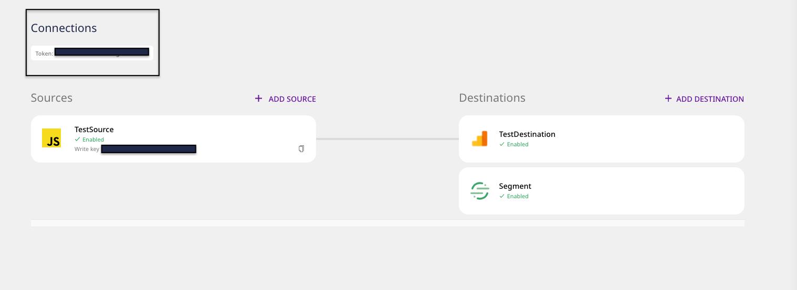

# Docker

This guide lists the steps required to set up RudderStack in your Docker environment.

<div class="successBlock">

  **
    The Docker setup is the easiest and the fastest way to get up and running
    with RudderStack.
  **
</div>

## Introduction

Installing and setting up RudderStack involves two key steps:

- Control Plane setup
- Data Plane setup

<div class="infoBlock">

Refer to the <a href="https://rudderstack.com/docs/get-started/rudderstack-architecture">RudderStack Architecture</a> to know more about the RudderStack Control Plane and Data Plane.

</div>

## Control Plane Setup

There are two ways you can set up the Control Plane. This section lists the steps involved in each of them.

### **Use RudderStack-Hosted Control Plane**

- Sign up and log into the [**RudderStack dashboard**](https://app.rudderlabs.com/signup).

<div class="infoBlock">

**Why do I need to sign up for RudderStack?**

RudderStack's dashboard lets you easily set up your data pipelines by configuring your sources and destinations. It is fully hosted by RudderStack and is free for open-source users. You also get access to some important features like <a href="https://rudderstack.com/docs/transformations/">Transformations</a> and a <a href="https://rudderstack.com/docs/user-guides/how-to-guides/live-destination-event-debugger">Live Events</a> tab.

</div>

- Note and copy your workspace **Token** from the top of the page, as shown below. This will be required for setting up the Data Plane.



<!---->

<!---->

### Self-Host the Control Plane

<div class="warningBlock">

Use this option if you don't wish to sign up for RudderStack.

</div>

You can self-host your own Control Plane using the open-source [**Control Plane Lite**](https://rudderstack.com/docs/get-started/control-plane-lite/) utility.

<div class="dangerBlock">

Note that the Control Plane set up using <a href="https://rudderstack.com/docs/get-started/control-plane-lite/">Control Plane Lite</a> lacks certain features like <a href="https://rudderstack.com/docs/transformations/">Transformations</a> and <a href="https://rudderstack.com/docs/user-guides/how-to-guides/live-destination-event-debugger/">Live Events</a> tab.

</div>

## Data Plane Setup

### For **RudderStack-Hosted Control Plane**

To set up the RudderStack Data Plane in your Docker environment, follow these steps:

- Download the `rudder-docker.yml` [**docker-compose**](https://raw.githubusercontent.com/rudderlabs/rudder-server/master/rudder-docker.yml) file.
- Replace `<your_workspace_token>` in this file with the token you copied in the previous section.
- Then, open your terminal, navigate to the directory where you want to install RudderStack, and run the following command:

```bash
docker-compose -f rudder-docker.yml up
```

- Once you have successfully followed the steps above, [**send test events**](https://rudderstack.com/docs/get-started/installing-and-setting-up-rudderstack/sending-test-events/) to verify the installation.

### For **Self-Hosted Control Plane**

If you have self-hosted the Control Plane using the open-source [**Control Plane Lite**](https://rudderstack.com/docs/get-started/control-plane-lite/) utility, follow [**these**](https://rudderstack.com/docs/get-started/control-plane-lite/#docker) instructions to set up the RudderStack Data Plane on Docker.

Once you have successfully followed the steps above, [**send test events**](https://rudderstack.com/docs/get-started/installing-and-setting-up-rudderstack/sending-test-events/) to verify the installation.

## Contact Us

If you come across any issues while setting up RudderStack on Docker, you can [**contact us**](mailto:docs@rudderstack.com) or start a conversation in our [**Slack**](https://rudderstack.com/join-rudderstack-slack-community) community.
