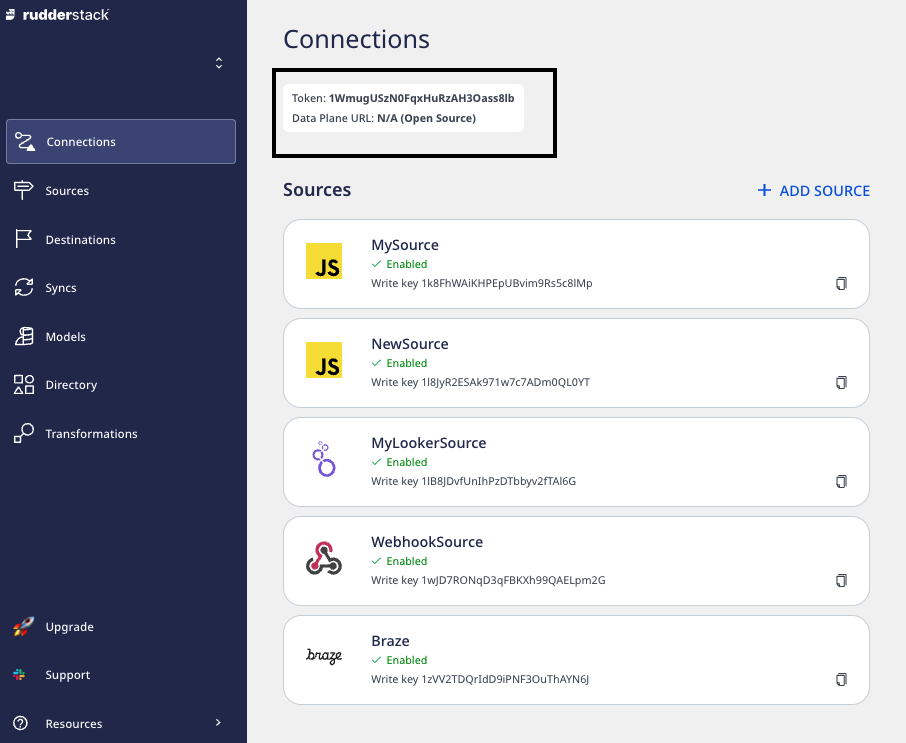

# Docker

This guide lists the steps required to set up the RudderStack server (backend) in your Docker environment.

<div class="successBlock">

The Docker setup is the easiest and the fastest way to get up and running with RudderStack.
</div>

## RudderStack-hosted control plane

If you're using a RudderStack-hosted control plane, follow these steps to set up the data plane in your Docker environment:

1. Log into your [RudderStack Open Source dashboard](https://app.rudderstack.com/signup?type=opensource).
2. Note and copy your workspace token from the top of the page, as shown:



<div class="infoBlock">

The workspace token is required for setting up the data plane.
</div>

3. Download the `rudder-docker.yml` [docker-compose](https://raw.githubusercontent.com/rudderlabs/rudder-server/master/rudder-docker.yml) file.
4. Replace `<your_workspace_token>` in this file with the workspace token copied above.
5. Then, open your terminal, navigate to the directory where you want to install RudderStack, and run the following command:

```bash
docker-compose -f rudder-docker.yml up
```

## Self-hosted control plane

If you have self-hosted the control plane using the open-source [Control Plane Lite](https://rudderstack.com/docs/rudderstack-open-source/control-plane-lite/) utility, follow [Docker instructions](https://rudderstack.com/docs/rudderstack-open-source/control-plane-lite/#docker) to set up the data plane.

## Sending test events

Once you have successfully performed the steps above, follow the [Sending Test Events](https://rudderstack.com/docs/rudderstack-open-source/installing-and-setting-up-rudderstack/sending-test-events/) guide to verify the installation.

## Contact us

If you come across any issues while setting up RudderStack on Docker, you can [contact us](mailto:docs@rudderstack.com) or start a conversation in our [Slack](https://rudderstack.com/join-rudderstack-slack-community) community.
