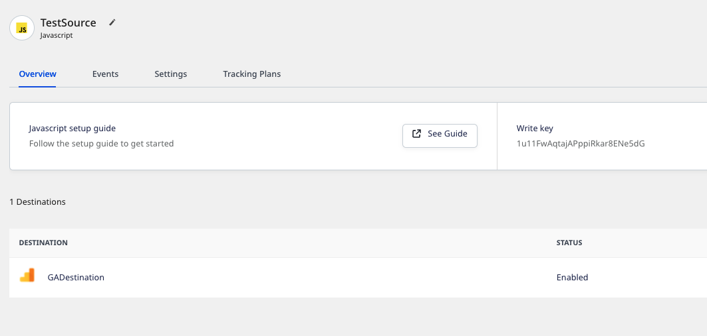
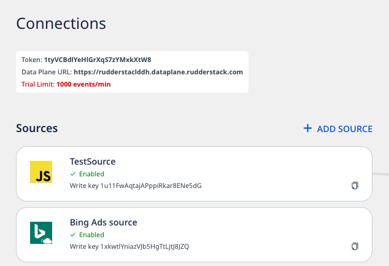
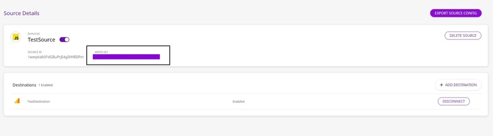
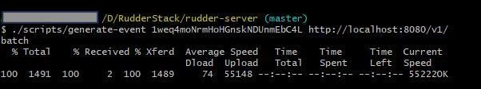
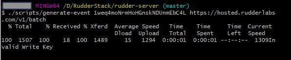

# Sending Test Events

<div class="infoBlock">

This guide assumes that you have already <a href="https://rudderstack.com/docs/rudderstack-open-source/installing-and-setting-up-rudderstack/">installed and set up RudderStack</a> in your preferred environment.
</div>

You can follow any of the two approaches to send test events and verify your RudderStack installation:

- Bundled shell script
- RudderStack's HTTP API

## Bundled Shell Script

The [RudderStack GitHub repository](https://github.com/rudderlabs/rudder-server) contains a bundled shell script that generates test events. Clone the [repository](https://github.com/rudderlabs/rudder-server) by running the following command:

```bash
git clone https://github.com/rudderlabs/rudder-server.git
```

Then, follow the steps below to send test events.

### Step 1: Getting the source write key

#### RudderStack Open Source  dashboard

If you have signed up for [RudderStack Open Source](https://app.rudderstack.com/signup?type=opensource), follow these steps to get the source write key:

1. Set up a source and a destination in RudderStack.
2. You can find the write key in the source details page, as shown:



Note that the write key is different from your workspace token. The write key is associated with the source, while the workspace token is associated with your RudderStack workspace, as seen below:



#### Self-hosted control plane

If you are self-hosting RudderStack and have set up the control plane using the [Control Plane Lite](https://rudderstack.com/docs/rudderstack-open-source/control-plane-lite/) utility, you can obtain the source write key by following these steps:

1. Set up a source and a destination.
2. Note the write key associated with the source in the dashboard as shown:



### Step 2: Sending test events

Follow these steps to send the test events:

1. Navigate to the folder where RudderStack is installed.
2. Then, run the following command after replacing `<WRITE_KEY>` with the source write key obtained in the previous section, and `<DATA_PLANE_URL>` with your [data plane URL](https://rudderstack.com/docs/rudderstack-open-source/installing-and-setting-up-rudderstack/#what-is-a-data-plane-url-where-do-i-get-it).

```bash
./scripts/generate-event <WRITE_KEY> <DATA_PLANE_URL>/v1/batch
```

An example is shown below:



You can then check your destination to verify that the events are delivered.

<div class="infoBlock">

Note that unlike RudderStack Open Source, the control plane set up using the <a href="https://rudderstack.com/docs/rudderstack-open-source/control-plane-lite/">Control Plane Lite</a> utility does not let you view live events.
</div>

If you supply an invalid source write key or data plane URL, you will get the following error:



## Using the HTTP API

To send test events via the [RudderStack HTTP API](https://www.rudderstack.com/docs/rudderstack-api/http-api/), follow these steps:

1. Import this [Postman collection](https://www.getpostman.com/collections/480307c55ad2b9dd4e27). 
2. Edit the variables `source_write_key` and `data_plane_url` in this collection with your source write key and your [data plane URL](https://rudderstack.com/docs/rudderstack-open-source/installing-and-setting-up-rudderstack/#what-is-a-data-plane-url-where-do-i-get-it).

RudderStack uses **Basic Authentication** for authenticating all the HTTP requests. The HTTP Basic Authentication requires a user name and password where:
  - The user name is the `source_write_key`
  - The password is an empty string (`""`)

Now you can send test API requests and verify if your installation is working as expected.

## Contact us

If you come across any issues while sending test events to verify your RudderStack installation, you can [contact us](mailto:%20docs@rudderstack.com) or start a conversation in our [Slack](https://rudderstack.com/join-rudderstack-slack-community) community.
