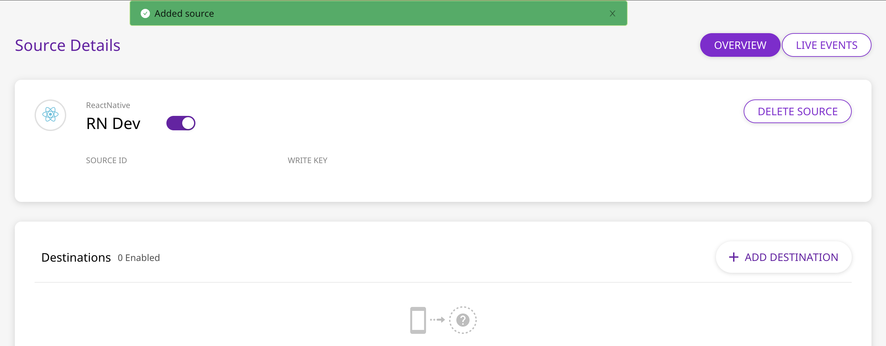

# React Native

## What is the RudderStack React Native SDK?

The RudderStack React Native SDK allows you to track event data from your app. It can be easily integrated into your React Native application. After integrating this SDK, you will also send the event data to your preferred analytics destination/s, such as Google Analytics, Amplitude, and more. 

You can check the [GitHub codebase](https://github.com/rudderlabs/rudder-sdk-react-native) if you want to get more hands-on or keen to know more about the SDK architecture.

## SDK Setup Requirements

To set up the RudderStack React Native SDK, there are a few prerequisites as mentioned below:

* You will need to set up a [RudderStack Account](https://app.rudderlabs.com).
* Once signed up, your `React Native` source `writeKey` will appear in the Dashboard, as shown:



* You will also need your `Data-Plane URL`. The following screenshot shows the data plane URL for the managed hosting mode:


* It would help if you also had the [React Native Development Environment](https://reactnative.dev/docs/environment-setup) setup on your system.

## Installing the RudderStack React Native SDK

The recommended way to install the React Native SDK is through [`npm`](https://www.npmjs.com/package/@rudderstack/rudder-sdk-react-native).

To add the SDK as a dependency, perform the following steps:

* Go to the root of your Application and add `@rudderstack/rudder-sdk-react-native` to your Application as a dependency with:



```bash
npm install @rudderstack/rudder-sdk-react-native --save
```



```bash
yarn add @rudderstack/rudder-sdk-react-native
```



* Navigate to your Application's `Android` folder and add the following to your application's `build.gradle` file:

```groovy
maven { 
    url { "https://dl.bintray.com/rudderstack/rudderstack" }
}
```

* Navigate to your Application's iOS folder and install all the required pods with:

```bash
pod install
```

## Initializing the RudderStack Client

After adding the SDK as a dependency, you need to set up the SDK.

* Make sure to import the SDK wherever you use it with:

```typescript
import rudderClient from '@rudderstack/rudder-sdk-react-native'
```

* Add the following code somewhere in your application.

```typescript
await rudderClient.setup( WRITE_KEY, {
    dataPlaneUrl: DATA_PLANE_URL,
    trackLifecycleEvents: true,
    recordScreenViews: true
})
```


It is highly recommended to use the `await` keyword with the setup call.


The `setup` method has the following signature:

| Name | Data Type | Required | Description |
| :--- | :--- | :--- | :--- |
| `writeKey` | `string` | Yes | Your React Native `writeKey` |
| `configuration` | `JSON Object` | No | Contains the RudderStack Client configuration |

Check the [Configuring your RudderStack Client](https://docs.rudderstack.com/rudderstack-sdk-integration-guides/rudderstack-react-native-sdk#configuring-your-rudderstack-client) section below for a full list of configurable parameters.

## Track

You can record the users' activity through the `track` method. Every action performed by the user is called an event.

An example of the `track` event is as shown:

```typescript
rudderClient.track("test_track_event", {
    "test_key_1": "test_value_1",
    "test_key_2": {
        "test_child_key_1":"test_child_value_1"
    }
})
```

The `track` method has the following signature:

| Name | Data Type | Required | Description |
| :--- | :--- | :--- | :--- |
| `name` | `string` | Yes | Name of the event you want to track |
| `property` | `JSON Object` | No | Extra data properties you want to send along with the event  |
| `options` | `JSON Object` | No | Extra event options |


We automatically track the following optional events:

1. `Application Installed` 
2. `Application Updated`
3. `Application Opened` 
4. `Application Backgrounded`  

You can disable these events by passing `trackLifecycleEvents` as false in the configuration object. But it is highly recommended to keep them enabled.


## Identify

Capture `deviceId` and use that as `anonymousId` for identifying the user. It helps to track the users across the application installation. To attach more information to the user, you can use the `identify` method. Once you set the `identify` information to the user, those will be passed to the successive `track` or `screen` calls. To reset the user identification, you can use the `reset` method.

An example `identify` event is as shown:

```typescript
rudderClient.identify("test_userId", {
    "email":"testuser@example.com",
    "location":"UK"
}, null)
```

The `identify` method has the following signatures:

| Name | Data Type | Required | Description |
| :--- | :--- | :--- | :--- |
| `userId` | `string` | Yes | Developer identity for the user |
| `traits` | `JSON Object` | No | Traits information for user |
| `option` | `JSON Object` | No | Extra options for the `identify` event |

## Screen

You can use the `screen` call to record whenever the user sees a screen on the mobile device. You can also send some extra properties along with this event.

An example of the `screen` event is as shown:

```typescript
rudderClient.screen("Main Activity", {
    "foo":"bar"
})
```

Alternatively, you can use the following method signature:

| Name | Data Type | Required | Description |
| :--- | :--- | :--- | :--- |
| `screenName` | `string` | Yes | Name of the screen viewed. |
| `property` | `JSON Object` | No | Extra property object that you want to pass along with the `screen` call. |
| `option` | `JSON Object` | No | Extra options to be passed along with `screen` event. |


You can also enable automatic recording of screen views by passing `recordScreenViews` as `true` while initializing the `rudderClient`.  
The default value for `recordScreenViews` is `false`.


## Reset

You can use the `reset` method to clear the persisted `traits` for the `identify` call. This is required for `Logout` operations.

```typescript
await rudderClient.reset()
```


It is highly recommended to use the `await` keyword with the reset call.


## Configuring your RudderStack Client

You can configure your client based on the following parameters by passing them in the `configuration` object of your `setup` call.

<table>
  <thead>
    <tr>
      <th style="text-align:left">Parameter</th>
      <th style="text-align:left">Type</th>
      <th style="text-align:left">Description</th>
      <th style="text-align:left">Default Value</th>
    </tr>
  </thead>
  <tbody>
    <tr>
      <td style="text-align:left"><code>logLevel</code>
      </td>
      <td style="text-align:left"><code>int</code>
      </td>
      <td style="text-align:left">
        <p>Controls how much of the log you want to see from the SDK.</p>
        <p>Refer to the Debugging section to get a list of all supported values.</p>
      </td>
      <td style="text-align:left"><code>RUDDER_LOG_LEVEL.ERROR</code>
      </td>
    </tr>
    <tr>
      <td style="text-align:left"><code>dataPlaneUrl</code>
      </td>
      <td style="text-align:left"><code>string</code>
      </td>
      <td style="text-align:left">URL of your <code>data-plane</code>. Please refer above to see how to fetch
        the data plane URL.</td>
      <td style="text-align:left"><code>https://hosted.rudderlabs.com</code>
      </td>
    </tr>
    <tr>
      <td style="text-align:left"><code>flushQueueSize</code>
      </td>
      <td style="text-align:left"><code>int</code>
      </td>
      <td style="text-align:left">Number of events in a batch request to the server.</td>
      <td style="text-align:left"><code>30</code>
      </td>
    </tr>
    <tr>
      <td style="text-align:left"><code>dbThresholdCount</code>
      </td>
      <td style="text-align:left"><code>int</code>
      </td>
      <td style="text-align:left">The number of events to be saved in the <code>SQLite</code> database. Once
        the limit is reached, older events are deleted from the DB.</td>
      <td style="text-align:left"><code>10000</code>
      </td>
    </tr>
    <tr>
      <td style="text-align:left"><code>sleepTimeout</code>
      </td>
      <td style="text-align:left"><code>int</code>
      </td>
      <td style="text-align:left">Minimum waiting time to flush the events to the server.</td>
      <td style="text-align:left"><code>10 seconds</code> 
      </td>
    </tr>
    <tr>
      <td style="text-align:left"><code>configRefreshInterval</code>
      </td>
      <td style="text-align:left"><code>int</code>
      </td>
      <td style="text-align:left">It will fetch the config from <code>dashboard</code> after this many hours.</td>
      <td
      style="text-align:left"><code>2</code>
        </td>
    </tr>
    <tr>
      <td style="text-align:left"><code>trackLifecycleEvents</code>
      </td>
      <td style="text-align:left"><code>boolean</code>
      </td>
      <td style="text-align:left">Whether SDK will capture application life cycle events automatically.</td>
      <td
      style="text-align:left"><code>true</code>
        </td>
    </tr>
    <tr>
      <td style="text-align:left"><code>recordScreenViews</code>
      </td>
      <td style="text-align:left"><code>boolean</code>
      </td>
      <td style="text-align:left">Whether SDK will capture screen view events automatically.</td>
      <td style="text-align:left"><code>false</code>
      </td>
    </tr>
    <tr>
      <td style="text-align:left"><code>controlPlaneUrl</code>
      </td>
      <td style="text-align:left"><code>string</code>
      </td>
      <td style="text-align:left">If you are using our open-source config generator, use this option to
        point to your hosted <code>sourceConfig</code>. SDK will add <code>/sourceConfig</code> along
        with this URL</td>
      <td style="text-align:left"><code>https://api.rudderlabs.com</code>
      </td>
    </tr>
  </tbody>
</table>

## Debugging

If you run into any issues regarding the RudderStack React Native SDK, you can turn on the `VERBOSE` or `DEBUG` logging to find out what the issue is. 

First, make sure you modify your import statement to include `RUDDER_LOG_LEVEL` with:

```typescript
import rudderClient, { RUDDER_LOG_LEVEL } from '@rudderstack/rudder-sdk-react-native'  
```

Then to turn on the logging, change your `RudderClient` initialization to the following:

```typescript
await rudderClient.setup(WRITE_KEY, {
    dataPlaneUrl: DATA_PLANE_URL,
    logLevel: RUDDER_LOG_LEVEL.DEBUG // or VERBOSE
})
```

You can set the log level to one of the following values:

1. `NONE`
2. `ERROR`
3. `WARN`
4. `INFO`
5. `DEBUG`
6. `VERBOSE`

## Advertising ID

You can use the `setAdvertisingId` method to pass your Android and iOS AAID and IDFA respectively. The `setAdvertisingId` method accepts two `string` arguments :

* `androidId` : Your Android `advertisingId` \(AAID\)
* `iOSId` : Your iOS `advertisingId` \(IDFA\)

Example Usage:

```typescript
rudderClient.setAdvertisingId(AAID, IDFA);
```

## Anonymous ID

You can use the `setAnonymousId` method to pass your `anonymousId` and the SDK will use that instead of the `deviceId`. The `setAnonymousId` method accepts one `string` argument:

* `id` : Your `anonymousId`

Example Usage:

```typescript
rudderClient.setAnonymousId(ANONYMOUS_ID);
```

## FAQ

### Do I need to link the SDK using the React Native link?

No, you don't need to link the SDK as it is auto-linked. If you have linked it using `react-native link` and are facing issues, use `react-native unlink rudder-sdk-react-native` to unlink it.

### Can I use the SDK with a React Native application created with Expo?

No. The SDK is a React Native module, and currently, the expo doesn't support adding native modules. You can still [eject](https://docs.expo.io/versions/latest/expokit/eject/) your Expo application and use our [Android](https://docs.rudderstack.com/rudderstack-sdk-integration-guides/rudderstack-android-sdk) and [iOS](https://docs.rudderstack.com/rudderstack-sdk-integration-guides/rudderstack-ios-sdk) SDKs.

### What is the need to use the await keyword?

The functions exposed by the SDK are asynchronous in nature. If you want synchronous behavior, you must use the `await` keyword. We highly recommend using the `await` keyword with the setup call to make sure that the SDK has been properly set up before any further calls are made.

### Does Android build fails after adding the SDK to your Application?

Please try using Android Studio to build your application. This should fix most of the errors.

## Contact us

In case of any queries, you can always [reach out to us](mailto:%20contact@rudderstack.com), or feel free to open an issue [on our GitHub Issues page](https://github.com/rudderlabs/rudder-sdk-react-native/issues) in case of any discrepancy. You can also start a conversation on our [Slack](https://resources.rudderstack.com/join-rudderstack-slack) channel; we will be happy to talk to you!

